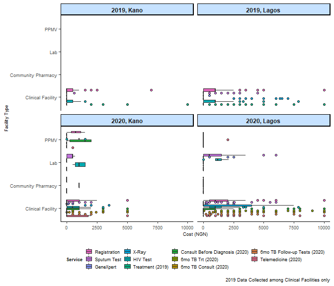

Nigeria Shops Analysis
================

<table>
<caption>
Table 1. Summary of Facilities in this Dataset by State and Type
</caption>
<thead>
<tr>
<th style="text-align:left;">
State
</th>
<th style="text-align:left;">
Facility Type
</th>
<th style="text-align:right;">
Total Number of Facilities (N)
</th>
</tr>
</thead>
<tbody>
<tr>
<td style="text-align:left;">
Kano
</td>
<td style="text-align:left;">
Clinical Facility
</td>
<td style="text-align:right;">
217
</td>
</tr>
<tr>
<td style="text-align:left;">
Kano
</td>
<td style="text-align:left;">
Community Pharmacy
</td>
<td style="text-align:right;">
28
</td>
</tr>
<tr>
<td style="text-align:left;">
Kano
</td>
<td style="text-align:left;">
Lab
</td>
<td style="text-align:right;">
35
</td>
</tr>
<tr>
<td style="text-align:left;">
Kano
</td>
<td style="text-align:left;">
PPMV
</td>
<td style="text-align:right;">
804
</td>
</tr>
<tr>
<td style="text-align:left;">
Lagos
</td>
<td style="text-align:left;">
Clinical Facility
</td>
<td style="text-align:right;">
472
</td>
</tr>
<tr>
<td style="text-align:left;">
Lagos
</td>
<td style="text-align:left;">
Community Pharmacy
</td>
<td style="text-align:right;">
195
</td>
</tr>
<tr>
<td style="text-align:left;">
Lagos
</td>
<td style="text-align:left;">
Lab
</td>
<td style="text-align:right;">
140
</td>
</tr>
<tr>
<td style="text-align:left;">
Lagos
</td>
<td style="text-align:left;">
PPMV
</td>
<td style="text-align:right;">
511
</td>
</tr>
<tr>
<td style="text-align:left;">
Kano
</td>
<td style="text-align:left;">
Total
</td>
<td style="text-align:right;">
1084
</td>
</tr>
<tr>
<td style="text-align:left;">
Lagos
</td>
<td style="text-align:left;">
Total
</td>
<td style="text-align:right;">
1318
</td>
</tr>
<tr>
<td style="text-align:left;">
Total
</td>
<td style="text-align:left;">
Total
</td>
<td style="text-align:right;">
2402
</td>
</tr>
</tbody>
</table>

## Which variables apply to each facility type?

*Step 1:* Examine which facility types contain data for each variable
(sum all numeric variables, everything with &gt;0 counted as TRUE,
ignoring NAs)

``` r
variables <- data %>% 
  select(c(1:grep("^ontreat_ds_total", colnames(data)))) %>% 
  group_by(fac_type) %>% 
  summarise_if(is.numeric, sum, na.rm = TRUE) %>% 
  select(-c(fac_id, month, year))

variables <- data.frame(t(variables[,-1]))
colnames(variables) <- c("CF", "CP", "L", "P")

variables <- variables %>% 
  mutate(CF_any = ifelse(CF > 0, TRUE, FALSE), CP_any = ifelse(CP > 0, TRUE, FALSE),
         L_any = ifelse(L > 0, TRUE, FALSE), P_any = ifelse(P > 0, TRUE, FALSE))

variables$var_name <- rownames(variables)
rownames(variables) <- NULL
variables <- variables[,c(9, 1:8)]
head(variables)
```

    ##            var_name        CF CP L P CF_any CP_any L_any P_any
    ## 1    q_recd_cat1kit    9216.0  0 0 0   TRUE  FALSE FALSE FALSE
    ## 2  phys_inv_cat1kit   27177.0  0 0 0   TRUE  FALSE FALSE FALSE
    ## 3        q_recd_inh   79843.0  0 0 0   TRUE  FALSE FALSE FALSE
    ## 4      phys_inv_inh 1381728.0  0 0 0   TRUE  FALSE FALSE FALSE
    ## 5   q_recd_rhz_paed    5675.0  0 0 0   TRUE  FALSE FALSE FALSE
    ## 6 phys_inv_rhz_paed   13951.5  0 0 0   TRUE  FALSE FALSE FALSE

``` r
write_csv(variables, file="./outputs/data/variables.csv")
```

*Step 2:* Cross-check with the codebook shared by our partners in
Nigeria (formatting done in Excel).

``` r
codebook <- read_csv("C:/Users/angie/OneDrive - McGill University/Pai Team/COVET/Nigeria program data/TB Nigeria_Program Data_Codebook.csv")
head(codebook)
```

    ## # A tibble: 6 x 10
    ##   `Variable Name` `Variable Label` `Answer Label` `Answer Code` `Variable Type`
    ##   <chr>           <chr>            <chr>                  <dbl> <chr>          
    ## 1 fac_id          fac_id           Open ended                NA Numeric        
    ## 2 month           month            Open ended                NA Numeric        
    ## 3 year            year             Open ended                NA Numeric        
    ## 4 monthyear       monthyear        Open ended                NA Numeric        
    ## 5 state           state            Open ended                NA String         
    ## 6 lga             lga              Open ended                NA String         
    ## # ... with 5 more variables: Notes <chr>, Clinical facilities <lgl>, CPs <lgl>,
    ## #   Labs <lgl>, PPMVs <lgl>

``` r
colnames(codebook)[1] <- "var_name"
colnames(codebook)[7:10] <- c("CF_codebook", "CP_codebook", "L_codebook", "P_codebook")

crosscheck <- left_join(variables, codebook, by = "var_name")

mismatches <- crosscheck %>% 
  select(var_name, CF_any, CF_codebook, CP_any, CP_codebook, 
         L_any, L_codebook, P_any, P_codebook) %>% 
  filter(CF_any != CF_codebook | 
         CP_any != CP_codebook | 
          L_any != L_codebook | 
          P_any != P_codebook) %>% 
  pivot_longer(cols = c(2:9), names_to = c("fac_type", "source"), 
               names_sep = "_", values_to = "test") %>% 
  pivot_wider(names_from = "source", values_from = "test") %>% 
  rename(actual_data = any) %>% 
  filter(actual_data != codebook) %>% 
  arrange(actual_data)

head(mismatches)
```

    ## # A tibble: 6 x 4
    ##   var_name          fac_type actual_data codebook
    ##   <chr>             <chr>    <lgl>       <lgl>   
    ## 1 presumptives_dr_m L        FALSE       TRUE    
    ## 2 presumptives_dr_f L        FALSE       TRUE    
    ## 3 examined_xpert_f  CP       FALSE       TRUE    
    ## 4 examined_afb_m    CP       FALSE       TRUE    
    ## 5 examined_afb_m    P        FALSE       TRUE    
    ## 6 examined_afb_f    CP       FALSE       TRUE

When `actual_data` is FALSE and `codebook` is TRUE, that means there is
no data where there should be data.

When `actual_data` is TRUE and `codebook` is FALSE, this means there are
data where there should not be any.

*Decision:*

-   If a variable should have data for a given facility type, classify
    it as such.
    -   if `actual_data` = FALSE & `codebook` = TRUE, keep label as TRUE
-   If a variable has data for a specific facility type when it
    shouldn’t, classify that variable as valid for that facility type.
    -   if `actual_data` = TRUE & `codebook` = FALSE, re-label as TRUE

<!-- -->

    ## # A tibble: 18 x 4
    ##    var_name                        fac_type actual_data codebook
    ##    <chr>                           <chr>    <lgl>       <lgl>   
    ##  1 lab_walkins                     CF       TRUE        FALSE   
    ##  2 ss_sent_xpert                   CF       TRUE        FALSE   
    ##  3 ref_trt_m15_plus                CF       TRUE        FALSE   
    ##  4 ref_trt_f15_plus                CF       TRUE        FALSE   
    ##  5 ref_trt_total                   CF       TRUE        FALSE   
    ##  6 cases_starttrt_pvthosp_m15_plus CF       TRUE        FALSE   
    ##  7 cases_starttrt_pvthosp_f15_plus CF       TRUE        FALSE   
    ##  8 cases_starttrt_pvthosp_total    CF       TRUE        FALSE   
    ##  9 cases_starttrt_pubhosp_m15_plus CF       TRUE        FALSE   
    ## 10 cases_starttrt_pubhosp_f15_plus CF       TRUE        FALSE   
    ## 11 cases_starttrt_pubhosp_total    CF       TRUE        FALSE   
    ## 12 cases_hivneg_m15_plus           CF       TRUE        FALSE   
    ## 13 cases_hivneg_f15_plus           CF       TRUE        FALSE   
    ## 14 cases_hivneg_total              CF       TRUE        FALSE   
    ## 15 cases_hivdk_m15_plus            CF       TRUE        FALSE   
    ## 16 cases_hivdk_f15_plus            CF       TRUE        FALSE   
    ## 17 cases_hivdk_total               CF       TRUE        FALSE   
    ## 18 cases_hivstatus_total           CF       TRUE        FALSE

The only facility type where `actual_data` = TRUE & `codebook` = FALSE
is clinical facilities, so those are the only ones that need to be
re-labeled as TRUE.

``` r
to_be_labeled_true <- mismatches$var_name[mismatches$actual_data==TRUE]

codebook_new <- crosscheck %>% 
  transmute(var_name = var_name,
            `Clinical Facility` = CF_codebook, 
            `Community Pharmacy` = CP_codebook, 
            `Lab` = L_codebook, 
            `PPMV` = P_codebook) 

codebook_new$`Clinical Facility`[codebook_new$var_name %in% to_be_labeled_true] <- TRUE
```

# Additional Variable Analysis

## 9a. Sum Total of PTB Cases Bacteriologically Diagnosed and 9b. Sum Total of PTB Cases Clinically Diagnosed (Applies to Clinical facilities only)


## 10. Grand Total of HIV Status of TB Cases


## 16. Grand Total of Cases Notified (Clinical Facilities and Labs Only)


# Results from the December 2020 COVID Survey

## General survey information

Information on 1598 facilities out of 2401 total facilities was included
in the responses to the COVID questionnaire.

<table>
<caption>
Table 3. Summary of Response to Dec 2020 COVID Survey
</caption>
<thead>
<tr>
<th style="text-align:left;">
State
</th>
<th style="text-align:left;">
Facility Type
</th>
<th style="text-align:right;">
Number of Facilities Responding to COVID Survey
</th>
<th style="text-align:right;">
Total Number of Facilities
</th>
<th style="text-align:right;">
Percent Response (%)
</th>
</tr>
</thead>
<tbody>
<tr>
<td style="text-align:left;">
Kano
</td>
<td style="text-align:left;">
Clinical Facility
</td>
<td style="text-align:right;">
151
</td>
<td style="text-align:right;">
217
</td>
<td style="text-align:right;">
69.59
</td>
</tr>
<tr>
<td style="text-align:left;">
Kano
</td>
<td style="text-align:left;">
Community Pharmacy
</td>
<td style="text-align:right;">
17
</td>
<td style="text-align:right;">
28
</td>
<td style="text-align:right;">
60.71
</td>
</tr>
<tr>
<td style="text-align:left;">
Kano
</td>
<td style="text-align:left;">
Lab
</td>
<td style="text-align:right;">
20
</td>
<td style="text-align:right;">
35
</td>
<td style="text-align:right;">
57.14
</td>
</tr>
<tr>
<td style="text-align:left;">
Kano
</td>
<td style="text-align:left;">
PPMV
</td>
<td style="text-align:right;">
550
</td>
<td style="text-align:right;">
804
</td>
<td style="text-align:right;">
68.41
</td>
</tr>
<tr>
<td style="text-align:left;">
Lagos
</td>
<td style="text-align:left;">
Clinical Facility
</td>
<td style="text-align:right;">
395
</td>
<td style="text-align:right;">
472
</td>
<td style="text-align:right;">
83.69
</td>
</tr>
<tr>
<td style="text-align:left;">
Lagos
</td>
<td style="text-align:left;">
Community Pharmacy
</td>
<td style="text-align:right;">
91
</td>
<td style="text-align:right;">
195
</td>
<td style="text-align:right;">
46.67
</td>
</tr>
<tr>
<td style="text-align:left;">
Lagos
</td>
<td style="text-align:left;">
Lab
</td>
<td style="text-align:right;">
108
</td>
<td style="text-align:right;">
140
</td>
<td style="text-align:right;">
77.14
</td>
</tr>
<tr>
<td style="text-align:left;">
Lagos
</td>
<td style="text-align:left;">
PPMV
</td>
<td style="text-align:right;">
266
</td>
<td style="text-align:right;">
511
</td>
<td style="text-align:right;">
52.05
</td>
</tr>
<tr>
<td style="text-align:left;">
Kano
</td>
<td style="text-align:left;">
Total
</td>
<td style="text-align:right;">
738
</td>
<td style="text-align:right;">
1084
</td>
<td style="text-align:right;">
68.08
</td>
</tr>
<tr>
<td style="text-align:left;">
Lagos
</td>
<td style="text-align:left;">
Total
</td>
<td style="text-align:right;">
860
</td>
<td style="text-align:right;">
1318
</td>
<td style="text-align:right;">
65.25
</td>
</tr>
<tr>
<td style="text-align:left;">
Total
</td>
<td style="text-align:left;">
Total
</td>
<td style="text-align:right;">
1598
</td>
<td style="text-align:right;">
2402
</td>
<td style="text-align:right;">
66.53
</td>
</tr>
</tbody>
</table>

## Current Status of Facilities

<table>
<caption>
Table 4. Percent of Facilities Open and Accepting Clients at time of
Survey (Dec 2020)
</caption>
<thead>
<tr>
<th style="text-align:left;">
State
</th>
<th style="text-align:left;">
Facility Type
</th>
<th style="text-align:right;">
Number of Open Facilities
</th>
<th style="text-align:right;">
Total N of Responding Facilities
</th>
<th style="text-align:right;">
Percent Currently Open (%)
</th>
</tr>
</thead>
<tbody>
<tr>
<td style="text-align:left;">
Kano
</td>
<td style="text-align:left;">
Clinical Facility
</td>
<td style="text-align:right;">
148
</td>
<td style="text-align:right;">
151
</td>
<td style="text-align:right;">
98.01
</td>
</tr>
<tr>
<td style="text-align:left;">
Kano
</td>
<td style="text-align:left;">
Community Pharmacy
</td>
<td style="text-align:right;">
17
</td>
<td style="text-align:right;">
17
</td>
<td style="text-align:right;">
100.00
</td>
</tr>
<tr>
<td style="text-align:left;">
Kano
</td>
<td style="text-align:left;">
Lab
</td>
<td style="text-align:right;">
17
</td>
<td style="text-align:right;">
20
</td>
<td style="text-align:right;">
85.00
</td>
</tr>
<tr>
<td style="text-align:left;">
Kano
</td>
<td style="text-align:left;">
PPMV
</td>
<td style="text-align:right;">
502
</td>
<td style="text-align:right;">
550
</td>
<td style="text-align:right;">
91.27
</td>
</tr>
<tr>
<td style="text-align:left;">
Lagos
</td>
<td style="text-align:left;">
Clinical Facility
</td>
<td style="text-align:right;">
389
</td>
<td style="text-align:right;">
395
</td>
<td style="text-align:right;">
98.48
</td>
</tr>
<tr>
<td style="text-align:left;">
Lagos
</td>
<td style="text-align:left;">
Community Pharmacy
</td>
<td style="text-align:right;">
88
</td>
<td style="text-align:right;">
91
</td>
<td style="text-align:right;">
96.70
</td>
</tr>
<tr>
<td style="text-align:left;">
Lagos
</td>
<td style="text-align:left;">
Lab
</td>
<td style="text-align:right;">
108
</td>
<td style="text-align:right;">
108
</td>
<td style="text-align:right;">
100.00
</td>
</tr>
<tr>
<td style="text-align:left;">
Lagos
</td>
<td style="text-align:left;">
PPMV
</td>
<td style="text-align:right;">
248
</td>
<td style="text-align:right;">
266
</td>
<td style="text-align:right;">
93.23
</td>
</tr>
<tr>
<td style="text-align:left;">
Kano
</td>
<td style="text-align:left;">
Total
</td>
<td style="text-align:right;">
684
</td>
<td style="text-align:right;">
738
</td>
<td style="text-align:right;">
92.68
</td>
</tr>
<tr>
<td style="text-align:left;">
Lagos
</td>
<td style="text-align:left;">
Total
</td>
<td style="text-align:right;">
833
</td>
<td style="text-align:right;">
860
</td>
<td style="text-align:right;">
96.86
</td>
</tr>
<tr>
<td style="text-align:left;">
Total
</td>
<td style="text-align:left;">
Total
</td>
<td style="text-align:right;">
1517
</td>
<td style="text-align:right;">
1598
</td>
<td style="text-align:right;">
94.93
</td>
</tr>
</tbody>
</table>

## Previous Status during Lockdown

<table>
<caption>
Table 5. Summary of Facilities Reporting Having Closed During the COVID
Lockdown (April-May 2020
</caption>
<thead>
<tr>
<th style="text-align:left;">
State
</th>
<th style="text-align:left;">
Facility Type
</th>
<th style="text-align:right;">
Number of Facilities that Closed at least once during COVID lockdown
</th>
<th style="text-align:right;">
Total N of Responding Facilities
</th>
<th style="text-align:right;">
Percent Closed at least once during COVID lockdown (%)
</th>
<th style="text-align:right;">
Mean Number of Times Each Facility Closed
</th>
<th style="text-align:right;">
Std. Dev. of Number of Times Closed
</th>
</tr>
</thead>
<tbody>
<tr>
<td style="text-align:left;">
Kano
</td>
<td style="text-align:left;">
Clinical Facility
</td>
<td style="text-align:right;">
25
</td>
<td style="text-align:right;">
151
</td>
<td style="text-align:right;">
16.56
</td>
<td style="text-align:right;">
1.12
</td>
<td style="text-align:right;">
0.33
</td>
</tr>
<tr>
<td style="text-align:left;">
Kano
</td>
<td style="text-align:left;">
Community Pharmacy
</td>
<td style="text-align:right;">
4
</td>
<td style="text-align:right;">
17
</td>
<td style="text-align:right;">
23.53
</td>
<td style="text-align:right;">
1.00
</td>
<td style="text-align:right;">
0.00
</td>
</tr>
<tr>
<td style="text-align:left;">
Kano
</td>
<td style="text-align:left;">
Lab
</td>
<td style="text-align:right;">
2
</td>
<td style="text-align:right;">
20
</td>
<td style="text-align:right;">
10.00
</td>
<td style="text-align:right;">
1.00
</td>
<td style="text-align:right;">
0.00
</td>
</tr>
<tr>
<td style="text-align:left;">
Kano
</td>
<td style="text-align:left;">
PPMV
</td>
<td style="text-align:right;">
46
</td>
<td style="text-align:right;">
550
</td>
<td style="text-align:right;">
8.36
</td>
<td style="text-align:right;">
1.28
</td>
<td style="text-align:right;">
1.34
</td>
</tr>
<tr>
<td style="text-align:left;">
Lagos
</td>
<td style="text-align:left;">
Clinical Facility
</td>
<td style="text-align:right;">
19
</td>
<td style="text-align:right;">
395
</td>
<td style="text-align:right;">
4.81
</td>
<td style="text-align:right;">
1.21
</td>
<td style="text-align:right;">
0.42
</td>
</tr>
<tr>
<td style="text-align:left;">
Lagos
</td>
<td style="text-align:left;">
Community Pharmacy
</td>
<td style="text-align:right;">
10
</td>
<td style="text-align:right;">
91
</td>
<td style="text-align:right;">
10.99
</td>
<td style="text-align:right;">
1.50
</td>
<td style="text-align:right;">
0.97
</td>
</tr>
<tr>
<td style="text-align:left;">
Lagos
</td>
<td style="text-align:left;">
Lab
</td>
<td style="text-align:right;">
18
</td>
<td style="text-align:right;">
108
</td>
<td style="text-align:right;">
16.67
</td>
<td style="text-align:right;">
1.11
</td>
<td style="text-align:right;">
0.32
</td>
</tr>
<tr>
<td style="text-align:left;">
Lagos
</td>
<td style="text-align:left;">
PPMV
</td>
<td style="text-align:right;">
55
</td>
<td style="text-align:right;">
266
</td>
<td style="text-align:right;">
20.68
</td>
<td style="text-align:right;">
1.29
</td>
<td style="text-align:right;">
0.79
</td>
</tr>
<tr>
<td style="text-align:left;">
Kano
</td>
<td style="text-align:left;">
Total
</td>
<td style="text-align:right;">
77
</td>
<td style="text-align:right;">
738
</td>
<td style="text-align:right;">
10.43
</td>
<td style="text-align:right;">
1.21
</td>
<td style="text-align:right;">
1.06
</td>
</tr>
<tr>
<td style="text-align:left;">
Lagos
</td>
<td style="text-align:left;">
Total
</td>
<td style="text-align:right;">
102
</td>
<td style="text-align:right;">
860
</td>
<td style="text-align:right;">
11.86
</td>
<td style="text-align:right;">
1.26
</td>
<td style="text-align:right;">
0.69
</td>
</tr>
<tr>
<td style="text-align:left;">
Total
</td>
<td style="text-align:left;">
Total
</td>
<td style="text-align:right;">
179
</td>
<td style="text-align:right;">
1598
</td>
<td style="text-align:right;">
11.20
</td>
<td style="text-align:right;">
1.24
</td>
<td style="text-align:right;">
1.06
</td>
</tr>
</tbody>
</table>

## Has facility added incremental fees to cover PPE cost?

<div id="imnurvoltm" style="overflow-x:auto;overflow-y:auto;width:auto;height:auto;">
<style>html {
  font-family: -apple-system, BlinkMacSystemFont, 'Segoe UI', Roboto, Oxygen, Ubuntu, Cantarell, 'Helvetica Neue', 'Fira Sans', 'Droid Sans', Arial, sans-serif;
}

#imnurvoltm .gt_table {
  display: table;
  border-collapse: collapse;
  margin-left: auto;
  margin-right: auto;
  color: #333333;
  font-size: 16px;
  font-weight: normal;
  font-style: normal;
  background-color: #FFFFFF;
  width: auto;
  border-top-style: solid;
  border-top-width: 2px;
  border-top-color: #A8A8A8;
  border-right-style: none;
  border-right-width: 2px;
  border-right-color: #D3D3D3;
  border-bottom-style: solid;
  border-bottom-width: 2px;
  border-bottom-color: #A8A8A8;
  border-left-style: none;
  border-left-width: 2px;
  border-left-color: #D3D3D3;
}

#imnurvoltm .gt_heading {
  background-color: #FFFFFF;
  text-align: center;
  border-bottom-color: #FFFFFF;
  border-left-style: none;
  border-left-width: 1px;
  border-left-color: #D3D3D3;
  border-right-style: none;
  border-right-width: 1px;
  border-right-color: #D3D3D3;
}

#imnurvoltm .gt_title {
  color: #333333;
  font-size: 125%;
  font-weight: initial;
  padding-top: 4px;
  padding-bottom: 4px;
  border-bottom-color: #FFFFFF;
  border-bottom-width: 0;
}

#imnurvoltm .gt_subtitle {
  color: #333333;
  font-size: 85%;
  font-weight: initial;
  padding-top: 0;
  padding-bottom: 4px;
  border-top-color: #FFFFFF;
  border-top-width: 0;
}

#imnurvoltm .gt_bottom_border {
  border-bottom-style: solid;
  border-bottom-width: 2px;
  border-bottom-color: #D3D3D3;
}

#imnurvoltm .gt_col_headings {
  border-top-style: solid;
  border-top-width: 2px;
  border-top-color: #D3D3D3;
  border-bottom-style: solid;
  border-bottom-width: 2px;
  border-bottom-color: #D3D3D3;
  border-left-style: none;
  border-left-width: 1px;
  border-left-color: #D3D3D3;
  border-right-style: none;
  border-right-width: 1px;
  border-right-color: #D3D3D3;
}

#imnurvoltm .gt_col_heading {
  color: #333333;
  background-color: #FFFFFF;
  font-size: 100%;
  font-weight: normal;
  text-transform: inherit;
  border-left-style: none;
  border-left-width: 1px;
  border-left-color: #D3D3D3;
  border-right-style: none;
  border-right-width: 1px;
  border-right-color: #D3D3D3;
  vertical-align: bottom;
  padding-top: 5px;
  padding-bottom: 6px;
  padding-left: 5px;
  padding-right: 5px;
  overflow-x: hidden;
}

#imnurvoltm .gt_column_spanner_outer {
  color: #333333;
  background-color: #FFFFFF;
  font-size: 100%;
  font-weight: normal;
  text-transform: inherit;
  padding-top: 0;
  padding-bottom: 0;
  padding-left: 4px;
  padding-right: 4px;
}

#imnurvoltm .gt_column_spanner_outer:first-child {
  padding-left: 0;
}

#imnurvoltm .gt_column_spanner_outer:last-child {
  padding-right: 0;
}

#imnurvoltm .gt_column_spanner {
  border-bottom-style: solid;
  border-bottom-width: 2px;
  border-bottom-color: #D3D3D3;
  vertical-align: bottom;
  padding-top: 5px;
  padding-bottom: 6px;
  overflow-x: hidden;
  display: inline-block;
  width: 100%;
}

#imnurvoltm .gt_group_heading {
  padding: 8px;
  color: #333333;
  background-color: #FFFFFF;
  font-size: 100%;
  font-weight: initial;
  text-transform: inherit;
  border-top-style: solid;
  border-top-width: 2px;
  border-top-color: #D3D3D3;
  border-bottom-style: solid;
  border-bottom-width: 2px;
  border-bottom-color: #D3D3D3;
  border-left-style: none;
  border-left-width: 1px;
  border-left-color: #D3D3D3;
  border-right-style: none;
  border-right-width: 1px;
  border-right-color: #D3D3D3;
  vertical-align: middle;
}

#imnurvoltm .gt_empty_group_heading {
  padding: 0.5px;
  color: #333333;
  background-color: #FFFFFF;
  font-size: 100%;
  font-weight: initial;
  border-top-style: solid;
  border-top-width: 2px;
  border-top-color: #D3D3D3;
  border-bottom-style: solid;
  border-bottom-width: 2px;
  border-bottom-color: #D3D3D3;
  vertical-align: middle;
}

#imnurvoltm .gt_from_md > :first-child {
  margin-top: 0;
}

#imnurvoltm .gt_from_md > :last-child {
  margin-bottom: 0;
}

#imnurvoltm .gt_row {
  padding-top: 8px;
  padding-bottom: 8px;
  padding-left: 5px;
  padding-right: 5px;
  margin: 10px;
  border-top-style: solid;
  border-top-width: 1px;
  border-top-color: #D3D3D3;
  border-left-style: none;
  border-left-width: 1px;
  border-left-color: #D3D3D3;
  border-right-style: none;
  border-right-width: 1px;
  border-right-color: #D3D3D3;
  vertical-align: middle;
  overflow-x: hidden;
}

#imnurvoltm .gt_stub {
  color: #333333;
  background-color: #FFFFFF;
  font-size: 100%;
  font-weight: initial;
  text-transform: inherit;
  border-right-style: solid;
  border-right-width: 2px;
  border-right-color: #D3D3D3;
  padding-left: 12px;
}

#imnurvoltm .gt_summary_row {
  color: #333333;
  background-color: #FFFFFF;
  text-transform: inherit;
  padding-top: 8px;
  padding-bottom: 8px;
  padding-left: 5px;
  padding-right: 5px;
}

#imnurvoltm .gt_first_summary_row {
  padding-top: 8px;
  padding-bottom: 8px;
  padding-left: 5px;
  padding-right: 5px;
  border-top-style: solid;
  border-top-width: 2px;
  border-top-color: #D3D3D3;
}

#imnurvoltm .gt_grand_summary_row {
  color: #333333;
  background-color: #FFFFFF;
  text-transform: inherit;
  padding-top: 8px;
  padding-bottom: 8px;
  padding-left: 5px;
  padding-right: 5px;
}

#imnurvoltm .gt_first_grand_summary_row {
  padding-top: 8px;
  padding-bottom: 8px;
  padding-left: 5px;
  padding-right: 5px;
  border-top-style: double;
  border-top-width: 6px;
  border-top-color: #D3D3D3;
}

#imnurvoltm .gt_striped {
  background-color: rgba(128, 128, 128, 0.05);
}

#imnurvoltm .gt_table_body {
  border-top-style: solid;
  border-top-width: 2px;
  border-top-color: #D3D3D3;
  border-bottom-style: solid;
  border-bottom-width: 2px;
  border-bottom-color: #D3D3D3;
}

#imnurvoltm .gt_footnotes {
  color: #333333;
  background-color: #FFFFFF;
  border-bottom-style: none;
  border-bottom-width: 2px;
  border-bottom-color: #D3D3D3;
  border-left-style: none;
  border-left-width: 2px;
  border-left-color: #D3D3D3;
  border-right-style: none;
  border-right-width: 2px;
  border-right-color: #D3D3D3;
}

#imnurvoltm .gt_footnote {
  margin: 0px;
  font-size: 90%;
  padding: 4px;
}

#imnurvoltm .gt_sourcenotes {
  color: #333333;
  background-color: #FFFFFF;
  border-bottom-style: none;
  border-bottom-width: 2px;
  border-bottom-color: #D3D3D3;
  border-left-style: none;
  border-left-width: 2px;
  border-left-color: #D3D3D3;
  border-right-style: none;
  border-right-width: 2px;
  border-right-color: #D3D3D3;
}

#imnurvoltm .gt_sourcenote {
  font-size: 90%;
  padding: 4px;
}

#imnurvoltm .gt_left {
  text-align: left;
}

#imnurvoltm .gt_center {
  text-align: center;
}

#imnurvoltm .gt_right {
  text-align: right;
  font-variant-numeric: tabular-nums;
}

#imnurvoltm .gt_font_normal {
  font-weight: normal;
}

#imnurvoltm .gt_font_bold {
  font-weight: bold;
}

#imnurvoltm .gt_font_italic {
  font-style: italic;
}

#imnurvoltm .gt_super {
  font-size: 65%;
}

#imnurvoltm .gt_footnote_marks {
  font-style: italic;
  font-weight: normal;
  font-size: 65%;
}
</style>
<table class="gt_table">
  
  <thead class="gt_col_headings">
    <tr>
      <th class="gt_col_heading gt_columns_bottom_border gt_left" rowspan="1" colspan="1"><strong>Characteristic</strong></th>
      <th class="gt_col_heading gt_columns_bottom_border gt_center" rowspan="1" colspan="1"><strong>Kano</strong>, N = 738<sup class="gt_footnote_marks">1</sup></th>
      <th class="gt_col_heading gt_columns_bottom_border gt_center" rowspan="1" colspan="1"><strong>Lagos</strong>, N = 860<sup class="gt_footnote_marks">1</sup></th>
      <th class="gt_col_heading gt_columns_bottom_border gt_center" rowspan="1" colspan="1"><strong>p-value</strong><sup class="gt_footnote_marks">2</sup></th>
    </tr>
  </thead>
  <tbody class="gt_table_body">
    <tr><td class="gt_row gt_left">facility_incrmnt_fees_due_ppe</td>
<td class="gt_row gt_center">47 (6.4%)</td>
<td class="gt_row gt_center">185 (22%)</td>
<td class="gt_row gt_center"><0.001</td></tr>
  </tbody>
  
  <tfoot>
    <tr class="gt_footnotes">
      <td colspan="4">
        <p class="gt_footnote">
          <sup class="gt_footnote_marks">
            <em>1</em>
          </sup>
           
          n (%)
          <br />
        </p>
        <p class="gt_footnote">
          <sup class="gt_footnote_marks">
            <em>2</em>
          </sup>
           
          Pearson's Chi-squared test
          <br />
        </p>
      </td>
    </tr>
  </tfoot>
</table>
</div>
<div id="mcldfswmgp" style="overflow-x:auto;overflow-y:auto;width:auto;height:auto;">
<style>html {
  font-family: -apple-system, BlinkMacSystemFont, 'Segoe UI', Roboto, Oxygen, Ubuntu, Cantarell, 'Helvetica Neue', 'Fira Sans', 'Droid Sans', Arial, sans-serif;
}

#mcldfswmgp .gt_table {
  display: table;
  border-collapse: collapse;
  margin-left: auto;
  margin-right: auto;
  color: #333333;
  font-size: 16px;
  font-weight: normal;
  font-style: normal;
  background-color: #FFFFFF;
  width: auto;
  border-top-style: solid;
  border-top-width: 2px;
  border-top-color: #A8A8A8;
  border-right-style: none;
  border-right-width: 2px;
  border-right-color: #D3D3D3;
  border-bottom-style: solid;
  border-bottom-width: 2px;
  border-bottom-color: #A8A8A8;
  border-left-style: none;
  border-left-width: 2px;
  border-left-color: #D3D3D3;
}

#mcldfswmgp .gt_heading {
  background-color: #FFFFFF;
  text-align: center;
  border-bottom-color: #FFFFFF;
  border-left-style: none;
  border-left-width: 1px;
  border-left-color: #D3D3D3;
  border-right-style: none;
  border-right-width: 1px;
  border-right-color: #D3D3D3;
}

#mcldfswmgp .gt_title {
  color: #333333;
  font-size: 125%;
  font-weight: initial;
  padding-top: 4px;
  padding-bottom: 4px;
  border-bottom-color: #FFFFFF;
  border-bottom-width: 0;
}

#mcldfswmgp .gt_subtitle {
  color: #333333;
  font-size: 85%;
  font-weight: initial;
  padding-top: 0;
  padding-bottom: 4px;
  border-top-color: #FFFFFF;
  border-top-width: 0;
}

#mcldfswmgp .gt_bottom_border {
  border-bottom-style: solid;
  border-bottom-width: 2px;
  border-bottom-color: #D3D3D3;
}

#mcldfswmgp .gt_col_headings {
  border-top-style: solid;
  border-top-width: 2px;
  border-top-color: #D3D3D3;
  border-bottom-style: solid;
  border-bottom-width: 2px;
  border-bottom-color: #D3D3D3;
  border-left-style: none;
  border-left-width: 1px;
  border-left-color: #D3D3D3;
  border-right-style: none;
  border-right-width: 1px;
  border-right-color: #D3D3D3;
}

#mcldfswmgp .gt_col_heading {
  color: #333333;
  background-color: #FFFFFF;
  font-size: 100%;
  font-weight: normal;
  text-transform: inherit;
  border-left-style: none;
  border-left-width: 1px;
  border-left-color: #D3D3D3;
  border-right-style: none;
  border-right-width: 1px;
  border-right-color: #D3D3D3;
  vertical-align: bottom;
  padding-top: 5px;
  padding-bottom: 6px;
  padding-left: 5px;
  padding-right: 5px;
  overflow-x: hidden;
}

#mcldfswmgp .gt_column_spanner_outer {
  color: #333333;
  background-color: #FFFFFF;
  font-size: 100%;
  font-weight: normal;
  text-transform: inherit;
  padding-top: 0;
  padding-bottom: 0;
  padding-left: 4px;
  padding-right: 4px;
}

#mcldfswmgp .gt_column_spanner_outer:first-child {
  padding-left: 0;
}

#mcldfswmgp .gt_column_spanner_outer:last-child {
  padding-right: 0;
}

#mcldfswmgp .gt_column_spanner {
  border-bottom-style: solid;
  border-bottom-width: 2px;
  border-bottom-color: #D3D3D3;
  vertical-align: bottom;
  padding-top: 5px;
  padding-bottom: 6px;
  overflow-x: hidden;
  display: inline-block;
  width: 100%;
}

#mcldfswmgp .gt_group_heading {
  padding: 8px;
  color: #333333;
  background-color: #FFFFFF;
  font-size: 100%;
  font-weight: initial;
  text-transform: inherit;
  border-top-style: solid;
  border-top-width: 2px;
  border-top-color: #D3D3D3;
  border-bottom-style: solid;
  border-bottom-width: 2px;
  border-bottom-color: #D3D3D3;
  border-left-style: none;
  border-left-width: 1px;
  border-left-color: #D3D3D3;
  border-right-style: none;
  border-right-width: 1px;
  border-right-color: #D3D3D3;
  vertical-align: middle;
}

#mcldfswmgp .gt_empty_group_heading {
  padding: 0.5px;
  color: #333333;
  background-color: #FFFFFF;
  font-size: 100%;
  font-weight: initial;
  border-top-style: solid;
  border-top-width: 2px;
  border-top-color: #D3D3D3;
  border-bottom-style: solid;
  border-bottom-width: 2px;
  border-bottom-color: #D3D3D3;
  vertical-align: middle;
}

#mcldfswmgp .gt_from_md > :first-child {
  margin-top: 0;
}

#mcldfswmgp .gt_from_md > :last-child {
  margin-bottom: 0;
}

#mcldfswmgp .gt_row {
  padding-top: 8px;
  padding-bottom: 8px;
  padding-left: 5px;
  padding-right: 5px;
  margin: 10px;
  border-top-style: solid;
  border-top-width: 1px;
  border-top-color: #D3D3D3;
  border-left-style: none;
  border-left-width: 1px;
  border-left-color: #D3D3D3;
  border-right-style: none;
  border-right-width: 1px;
  border-right-color: #D3D3D3;
  vertical-align: middle;
  overflow-x: hidden;
}

#mcldfswmgp .gt_stub {
  color: #333333;
  background-color: #FFFFFF;
  font-size: 100%;
  font-weight: initial;
  text-transform: inherit;
  border-right-style: solid;
  border-right-width: 2px;
  border-right-color: #D3D3D3;
  padding-left: 12px;
}

#mcldfswmgp .gt_summary_row {
  color: #333333;
  background-color: #FFFFFF;
  text-transform: inherit;
  padding-top: 8px;
  padding-bottom: 8px;
  padding-left: 5px;
  padding-right: 5px;
}

#mcldfswmgp .gt_first_summary_row {
  padding-top: 8px;
  padding-bottom: 8px;
  padding-left: 5px;
  padding-right: 5px;
  border-top-style: solid;
  border-top-width: 2px;
  border-top-color: #D3D3D3;
}

#mcldfswmgp .gt_grand_summary_row {
  color: #333333;
  background-color: #FFFFFF;
  text-transform: inherit;
  padding-top: 8px;
  padding-bottom: 8px;
  padding-left: 5px;
  padding-right: 5px;
}

#mcldfswmgp .gt_first_grand_summary_row {
  padding-top: 8px;
  padding-bottom: 8px;
  padding-left: 5px;
  padding-right: 5px;
  border-top-style: double;
  border-top-width: 6px;
  border-top-color: #D3D3D3;
}

#mcldfswmgp .gt_striped {
  background-color: rgba(128, 128, 128, 0.05);
}

#mcldfswmgp .gt_table_body {
  border-top-style: solid;
  border-top-width: 2px;
  border-top-color: #D3D3D3;
  border-bottom-style: solid;
  border-bottom-width: 2px;
  border-bottom-color: #D3D3D3;
}

#mcldfswmgp .gt_footnotes {
  color: #333333;
  background-color: #FFFFFF;
  border-bottom-style: none;
  border-bottom-width: 2px;
  border-bottom-color: #D3D3D3;
  border-left-style: none;
  border-left-width: 2px;
  border-left-color: #D3D3D3;
  border-right-style: none;
  border-right-width: 2px;
  border-right-color: #D3D3D3;
}

#mcldfswmgp .gt_footnote {
  margin: 0px;
  font-size: 90%;
  padding: 4px;
}

#mcldfswmgp .gt_sourcenotes {
  color: #333333;
  background-color: #FFFFFF;
  border-bottom-style: none;
  border-bottom-width: 2px;
  border-bottom-color: #D3D3D3;
  border-left-style: none;
  border-left-width: 2px;
  border-left-color: #D3D3D3;
  border-right-style: none;
  border-right-width: 2px;
  border-right-color: #D3D3D3;
}

#mcldfswmgp .gt_sourcenote {
  font-size: 90%;
  padding: 4px;
}

#mcldfswmgp .gt_left {
  text-align: left;
}

#mcldfswmgp .gt_center {
  text-align: center;
}

#mcldfswmgp .gt_right {
  text-align: right;
  font-variant-numeric: tabular-nums;
}

#mcldfswmgp .gt_font_normal {
  font-weight: normal;
}

#mcldfswmgp .gt_font_bold {
  font-weight: bold;
}

#mcldfswmgp .gt_font_italic {
  font-style: italic;
}

#mcldfswmgp .gt_super {
  font-size: 65%;
}

#mcldfswmgp .gt_footnote_marks {
  font-style: italic;
  font-weight: normal;
  font-size: 65%;
}
</style>
<table class="gt_table">
  
  <thead class="gt_col_headings">
    <tr>
      <th class="gt_col_heading gt_columns_bottom_border gt_left" rowspan="2" colspan="1"><strong>Characteristic</strong></th>
      <th class="gt_center gt_columns_top_border gt_column_spanner_outer" rowspan="1" colspan="3">
        <span class="gt_column_spanner"><strong>Clinical Facility</strong></span>
      </th>
      <th class="gt_center gt_columns_top_border gt_column_spanner_outer" rowspan="1" colspan="3">
        <span class="gt_column_spanner"><strong>Community Pharmacy</strong></span>
      </th>
      <th class="gt_center gt_columns_top_border gt_column_spanner_outer" rowspan="1" colspan="3">
        <span class="gt_column_spanner"><strong>Lab</strong></span>
      </th>
      <th class="gt_center gt_columns_top_border gt_column_spanner_outer" rowspan="1" colspan="3">
        <span class="gt_column_spanner"><strong>PPMV</strong></span>
      </th>
      <th class="gt_center gt_columns_top_border gt_column_spanner_outer" rowspan="1" colspan="3">
        <span class="gt_column_spanner"><strong>All Facility Types</strong></span>
      </th>
    </tr>
    <tr>
      <th class="gt_col_heading gt_columns_bottom_border gt_center" rowspan="1" colspan="1"><strong>Kano</strong>, N = 151<sup class="gt_footnote_marks">1</sup></th>
      <th class="gt_col_heading gt_columns_bottom_border gt_center" rowspan="1" colspan="1"><strong>Lagos</strong>, N = 395<sup class="gt_footnote_marks">1</sup></th>
      <th class="gt_col_heading gt_columns_bottom_border gt_center" rowspan="1" colspan="1"><strong>p-value</strong><sup class="gt_footnote_marks">2</sup></th>
      <th class="gt_col_heading gt_columns_bottom_border gt_center" rowspan="1" colspan="1"><strong>Kano</strong>, N = 17<sup class="gt_footnote_marks">1</sup></th>
      <th class="gt_col_heading gt_columns_bottom_border gt_center" rowspan="1" colspan="1"><strong>Lagos</strong>, N = 91<sup class="gt_footnote_marks">1</sup></th>
      <th class="gt_col_heading gt_columns_bottom_border gt_center" rowspan="1" colspan="1"><strong>p-value</strong><sup class="gt_footnote_marks">2</sup></th>
      <th class="gt_col_heading gt_columns_bottom_border gt_center" rowspan="1" colspan="1"><strong>Kano</strong>, N = 20<sup class="gt_footnote_marks">1</sup></th>
      <th class="gt_col_heading gt_columns_bottom_border gt_center" rowspan="1" colspan="1"><strong>Lagos</strong>, N = 108<sup class="gt_footnote_marks">1</sup></th>
      <th class="gt_col_heading gt_columns_bottom_border gt_center" rowspan="1" colspan="1"><strong>p-value</strong><sup class="gt_footnote_marks">3</sup></th>
      <th class="gt_col_heading gt_columns_bottom_border gt_center" rowspan="1" colspan="1"><strong>Kano</strong>, N = 550<sup class="gt_footnote_marks">1</sup></th>
      <th class="gt_col_heading gt_columns_bottom_border gt_center" rowspan="1" colspan="1"><strong>Lagos</strong>, N = 266<sup class="gt_footnote_marks">1</sup></th>
      <th class="gt_col_heading gt_columns_bottom_border gt_center" rowspan="1" colspan="1"><strong>p-value</strong><sup class="gt_footnote_marks">2</sup></th>
      <th class="gt_col_heading gt_columns_bottom_border gt_center" rowspan="1" colspan="1"><strong>Kano</strong>, N = 738<sup class="gt_footnote_marks">1</sup></th>
      <th class="gt_col_heading gt_columns_bottom_border gt_center" rowspan="1" colspan="1"><strong>Lagos</strong>, N = 860<sup class="gt_footnote_marks">1</sup></th>
      <th class="gt_col_heading gt_columns_bottom_border gt_center" rowspan="1" colspan="1"><strong>p-value</strong><sup class="gt_footnote_marks">2</sup></th>
    </tr>
  </thead>
  <tbody class="gt_table_body">
    <tr><td class="gt_row gt_left">facility_incrmnt_fees_due_ppe</td>
<td class="gt_row gt_center">17 (11%)</td>
<td class="gt_row gt_center">77 (19%)</td>
<td class="gt_row gt_center">0.023</td>
<td class="gt_row gt_center">3 (18%)</td>
<td class="gt_row gt_center">36 (40%)</td>
<td class="gt_row gt_center">0.084</td>
<td class="gt_row gt_center">0 (0%)</td>
<td class="gt_row gt_center">15 (14%)</td>
<td class="gt_row gt_center">0.13</td>
<td class="gt_row gt_center">27 (4.9%)</td>
<td class="gt_row gt_center">57 (21%)</td>
<td class="gt_row gt_center"><0.001</td>
<td class="gt_row gt_center">47 (6.4%)</td>
<td class="gt_row gt_center">185 (22%)</td>
<td class="gt_row gt_center"><0.001</td></tr>
  </tbody>
  
  <tfoot>
    <tr class="gt_footnotes">
      <td colspan="16">
        <p class="gt_footnote">
          <sup class="gt_footnote_marks">
            <em>1</em>
          </sup>
           
          n (%)
          <br />
        </p>
        <p class="gt_footnote">
          <sup class="gt_footnote_marks">
            <em>2</em>
          </sup>
           
          Pearson's Chi-squared test
          <br />
        </p>
        <p class="gt_footnote">
          <sup class="gt_footnote_marks">
            <em>3</em>
          </sup>
           
          Fisher's exact test
          <br />
        </p>
      </td>
    </tr>
  </tfoot>
</table>
</div>

### In what ways has this facility passed PPE costs on clients/patients?

`ppe_cost_bearing` was a multi-select question with the following
options:

The question represented by the variable `ppe_cost_bearing` asked: “In
what ways has this facility passed PPE costs on clients/patients?”

Answer options:

| Variable                            | Answer                                                             | Type                            | Amount                         |
|:------------------------------------|:-------------------------------------------------------------------|---------------------------------|--------------------------------|
| ppe\_cost\_bearingadd\_separate\_pp | A. Adding a separate PPE fee on each client/patient’s bill         | addseparateppefee\_onbill\_type | addseparateppefee\_onbill\_amt |
| ppe\_cost\_bearingincrease\_in\_con | B. Increasing consultation fees (for individual consultation fee)  | increaseconsultationfees\_type  | increaseconsultationfees\_amt  |
| ppe\_cost\_bearingincrease\_in\_reg | C. Increasing registration/card fees (for individual registration) | increaseregistrationfees\_type  | increaseregistrationfees\_amt  |
| ppe\_cost\_bearingincrease\_in\_lab | D. Increasing prices of labs, medicines, or other products sold    | increaselabsmed\_type           | increaselabsmed\_amt           |
| ppe\_cost\_bearingincrease\_mentio  | E. Other (specify)                                                 | increasementionedothers\_type   | increasementionedothers\_amt   |
| other\_ppe\_cost\_bearing           | Other: Specific                                                    | N/A                             | N/A                            |

<div id="srxbafmjrt" style="overflow-x:auto;overflow-y:auto;width:auto;height:auto;">
<style>html {
  font-family: -apple-system, BlinkMacSystemFont, 'Segoe UI', Roboto, Oxygen, Ubuntu, Cantarell, 'Helvetica Neue', 'Fira Sans', 'Droid Sans', Arial, sans-serif;
}

#srxbafmjrt .gt_table {
  display: table;
  border-collapse: collapse;
  margin-left: auto;
  margin-right: auto;
  color: #333333;
  font-size: 16px;
  font-weight: normal;
  font-style: normal;
  background-color: #FFFFFF;
  width: auto;
  border-top-style: solid;
  border-top-width: 2px;
  border-top-color: #A8A8A8;
  border-right-style: none;
  border-right-width: 2px;
  border-right-color: #D3D3D3;
  border-bottom-style: solid;
  border-bottom-width: 2px;
  border-bottom-color: #A8A8A8;
  border-left-style: none;
  border-left-width: 2px;
  border-left-color: #D3D3D3;
}

#srxbafmjrt .gt_heading {
  background-color: #FFFFFF;
  text-align: center;
  border-bottom-color: #FFFFFF;
  border-left-style: none;
  border-left-width: 1px;
  border-left-color: #D3D3D3;
  border-right-style: none;
  border-right-width: 1px;
  border-right-color: #D3D3D3;
}

#srxbafmjrt .gt_title {
  color: #333333;
  font-size: 125%;
  font-weight: initial;
  padding-top: 4px;
  padding-bottom: 4px;
  border-bottom-color: #FFFFFF;
  border-bottom-width: 0;
}

#srxbafmjrt .gt_subtitle {
  color: #333333;
  font-size: 85%;
  font-weight: initial;
  padding-top: 0;
  padding-bottom: 4px;
  border-top-color: #FFFFFF;
  border-top-width: 0;
}

#srxbafmjrt .gt_bottom_border {
  border-bottom-style: solid;
  border-bottom-width: 2px;
  border-bottom-color: #D3D3D3;
}

#srxbafmjrt .gt_col_headings {
  border-top-style: solid;
  border-top-width: 2px;
  border-top-color: #D3D3D3;
  border-bottom-style: solid;
  border-bottom-width: 2px;
  border-bottom-color: #D3D3D3;
  border-left-style: none;
  border-left-width: 1px;
  border-left-color: #D3D3D3;
  border-right-style: none;
  border-right-width: 1px;
  border-right-color: #D3D3D3;
}

#srxbafmjrt .gt_col_heading {
  color: #333333;
  background-color: #FFFFFF;
  font-size: 100%;
  font-weight: normal;
  text-transform: inherit;
  border-left-style: none;
  border-left-width: 1px;
  border-left-color: #D3D3D3;
  border-right-style: none;
  border-right-width: 1px;
  border-right-color: #D3D3D3;
  vertical-align: bottom;
  padding-top: 5px;
  padding-bottom: 6px;
  padding-left: 5px;
  padding-right: 5px;
  overflow-x: hidden;
}

#srxbafmjrt .gt_column_spanner_outer {
  color: #333333;
  background-color: #FFFFFF;
  font-size: 100%;
  font-weight: normal;
  text-transform: inherit;
  padding-top: 0;
  padding-bottom: 0;
  padding-left: 4px;
  padding-right: 4px;
}

#srxbafmjrt .gt_column_spanner_outer:first-child {
  padding-left: 0;
}

#srxbafmjrt .gt_column_spanner_outer:last-child {
  padding-right: 0;
}

#srxbafmjrt .gt_column_spanner {
  border-bottom-style: solid;
  border-bottom-width: 2px;
  border-bottom-color: #D3D3D3;
  vertical-align: bottom;
  padding-top: 5px;
  padding-bottom: 6px;
  overflow-x: hidden;
  display: inline-block;
  width: 100%;
}

#srxbafmjrt .gt_group_heading {
  padding: 8px;
  color: #333333;
  background-color: #FFFFFF;
  font-size: 100%;
  font-weight: initial;
  text-transform: inherit;
  border-top-style: solid;
  border-top-width: 2px;
  border-top-color: #D3D3D3;
  border-bottom-style: solid;
  border-bottom-width: 2px;
  border-bottom-color: #D3D3D3;
  border-left-style: none;
  border-left-width: 1px;
  border-left-color: #D3D3D3;
  border-right-style: none;
  border-right-width: 1px;
  border-right-color: #D3D3D3;
  vertical-align: middle;
}

#srxbafmjrt .gt_empty_group_heading {
  padding: 0.5px;
  color: #333333;
  background-color: #FFFFFF;
  font-size: 100%;
  font-weight: initial;
  border-top-style: solid;
  border-top-width: 2px;
  border-top-color: #D3D3D3;
  border-bottom-style: solid;
  border-bottom-width: 2px;
  border-bottom-color: #D3D3D3;
  vertical-align: middle;
}

#srxbafmjrt .gt_from_md > :first-child {
  margin-top: 0;
}

#srxbafmjrt .gt_from_md > :last-child {
  margin-bottom: 0;
}

#srxbafmjrt .gt_row {
  padding-top: 8px;
  padding-bottom: 8px;
  padding-left: 5px;
  padding-right: 5px;
  margin: 10px;
  border-top-style: solid;
  border-top-width: 1px;
  border-top-color: #D3D3D3;
  border-left-style: none;
  border-left-width: 1px;
  border-left-color: #D3D3D3;
  border-right-style: none;
  border-right-width: 1px;
  border-right-color: #D3D3D3;
  vertical-align: middle;
  overflow-x: hidden;
}

#srxbafmjrt .gt_stub {
  color: #333333;
  background-color: #FFFFFF;
  font-size: 100%;
  font-weight: initial;
  text-transform: inherit;
  border-right-style: solid;
  border-right-width: 2px;
  border-right-color: #D3D3D3;
  padding-left: 12px;
}

#srxbafmjrt .gt_summary_row {
  color: #333333;
  background-color: #FFFFFF;
  text-transform: inherit;
  padding-top: 8px;
  padding-bottom: 8px;
  padding-left: 5px;
  padding-right: 5px;
}

#srxbafmjrt .gt_first_summary_row {
  padding-top: 8px;
  padding-bottom: 8px;
  padding-left: 5px;
  padding-right: 5px;
  border-top-style: solid;
  border-top-width: 2px;
  border-top-color: #D3D3D3;
}

#srxbafmjrt .gt_grand_summary_row {
  color: #333333;
  background-color: #FFFFFF;
  text-transform: inherit;
  padding-top: 8px;
  padding-bottom: 8px;
  padding-left: 5px;
  padding-right: 5px;
}

#srxbafmjrt .gt_first_grand_summary_row {
  padding-top: 8px;
  padding-bottom: 8px;
  padding-left: 5px;
  padding-right: 5px;
  border-top-style: double;
  border-top-width: 6px;
  border-top-color: #D3D3D3;
}

#srxbafmjrt .gt_striped {
  background-color: rgba(128, 128, 128, 0.05);
}

#srxbafmjrt .gt_table_body {
  border-top-style: solid;
  border-top-width: 2px;
  border-top-color: #D3D3D3;
  border-bottom-style: solid;
  border-bottom-width: 2px;
  border-bottom-color: #D3D3D3;
}

#srxbafmjrt .gt_footnotes {
  color: #333333;
  background-color: #FFFFFF;
  border-bottom-style: none;
  border-bottom-width: 2px;
  border-bottom-color: #D3D3D3;
  border-left-style: none;
  border-left-width: 2px;
  border-left-color: #D3D3D3;
  border-right-style: none;
  border-right-width: 2px;
  border-right-color: #D3D3D3;
}

#srxbafmjrt .gt_footnote {
  margin: 0px;
  font-size: 90%;
  padding: 4px;
}

#srxbafmjrt .gt_sourcenotes {
  color: #333333;
  background-color: #FFFFFF;
  border-bottom-style: none;
  border-bottom-width: 2px;
  border-bottom-color: #D3D3D3;
  border-left-style: none;
  border-left-width: 2px;
  border-left-color: #D3D3D3;
  border-right-style: none;
  border-right-width: 2px;
  border-right-color: #D3D3D3;
}

#srxbafmjrt .gt_sourcenote {
  font-size: 90%;
  padding: 4px;
}

#srxbafmjrt .gt_left {
  text-align: left;
}

#srxbafmjrt .gt_center {
  text-align: center;
}

#srxbafmjrt .gt_right {
  text-align: right;
  font-variant-numeric: tabular-nums;
}

#srxbafmjrt .gt_font_normal {
  font-weight: normal;
}

#srxbafmjrt .gt_font_bold {
  font-weight: bold;
}

#srxbafmjrt .gt_font_italic {
  font-style: italic;
}

#srxbafmjrt .gt_super {
  font-size: 65%;
}

#srxbafmjrt .gt_footnote_marks {
  font-style: italic;
  font-weight: normal;
  font-size: 65%;
}
</style>
<table class="gt_table">
  
  <thead class="gt_col_headings">
    <tr>
      <th class="gt_col_heading gt_columns_bottom_border gt_left" rowspan="1" colspan="1"><strong>Characteristic</strong></th>
      <th class="gt_col_heading gt_columns_bottom_border gt_center" rowspan="1" colspan="1"><strong>Kano</strong>, N = 47<sup class="gt_footnote_marks">1</sup></th>
      <th class="gt_col_heading gt_columns_bottom_border gt_center" rowspan="1" colspan="1"><strong>Lagos</strong>, N = 185<sup class="gt_footnote_marks">1</sup></th>
      <th class="gt_col_heading gt_columns_bottom_border gt_center" rowspan="1" colspan="1"><strong>p-value</strong><sup class="gt_footnote_marks">2</sup></th>
    </tr>
  </thead>
  <tbody class="gt_table_body">
    <tr><td class="gt_row gt_left">ppe_cost_bearingadd_separate_pp</td>
<td class="gt_row gt_center">14 (30%)</td>
<td class="gt_row gt_center">39 (21%)</td>
<td class="gt_row gt_center">0.2</td></tr>
    <tr><td class="gt_row gt_left">ppe_cost_bearingincrease_in_con</td>
<td class="gt_row gt_center">8 (17%)</td>
<td class="gt_row gt_center">17 (9.2%)</td>
<td class="gt_row gt_center">0.12</td></tr>
    <tr><td class="gt_row gt_left">ppe_cost_bearingincrease_in_reg</td>
<td class="gt_row gt_center">5 (11%)</td>
<td class="gt_row gt_center">15 (8.1%)</td>
<td class="gt_row gt_center">0.6</td></tr>
    <tr><td class="gt_row gt_left">ppe_cost_bearingincrease_in_lab</td>
<td class="gt_row gt_center">26 (55%)</td>
<td class="gt_row gt_center">135 (73%)</td>
<td class="gt_row gt_center">0.019</td></tr>
    <tr><td class="gt_row gt_left">ppe_cost_bearingincrease_mentio</td>
<td class="gt_row gt_center">5 (11%)</td>
<td class="gt_row gt_center">22 (12%)</td>
<td class="gt_row gt_center">0.8</td></tr>
  </tbody>
  
  <tfoot>
    <tr class="gt_footnotes">
      <td colspan="4">
        <p class="gt_footnote">
          <sup class="gt_footnote_marks">
            <em>1</em>
          </sup>
           
          n (%)
          <br />
        </p>
        <p class="gt_footnote">
          <sup class="gt_footnote_marks">
            <em>2</em>
          </sup>
           
          Pearson's Chi-squared test; Fisher's exact test
          <br />
        </p>
      </td>
    </tr>
  </tfoot>
</table>
</div>
<div id="lfktuqhvde" style="overflow-x:auto;overflow-y:auto;width:auto;height:auto;">
<style>html {
  font-family: -apple-system, BlinkMacSystemFont, 'Segoe UI', Roboto, Oxygen, Ubuntu, Cantarell, 'Helvetica Neue', 'Fira Sans', 'Droid Sans', Arial, sans-serif;
}

#lfktuqhvde .gt_table {
  display: table;
  border-collapse: collapse;
  margin-left: auto;
  margin-right: auto;
  color: #333333;
  font-size: 16px;
  font-weight: normal;
  font-style: normal;
  background-color: #FFFFFF;
  width: auto;
  border-top-style: solid;
  border-top-width: 2px;
  border-top-color: #A8A8A8;
  border-right-style: none;
  border-right-width: 2px;
  border-right-color: #D3D3D3;
  border-bottom-style: solid;
  border-bottom-width: 2px;
  border-bottom-color: #A8A8A8;
  border-left-style: none;
  border-left-width: 2px;
  border-left-color: #D3D3D3;
}

#lfktuqhvde .gt_heading {
  background-color: #FFFFFF;
  text-align: center;
  border-bottom-color: #FFFFFF;
  border-left-style: none;
  border-left-width: 1px;
  border-left-color: #D3D3D3;
  border-right-style: none;
  border-right-width: 1px;
  border-right-color: #D3D3D3;
}

#lfktuqhvde .gt_title {
  color: #333333;
  font-size: 125%;
  font-weight: initial;
  padding-top: 4px;
  padding-bottom: 4px;
  border-bottom-color: #FFFFFF;
  border-bottom-width: 0;
}

#lfktuqhvde .gt_subtitle {
  color: #333333;
  font-size: 85%;
  font-weight: initial;
  padding-top: 0;
  padding-bottom: 4px;
  border-top-color: #FFFFFF;
  border-top-width: 0;
}

#lfktuqhvde .gt_bottom_border {
  border-bottom-style: solid;
  border-bottom-width: 2px;
  border-bottom-color: #D3D3D3;
}

#lfktuqhvde .gt_col_headings {
  border-top-style: solid;
  border-top-width: 2px;
  border-top-color: #D3D3D3;
  border-bottom-style: solid;
  border-bottom-width: 2px;
  border-bottom-color: #D3D3D3;
  border-left-style: none;
  border-left-width: 1px;
  border-left-color: #D3D3D3;
  border-right-style: none;
  border-right-width: 1px;
  border-right-color: #D3D3D3;
}

#lfktuqhvde .gt_col_heading {
  color: #333333;
  background-color: #FFFFFF;
  font-size: 100%;
  font-weight: normal;
  text-transform: inherit;
  border-left-style: none;
  border-left-width: 1px;
  border-left-color: #D3D3D3;
  border-right-style: none;
  border-right-width: 1px;
  border-right-color: #D3D3D3;
  vertical-align: bottom;
  padding-top: 5px;
  padding-bottom: 6px;
  padding-left: 5px;
  padding-right: 5px;
  overflow-x: hidden;
}

#lfktuqhvde .gt_column_spanner_outer {
  color: #333333;
  background-color: #FFFFFF;
  font-size: 100%;
  font-weight: normal;
  text-transform: inherit;
  padding-top: 0;
  padding-bottom: 0;
  padding-left: 4px;
  padding-right: 4px;
}

#lfktuqhvde .gt_column_spanner_outer:first-child {
  padding-left: 0;
}

#lfktuqhvde .gt_column_spanner_outer:last-child {
  padding-right: 0;
}

#lfktuqhvde .gt_column_spanner {
  border-bottom-style: solid;
  border-bottom-width: 2px;
  border-bottom-color: #D3D3D3;
  vertical-align: bottom;
  padding-top: 5px;
  padding-bottom: 6px;
  overflow-x: hidden;
  display: inline-block;
  width: 100%;
}

#lfktuqhvde .gt_group_heading {
  padding: 8px;
  color: #333333;
  background-color: #FFFFFF;
  font-size: 100%;
  font-weight: initial;
  text-transform: inherit;
  border-top-style: solid;
  border-top-width: 2px;
  border-top-color: #D3D3D3;
  border-bottom-style: solid;
  border-bottom-width: 2px;
  border-bottom-color: #D3D3D3;
  border-left-style: none;
  border-left-width: 1px;
  border-left-color: #D3D3D3;
  border-right-style: none;
  border-right-width: 1px;
  border-right-color: #D3D3D3;
  vertical-align: middle;
}

#lfktuqhvde .gt_empty_group_heading {
  padding: 0.5px;
  color: #333333;
  background-color: #FFFFFF;
  font-size: 100%;
  font-weight: initial;
  border-top-style: solid;
  border-top-width: 2px;
  border-top-color: #D3D3D3;
  border-bottom-style: solid;
  border-bottom-width: 2px;
  border-bottom-color: #D3D3D3;
  vertical-align: middle;
}

#lfktuqhvde .gt_from_md > :first-child {
  margin-top: 0;
}

#lfktuqhvde .gt_from_md > :last-child {
  margin-bottom: 0;
}

#lfktuqhvde .gt_row {
  padding-top: 8px;
  padding-bottom: 8px;
  padding-left: 5px;
  padding-right: 5px;
  margin: 10px;
  border-top-style: solid;
  border-top-width: 1px;
  border-top-color: #D3D3D3;
  border-left-style: none;
  border-left-width: 1px;
  border-left-color: #D3D3D3;
  border-right-style: none;
  border-right-width: 1px;
  border-right-color: #D3D3D3;
  vertical-align: middle;
  overflow-x: hidden;
}

#lfktuqhvde .gt_stub {
  color: #333333;
  background-color: #FFFFFF;
  font-size: 100%;
  font-weight: initial;
  text-transform: inherit;
  border-right-style: solid;
  border-right-width: 2px;
  border-right-color: #D3D3D3;
  padding-left: 12px;
}

#lfktuqhvde .gt_summary_row {
  color: #333333;
  background-color: #FFFFFF;
  text-transform: inherit;
  padding-top: 8px;
  padding-bottom: 8px;
  padding-left: 5px;
  padding-right: 5px;
}

#lfktuqhvde .gt_first_summary_row {
  padding-top: 8px;
  padding-bottom: 8px;
  padding-left: 5px;
  padding-right: 5px;
  border-top-style: solid;
  border-top-width: 2px;
  border-top-color: #D3D3D3;
}

#lfktuqhvde .gt_grand_summary_row {
  color: #333333;
  background-color: #FFFFFF;
  text-transform: inherit;
  padding-top: 8px;
  padding-bottom: 8px;
  padding-left: 5px;
  padding-right: 5px;
}

#lfktuqhvde .gt_first_grand_summary_row {
  padding-top: 8px;
  padding-bottom: 8px;
  padding-left: 5px;
  padding-right: 5px;
  border-top-style: double;
  border-top-width: 6px;
  border-top-color: #D3D3D3;
}

#lfktuqhvde .gt_striped {
  background-color: rgba(128, 128, 128, 0.05);
}

#lfktuqhvde .gt_table_body {
  border-top-style: solid;
  border-top-width: 2px;
  border-top-color: #D3D3D3;
  border-bottom-style: solid;
  border-bottom-width: 2px;
  border-bottom-color: #D3D3D3;
}

#lfktuqhvde .gt_footnotes {
  color: #333333;
  background-color: #FFFFFF;
  border-bottom-style: none;
  border-bottom-width: 2px;
  border-bottom-color: #D3D3D3;
  border-left-style: none;
  border-left-width: 2px;
  border-left-color: #D3D3D3;
  border-right-style: none;
  border-right-width: 2px;
  border-right-color: #D3D3D3;
}

#lfktuqhvde .gt_footnote {
  margin: 0px;
  font-size: 90%;
  padding: 4px;
}

#lfktuqhvde .gt_sourcenotes {
  color: #333333;
  background-color: #FFFFFF;
  border-bottom-style: none;
  border-bottom-width: 2px;
  border-bottom-color: #D3D3D3;
  border-left-style: none;
  border-left-width: 2px;
  border-left-color: #D3D3D3;
  border-right-style: none;
  border-right-width: 2px;
  border-right-color: #D3D3D3;
}

#lfktuqhvde .gt_sourcenote {
  font-size: 90%;
  padding: 4px;
}

#lfktuqhvde .gt_left {
  text-align: left;
}

#lfktuqhvde .gt_center {
  text-align: center;
}

#lfktuqhvde .gt_right {
  text-align: right;
  font-variant-numeric: tabular-nums;
}

#lfktuqhvde .gt_font_normal {
  font-weight: normal;
}

#lfktuqhvde .gt_font_bold {
  font-weight: bold;
}

#lfktuqhvde .gt_font_italic {
  font-style: italic;
}

#lfktuqhvde .gt_super {
  font-size: 65%;
}

#lfktuqhvde .gt_footnote_marks {
  font-style: italic;
  font-weight: normal;
  font-size: 65%;
}
</style>
<table class="gt_table">
  
  <thead class="gt_col_headings">
    <tr>
      <th class="gt_col_heading gt_columns_bottom_border gt_left" rowspan="2" colspan="1"><strong>Characteristic</strong></th>
      <th class="gt_center gt_columns_top_border gt_column_spanner_outer" rowspan="1" colspan="4">
        <span class="gt_column_spanner"><strong>Kano State</strong></span>
      </th>
      <th class="gt_center gt_columns_top_border gt_column_spanner_outer" rowspan="1" colspan="5">
        <span class="gt_column_spanner"><strong>Lagos State</strong></span>
      </th>
    </tr>
    <tr>
      <th class="gt_col_heading gt_columns_bottom_border gt_center" rowspan="1" colspan="1"><strong>Clinical Facility</strong>, N = 17<sup class="gt_footnote_marks">1</sup></th>
      <th class="gt_col_heading gt_columns_bottom_border gt_center" rowspan="1" colspan="1"><strong>Community Pharmacy</strong>, N = 3<sup class="gt_footnote_marks">1</sup></th>
      <th class="gt_col_heading gt_columns_bottom_border gt_center" rowspan="1" colspan="1"><strong>PPMV</strong>, N = 27<sup class="gt_footnote_marks">1</sup></th>
      <th class="gt_col_heading gt_columns_bottom_border gt_center" rowspan="1" colspan="1"><strong>p-value</strong><sup class="gt_footnote_marks">2</sup></th>
      <th class="gt_col_heading gt_columns_bottom_border gt_center" rowspan="1" colspan="1"><strong>Clinical Facility</strong>, N = 77<sup class="gt_footnote_marks">1</sup></th>
      <th class="gt_col_heading gt_columns_bottom_border gt_center" rowspan="1" colspan="1"><strong>Community Pharmacy</strong>, N = 36<sup class="gt_footnote_marks">1</sup></th>
      <th class="gt_col_heading gt_columns_bottom_border gt_center" rowspan="1" colspan="1"><strong>Lab</strong>, N = 15<sup class="gt_footnote_marks">1</sup></th>
      <th class="gt_col_heading gt_columns_bottom_border gt_center" rowspan="1" colspan="1"><strong>PPMV</strong>, N = 57<sup class="gt_footnote_marks">1</sup></th>
      <th class="gt_col_heading gt_columns_bottom_border gt_center" rowspan="1" colspan="1"><strong>p-value</strong><sup class="gt_footnote_marks">2</sup></th>
    </tr>
  </thead>
  <tbody class="gt_table_body">
    <tr><td class="gt_row gt_left">ppe_cost_bearingadd_separate_pp</td>
<td class="gt_row gt_center">4 (24%)</td>
<td class="gt_row gt_center">1 (33%)</td>
<td class="gt_row gt_center">9 (33%)</td>
<td class="gt_row gt_center">0.9</td>
<td class="gt_row gt_center">25 (32%)</td>
<td class="gt_row gt_center">4 (11%)</td>
<td class="gt_row gt_center">4 (27%)</td>
<td class="gt_row gt_center">6 (11%)</td>
<td class="gt_row gt_center">0.006</td></tr>
    <tr><td class="gt_row gt_left">ppe_cost_bearingincrease_in_con</td>
<td class="gt_row gt_center">4 (24%)</td>
<td class="gt_row gt_center">0 (0%)</td>
<td class="gt_row gt_center">4 (15%)</td>
<td class="gt_row gt_center">0.8</td>
<td class="gt_row gt_center">17 (22%)</td>
<td class="gt_row gt_center">0 (0%)</td>
<td class="gt_row gt_center">0 (0%)</td>
<td class="gt_row gt_center">0 (0%)</td>
<td class="gt_row gt_center"><0.001</td></tr>
    <tr><td class="gt_row gt_left">ppe_cost_bearingincrease_in_reg</td>
<td class="gt_row gt_center">4 (24%)</td>
<td class="gt_row gt_center">0 (0%)</td>
<td class="gt_row gt_center">1 (3.7%)</td>
<td class="gt_row gt_center">0.15</td>
<td class="gt_row gt_center">15 (19%)</td>
<td class="gt_row gt_center">0 (0%)</td>
<td class="gt_row gt_center">0 (0%)</td>
<td class="gt_row gt_center">0 (0%)</td>
<td class="gt_row gt_center"><0.001</td></tr>
    <tr><td class="gt_row gt_left">ppe_cost_bearingincrease_in_lab</td>
<td class="gt_row gt_center">11 (65%)</td>
<td class="gt_row gt_center">2 (67%)</td>
<td class="gt_row gt_center">13 (48%)</td>
<td class="gt_row gt_center">0.6</td>
<td class="gt_row gt_center">50 (65%)</td>
<td class="gt_row gt_center">31 (86%)</td>
<td class="gt_row gt_center">11 (73%)</td>
<td class="gt_row gt_center">43 (75%)</td>
<td class="gt_row gt_center">0.12</td></tr>
    <tr><td class="gt_row gt_left">ppe_cost_bearingincrease_mentio</td>
<td class="gt_row gt_center">0 (0%)</td>
<td class="gt_row gt_center">0 (0%)</td>
<td class="gt_row gt_center">5 (19%)</td>
<td class="gt_row gt_center">0.2</td>
<td class="gt_row gt_center">6 (7.8%)</td>
<td class="gt_row gt_center">3 (8.3%)</td>
<td class="gt_row gt_center">0 (0%)</td>
<td class="gt_row gt_center">13 (23%)</td>
<td class="gt_row gt_center">0.027</td></tr>
  </tbody>
  
  <tfoot>
    <tr class="gt_footnotes">
      <td colspan="10">
        <p class="gt_footnote">
          <sup class="gt_footnote_marks">
            <em>1</em>
          </sup>
           
          n (%)
          <br />
        </p>
        <p class="gt_footnote">
          <sup class="gt_footnote_marks">
            <em>2</em>
          </sup>
           
          Fisher's exact test
          <br />
        </p>
      </td>
    </tr>
  </tfoot>
</table>
</div>
<div id="juriwzzqum" style="overflow-x:auto;overflow-y:auto;width:auto;height:auto;">
<style>html {
  font-family: -apple-system, BlinkMacSystemFont, 'Segoe UI', Roboto, Oxygen, Ubuntu, Cantarell, 'Helvetica Neue', 'Fira Sans', 'Droid Sans', Arial, sans-serif;
}

#juriwzzqum .gt_table {
  display: table;
  border-collapse: collapse;
  margin-left: auto;
  margin-right: auto;
  color: #333333;
  font-size: 16px;
  font-weight: normal;
  font-style: normal;
  background-color: #FFFFFF;
  width: auto;
  border-top-style: solid;
  border-top-width: 2px;
  border-top-color: #A8A8A8;
  border-right-style: none;
  border-right-width: 2px;
  border-right-color: #D3D3D3;
  border-bottom-style: solid;
  border-bottom-width: 2px;
  border-bottom-color: #A8A8A8;
  border-left-style: none;
  border-left-width: 2px;
  border-left-color: #D3D3D3;
}

#juriwzzqum .gt_heading {
  background-color: #FFFFFF;
  text-align: center;
  border-bottom-color: #FFFFFF;
  border-left-style: none;
  border-left-width: 1px;
  border-left-color: #D3D3D3;
  border-right-style: none;
  border-right-width: 1px;
  border-right-color: #D3D3D3;
}

#juriwzzqum .gt_title {
  color: #333333;
  font-size: 125%;
  font-weight: initial;
  padding-top: 4px;
  padding-bottom: 4px;
  border-bottom-color: #FFFFFF;
  border-bottom-width: 0;
}

#juriwzzqum .gt_subtitle {
  color: #333333;
  font-size: 85%;
  font-weight: initial;
  padding-top: 0;
  padding-bottom: 4px;
  border-top-color: #FFFFFF;
  border-top-width: 0;
}

#juriwzzqum .gt_bottom_border {
  border-bottom-style: solid;
  border-bottom-width: 2px;
  border-bottom-color: #D3D3D3;
}

#juriwzzqum .gt_col_headings {
  border-top-style: solid;
  border-top-width: 2px;
  border-top-color: #D3D3D3;
  border-bottom-style: solid;
  border-bottom-width: 2px;
  border-bottom-color: #D3D3D3;
  border-left-style: none;
  border-left-width: 1px;
  border-left-color: #D3D3D3;
  border-right-style: none;
  border-right-width: 1px;
  border-right-color: #D3D3D3;
}

#juriwzzqum .gt_col_heading {
  color: #333333;
  background-color: #FFFFFF;
  font-size: 100%;
  font-weight: normal;
  text-transform: inherit;
  border-left-style: none;
  border-left-width: 1px;
  border-left-color: #D3D3D3;
  border-right-style: none;
  border-right-width: 1px;
  border-right-color: #D3D3D3;
  vertical-align: bottom;
  padding-top: 5px;
  padding-bottom: 6px;
  padding-left: 5px;
  padding-right: 5px;
  overflow-x: hidden;
}

#juriwzzqum .gt_column_spanner_outer {
  color: #333333;
  background-color: #FFFFFF;
  font-size: 100%;
  font-weight: normal;
  text-transform: inherit;
  padding-top: 0;
  padding-bottom: 0;
  padding-left: 4px;
  padding-right: 4px;
}

#juriwzzqum .gt_column_spanner_outer:first-child {
  padding-left: 0;
}

#juriwzzqum .gt_column_spanner_outer:last-child {
  padding-right: 0;
}

#juriwzzqum .gt_column_spanner {
  border-bottom-style: solid;
  border-bottom-width: 2px;
  border-bottom-color: #D3D3D3;
  vertical-align: bottom;
  padding-top: 5px;
  padding-bottom: 6px;
  overflow-x: hidden;
  display: inline-block;
  width: 100%;
}

#juriwzzqum .gt_group_heading {
  padding: 8px;
  color: #333333;
  background-color: #FFFFFF;
  font-size: 100%;
  font-weight: initial;
  text-transform: inherit;
  border-top-style: solid;
  border-top-width: 2px;
  border-top-color: #D3D3D3;
  border-bottom-style: solid;
  border-bottom-width: 2px;
  border-bottom-color: #D3D3D3;
  border-left-style: none;
  border-left-width: 1px;
  border-left-color: #D3D3D3;
  border-right-style: none;
  border-right-width: 1px;
  border-right-color: #D3D3D3;
  vertical-align: middle;
}

#juriwzzqum .gt_empty_group_heading {
  padding: 0.5px;
  color: #333333;
  background-color: #FFFFFF;
  font-size: 100%;
  font-weight: initial;
  border-top-style: solid;
  border-top-width: 2px;
  border-top-color: #D3D3D3;
  border-bottom-style: solid;
  border-bottom-width: 2px;
  border-bottom-color: #D3D3D3;
  vertical-align: middle;
}

#juriwzzqum .gt_from_md > :first-child {
  margin-top: 0;
}

#juriwzzqum .gt_from_md > :last-child {
  margin-bottom: 0;
}

#juriwzzqum .gt_row {
  padding-top: 8px;
  padding-bottom: 8px;
  padding-left: 5px;
  padding-right: 5px;
  margin: 10px;
  border-top-style: solid;
  border-top-width: 1px;
  border-top-color: #D3D3D3;
  border-left-style: none;
  border-left-width: 1px;
  border-left-color: #D3D3D3;
  border-right-style: none;
  border-right-width: 1px;
  border-right-color: #D3D3D3;
  vertical-align: middle;
  overflow-x: hidden;
}

#juriwzzqum .gt_stub {
  color: #333333;
  background-color: #FFFFFF;
  font-size: 100%;
  font-weight: initial;
  text-transform: inherit;
  border-right-style: solid;
  border-right-width: 2px;
  border-right-color: #D3D3D3;
  padding-left: 12px;
}

#juriwzzqum .gt_summary_row {
  color: #333333;
  background-color: #FFFFFF;
  text-transform: inherit;
  padding-top: 8px;
  padding-bottom: 8px;
  padding-left: 5px;
  padding-right: 5px;
}

#juriwzzqum .gt_first_summary_row {
  padding-top: 8px;
  padding-bottom: 8px;
  padding-left: 5px;
  padding-right: 5px;
  border-top-style: solid;
  border-top-width: 2px;
  border-top-color: #D3D3D3;
}

#juriwzzqum .gt_grand_summary_row {
  color: #333333;
  background-color: #FFFFFF;
  text-transform: inherit;
  padding-top: 8px;
  padding-bottom: 8px;
  padding-left: 5px;
  padding-right: 5px;
}

#juriwzzqum .gt_first_grand_summary_row {
  padding-top: 8px;
  padding-bottom: 8px;
  padding-left: 5px;
  padding-right: 5px;
  border-top-style: double;
  border-top-width: 6px;
  border-top-color: #D3D3D3;
}

#juriwzzqum .gt_striped {
  background-color: rgba(128, 128, 128, 0.05);
}

#juriwzzqum .gt_table_body {
  border-top-style: solid;
  border-top-width: 2px;
  border-top-color: #D3D3D3;
  border-bottom-style: solid;
  border-bottom-width: 2px;
  border-bottom-color: #D3D3D3;
}

#juriwzzqum .gt_footnotes {
  color: #333333;
  background-color: #FFFFFF;
  border-bottom-style: none;
  border-bottom-width: 2px;
  border-bottom-color: #D3D3D3;
  border-left-style: none;
  border-left-width: 2px;
  border-left-color: #D3D3D3;
  border-right-style: none;
  border-right-width: 2px;
  border-right-color: #D3D3D3;
}

#juriwzzqum .gt_footnote {
  margin: 0px;
  font-size: 90%;
  padding: 4px;
}

#juriwzzqum .gt_sourcenotes {
  color: #333333;
  background-color: #FFFFFF;
  border-bottom-style: none;
  border-bottom-width: 2px;
  border-bottom-color: #D3D3D3;
  border-left-style: none;
  border-left-width: 2px;
  border-left-color: #D3D3D3;
  border-right-style: none;
  border-right-width: 2px;
  border-right-color: #D3D3D3;
}

#juriwzzqum .gt_sourcenote {
  font-size: 90%;
  padding: 4px;
}

#juriwzzqum .gt_left {
  text-align: left;
}

#juriwzzqum .gt_center {
  text-align: center;
}

#juriwzzqum .gt_right {
  text-align: right;
  font-variant-numeric: tabular-nums;
}

#juriwzzqum .gt_font_normal {
  font-weight: normal;
}

#juriwzzqum .gt_font_bold {
  font-weight: bold;
}

#juriwzzqum .gt_font_italic {
  font-style: italic;
}

#juriwzzqum .gt_super {
  font-size: 65%;
}

#juriwzzqum .gt_footnote_marks {
  font-style: italic;
  font-weight: normal;
  font-size: 65%;
}
</style>
<table class="gt_table">
  
  <thead class="gt_col_headings">
    <tr>
      <th class="gt_col_heading gt_columns_bottom_border gt_left" rowspan="2" colspan="1"><strong>Question</strong></th>
      <th class="gt_center gt_columns_top_border gt_column_spanner_outer" rowspan="1" colspan="3">
        <span class="gt_column_spanner"><strong>Clinical Facility</strong></span>
      </th>
      <th class="gt_center gt_columns_top_border gt_column_spanner_outer" rowspan="1" colspan="3">
        <span class="gt_column_spanner"><strong>Community Pharmacy</strong></span>
      </th>
      <th class="gt_center gt_columns_top_border gt_column_spanner_outer" rowspan="1" colspan="3">
        <span class="gt_column_spanner"><strong>Lab</strong></span>
      </th>
      <th class="gt_center gt_columns_top_border gt_column_spanner_outer" rowspan="1" colspan="3">
        <span class="gt_column_spanner"><strong>PPMV</strong></span>
      </th>
      <th class="gt_center gt_columns_top_border gt_column_spanner_outer" rowspan="1" colspan="3">
        <span class="gt_column_spanner"><strong>All Facility Types</strong></span>
      </th>
    </tr>
    <tr>
      <th class="gt_col_heading gt_columns_bottom_border gt_center" rowspan="1" colspan="1"><strong>Kano</strong>, N = 151<sup class="gt_footnote_marks">1</sup></th>
      <th class="gt_col_heading gt_columns_bottom_border gt_center" rowspan="1" colspan="1"><strong>Lagos</strong>, N = 395<sup class="gt_footnote_marks">1</sup></th>
      <th class="gt_col_heading gt_columns_bottom_border gt_center" rowspan="1" colspan="1"><strong>p-value</strong><sup class="gt_footnote_marks">2</sup></th>
      <th class="gt_col_heading gt_columns_bottom_border gt_center" rowspan="1" colspan="1"><strong>Kano</strong>, N = 17<sup class="gt_footnote_marks">1</sup></th>
      <th class="gt_col_heading gt_columns_bottom_border gt_center" rowspan="1" colspan="1"><strong>Lagos</strong>, N = 91<sup class="gt_footnote_marks">1</sup></th>
      <th class="gt_col_heading gt_columns_bottom_border gt_center" rowspan="1" colspan="1"><strong>p-value</strong><sup class="gt_footnote_marks">3</sup></th>
      <th class="gt_col_heading gt_columns_bottom_border gt_center" rowspan="1" colspan="1"><strong>Kano</strong>, N = 20<sup class="gt_footnote_marks">1</sup></th>
      <th class="gt_col_heading gt_columns_bottom_border gt_center" rowspan="1" colspan="1"><strong>Lagos</strong>, N = 108<sup class="gt_footnote_marks">1</sup></th>
      <th class="gt_col_heading gt_columns_bottom_border gt_center" rowspan="1" colspan="1"><strong>p-value</strong><sup class="gt_footnote_marks">3</sup></th>
      <th class="gt_col_heading gt_columns_bottom_border gt_center" rowspan="1" colspan="1"><strong>Kano</strong>, N = 550<sup class="gt_footnote_marks">1</sup></th>
      <th class="gt_col_heading gt_columns_bottom_border gt_center" rowspan="1" colspan="1"><strong>Lagos</strong>, N = 266<sup class="gt_footnote_marks">1</sup></th>
      <th class="gt_col_heading gt_columns_bottom_border gt_center" rowspan="1" colspan="1"><strong>p-value</strong><sup class="gt_footnote_marks">4</sup></th>
      <th class="gt_col_heading gt_columns_bottom_border gt_center" rowspan="1" colspan="1"><strong>Kano</strong>, N = 738<sup class="gt_footnote_marks">1</sup></th>
      <th class="gt_col_heading gt_columns_bottom_border gt_center" rowspan="1" colspan="1"><strong>Lagos</strong>, N = 860<sup class="gt_footnote_marks">1</sup></th>
      <th class="gt_col_heading gt_columns_bottom_border gt_center" rowspan="1" colspan="1"><strong>p-value</strong><sup class="gt_footnote_marks">4</sup></th>
    </tr>
  </thead>
  <tbody class="gt_table_body">
    <tr><td class="gt_row gt_left">Currently Open Facilities</td>
<td class="gt_row gt_center">98% (148 / 151)</td>
<td class="gt_row gt_center">98% (389 / 395)</td>
<td class="gt_row gt_center">0.7</td>
<td class="gt_row gt_center">100% (17 / 17)</td>
<td class="gt_row gt_center">97% (88 / 91)</td>
<td class="gt_row gt_center">>0.9</td>
<td class="gt_row gt_center">85% (17 / 20)</td>
<td class="gt_row gt_center">100% (108 / 108)</td>
<td class="gt_row gt_center">0.003</td>
<td class="gt_row gt_center">91% (502 / 550)</td>
<td class="gt_row gt_center">93% (248 / 266)</td>
<td class="gt_row gt_center">0.3</td>
<td class="gt_row gt_center">93% (684 / 738)</td>
<td class="gt_row gt_center">97% (833 / 860)</td>
<td class="gt_row gt_center"><0.001</td></tr>
    <tr><td class="gt_row gt_left">Facilities that Closed at least once during COVID lockdown</td>
<td class="gt_row gt_center">17% (25 / 151)</td>
<td class="gt_row gt_center">4.8% (19 / 395)</td>
<td class="gt_row gt_center"><0.001</td>
<td class="gt_row gt_center">24% (4 / 17)</td>
<td class="gt_row gt_center">11% (10 / 91)</td>
<td class="gt_row gt_center">0.2</td>
<td class="gt_row gt_center">10% (2 / 20)</td>
<td class="gt_row gt_center">17% (18 / 108)</td>
<td class="gt_row gt_center">0.7</td>
<td class="gt_row gt_center">8.4% (46 / 550)</td>
<td class="gt_row gt_center">21% (55 / 266)</td>
<td class="gt_row gt_center"><0.001</td>
<td class="gt_row gt_center">10% (77 / 738)</td>
<td class="gt_row gt_center">12% (102 / 860)</td>
<td class="gt_row gt_center">0.4</td></tr>
    <tr><td class="gt_row gt_left">Times Each Facility Closed</td>
<td class="gt_row gt_center">1.12 (0.33)</td>
<td class="gt_row gt_center">1.21 (0.42)</td>
<td class="gt_row gt_center">0.4</td>
<td class="gt_row gt_center">1.00 (0.00)</td>
<td class="gt_row gt_center">1.50 (0.97)</td>
<td class="gt_row gt_center">0.3</td>
<td class="gt_row gt_center">1.00 (0.00)</td>
<td class="gt_row gt_center">1.11 (0.32)</td>
<td class="gt_row gt_center">0.7</td>
<td class="gt_row gt_center">1.28 (1.34)</td>
<td class="gt_row gt_center">1.29 (0.79)</td>
<td class="gt_row gt_center">0.2</td>
<td class="gt_row gt_center">1.21 (1.06)</td>
<td class="gt_row gt_center">1.26 (0.69)</td>
<td class="gt_row gt_center">0.094</td></tr>
    <tr><td class="gt_row gt_left" style="text-align: left; text-indent: 10px;">Number of Facilities That Did Not Shut Down</td>
<td class="gt_row gt_center">126</td>
<td class="gt_row gt_center">376</td>
<td class="gt_row gt_center"></td>
<td class="gt_row gt_center">13</td>
<td class="gt_row gt_center">81</td>
<td class="gt_row gt_center"></td>
<td class="gt_row gt_center">18</td>
<td class="gt_row gt_center">90</td>
<td class="gt_row gt_center"></td>
<td class="gt_row gt_center">504</td>
<td class="gt_row gt_center">211</td>
<td class="gt_row gt_center"></td>
<td class="gt_row gt_center">661</td>
<td class="gt_row gt_center">758</td>
<td class="gt_row gt_center"></td></tr>
  </tbody>
  
  <tfoot>
    <tr class="gt_footnotes">
      <td colspan="16">
        <p class="gt_footnote">
          <sup class="gt_footnote_marks">
            <em>1</em>
          </sup>
           
          Mean (SD) or % (n/N)
          <br />
        </p>
        <p class="gt_footnote">
          <sup class="gt_footnote_marks">
            <em>2</em>
          </sup>
           
          Fisher's exact test; Pearson's Chi-squared test; Wilcoxon rank sum test
          <br />
        </p>
        <p class="gt_footnote">
          <sup class="gt_footnote_marks">
            <em>3</em>
          </sup>
           
          Fisher's exact test; Wilcoxon rank sum test
          <br />
        </p>
        <p class="gt_footnote">
          <sup class="gt_footnote_marks">
            <em>4</em>
          </sup>
           
          Pearson's Chi-squared test; Wilcoxon rank sum test
          <br />
        </p>
      </td>
    </tr>
  </tfoot>
</table>
</div>

# Regressions

Cascade = Total OPD, Total Screened, Total Diagnosed, Total Treated,
Total Completed/Cured - Comparing April 2019 and April 2020 or Q2 2019
vs. Q2 2020 - List of variables: - outcome\_cured\_total -
outcome\_fail\_total - outcome\_ltfu\_total - outcome\_died\_total -
outcome\_completed\_total - outcome\_total - notifbacter\_ptb\_total -
notifclinic\_ptb\_total - contactscreen\_index\_total -
contactscreen\_household\_total - contactscreen\_diagnosed\_total -
contactscreen\_starttrt\_total - contactscreen\_ontreat\_ds\_total -
Every variable except `notifbacter_ptb_total` and
`notifclinic_ptb_total` is clinical facility only

## Kano: April 2019 vs. April 2020

<div id="xikqaaipnz" style="overflow-x:auto;overflow-y:auto;width:auto;height:auto;">
<style>html {
  font-family: -apple-system, BlinkMacSystemFont, 'Segoe UI', Roboto, Oxygen, Ubuntu, Cantarell, 'Helvetica Neue', 'Fira Sans', 'Droid Sans', Arial, sans-serif;
}

#xikqaaipnz .gt_table {
  display: table;
  border-collapse: collapse;
  margin-left: auto;
  margin-right: auto;
  color: #333333;
  font-size: 16px;
  font-weight: normal;
  font-style: normal;
  background-color: #FFFFFF;
  width: auto;
  border-top-style: solid;
  border-top-width: 2px;
  border-top-color: #A8A8A8;
  border-right-style: none;
  border-right-width: 2px;
  border-right-color: #D3D3D3;
  border-bottom-style: solid;
  border-bottom-width: 2px;
  border-bottom-color: #A8A8A8;
  border-left-style: none;
  border-left-width: 2px;
  border-left-color: #D3D3D3;
}

#xikqaaipnz .gt_heading {
  background-color: #FFFFFF;
  text-align: center;
  border-bottom-color: #FFFFFF;
  border-left-style: none;
  border-left-width: 1px;
  border-left-color: #D3D3D3;
  border-right-style: none;
  border-right-width: 1px;
  border-right-color: #D3D3D3;
}

#xikqaaipnz .gt_title {
  color: #333333;
  font-size: 125%;
  font-weight: initial;
  padding-top: 4px;
  padding-bottom: 4px;
  border-bottom-color: #FFFFFF;
  border-bottom-width: 0;
}

#xikqaaipnz .gt_subtitle {
  color: #333333;
  font-size: 85%;
  font-weight: initial;
  padding-top: 0;
  padding-bottom: 4px;
  border-top-color: #FFFFFF;
  border-top-width: 0;
}

#xikqaaipnz .gt_bottom_border {
  border-bottom-style: solid;
  border-bottom-width: 2px;
  border-bottom-color: #D3D3D3;
}

#xikqaaipnz .gt_col_headings {
  border-top-style: solid;
  border-top-width: 2px;
  border-top-color: #D3D3D3;
  border-bottom-style: solid;
  border-bottom-width: 2px;
  border-bottom-color: #D3D3D3;
  border-left-style: none;
  border-left-width: 1px;
  border-left-color: #D3D3D3;
  border-right-style: none;
  border-right-width: 1px;
  border-right-color: #D3D3D3;
}

#xikqaaipnz .gt_col_heading {
  color: #333333;
  background-color: #FFFFFF;
  font-size: 100%;
  font-weight: normal;
  text-transform: inherit;
  border-left-style: none;
  border-left-width: 1px;
  border-left-color: #D3D3D3;
  border-right-style: none;
  border-right-width: 1px;
  border-right-color: #D3D3D3;
  vertical-align: bottom;
  padding-top: 5px;
  padding-bottom: 6px;
  padding-left: 5px;
  padding-right: 5px;
  overflow-x: hidden;
}

#xikqaaipnz .gt_column_spanner_outer {
  color: #333333;
  background-color: #FFFFFF;
  font-size: 100%;
  font-weight: normal;
  text-transform: inherit;
  padding-top: 0;
  padding-bottom: 0;
  padding-left: 4px;
  padding-right: 4px;
}

#xikqaaipnz .gt_column_spanner_outer:first-child {
  padding-left: 0;
}

#xikqaaipnz .gt_column_spanner_outer:last-child {
  padding-right: 0;
}

#xikqaaipnz .gt_column_spanner {
  border-bottom-style: solid;
  border-bottom-width: 2px;
  border-bottom-color: #D3D3D3;
  vertical-align: bottom;
  padding-top: 5px;
  padding-bottom: 6px;
  overflow-x: hidden;
  display: inline-block;
  width: 100%;
}

#xikqaaipnz .gt_group_heading {
  padding: 8px;
  color: #333333;
  background-color: #FFFFFF;
  font-size: 100%;
  font-weight: initial;
  text-transform: inherit;
  border-top-style: solid;
  border-top-width: 2px;
  border-top-color: #D3D3D3;
  border-bottom-style: solid;
  border-bottom-width: 2px;
  border-bottom-color: #D3D3D3;
  border-left-style: none;
  border-left-width: 1px;
  border-left-color: #D3D3D3;
  border-right-style: none;
  border-right-width: 1px;
  border-right-color: #D3D3D3;
  vertical-align: middle;
}

#xikqaaipnz .gt_empty_group_heading {
  padding: 0.5px;
  color: #333333;
  background-color: #FFFFFF;
  font-size: 100%;
  font-weight: initial;
  border-top-style: solid;
  border-top-width: 2px;
  border-top-color: #D3D3D3;
  border-bottom-style: solid;
  border-bottom-width: 2px;
  border-bottom-color: #D3D3D3;
  vertical-align: middle;
}

#xikqaaipnz .gt_from_md > :first-child {
  margin-top: 0;
}

#xikqaaipnz .gt_from_md > :last-child {
  margin-bottom: 0;
}

#xikqaaipnz .gt_row {
  padding-top: 8px;
  padding-bottom: 8px;
  padding-left: 5px;
  padding-right: 5px;
  margin: 10px;
  border-top-style: solid;
  border-top-width: 1px;
  border-top-color: #D3D3D3;
  border-left-style: none;
  border-left-width: 1px;
  border-left-color: #D3D3D3;
  border-right-style: none;
  border-right-width: 1px;
  border-right-color: #D3D3D3;
  vertical-align: middle;
  overflow-x: hidden;
}

#xikqaaipnz .gt_stub {
  color: #333333;
  background-color: #FFFFFF;
  font-size: 100%;
  font-weight: initial;
  text-transform: inherit;
  border-right-style: solid;
  border-right-width: 2px;
  border-right-color: #D3D3D3;
  padding-left: 12px;
}

#xikqaaipnz .gt_summary_row {
  color: #333333;
  background-color: #FFFFFF;
  text-transform: inherit;
  padding-top: 8px;
  padding-bottom: 8px;
  padding-left: 5px;
  padding-right: 5px;
}

#xikqaaipnz .gt_first_summary_row {
  padding-top: 8px;
  padding-bottom: 8px;
  padding-left: 5px;
  padding-right: 5px;
  border-top-style: solid;
  border-top-width: 2px;
  border-top-color: #D3D3D3;
}

#xikqaaipnz .gt_grand_summary_row {
  color: #333333;
  background-color: #FFFFFF;
  text-transform: inherit;
  padding-top: 8px;
  padding-bottom: 8px;
  padding-left: 5px;
  padding-right: 5px;
}

#xikqaaipnz .gt_first_grand_summary_row {
  padding-top: 8px;
  padding-bottom: 8px;
  padding-left: 5px;
  padding-right: 5px;
  border-top-style: double;
  border-top-width: 6px;
  border-top-color: #D3D3D3;
}

#xikqaaipnz .gt_striped {
  background-color: rgba(128, 128, 128, 0.05);
}

#xikqaaipnz .gt_table_body {
  border-top-style: solid;
  border-top-width: 2px;
  border-top-color: #D3D3D3;
  border-bottom-style: solid;
  border-bottom-width: 2px;
  border-bottom-color: #D3D3D3;
}

#xikqaaipnz .gt_footnotes {
  color: #333333;
  background-color: #FFFFFF;
  border-bottom-style: none;
  border-bottom-width: 2px;
  border-bottom-color: #D3D3D3;
  border-left-style: none;
  border-left-width: 2px;
  border-left-color: #D3D3D3;
  border-right-style: none;
  border-right-width: 2px;
  border-right-color: #D3D3D3;
}

#xikqaaipnz .gt_footnote {
  margin: 0px;
  font-size: 90%;
  padding: 4px;
}

#xikqaaipnz .gt_sourcenotes {
  color: #333333;
  background-color: #FFFFFF;
  border-bottom-style: none;
  border-bottom-width: 2px;
  border-bottom-color: #D3D3D3;
  border-left-style: none;
  border-left-width: 2px;
  border-left-color: #D3D3D3;
  border-right-style: none;
  border-right-width: 2px;
  border-right-color: #D3D3D3;
}

#xikqaaipnz .gt_sourcenote {
  font-size: 90%;
  padding: 4px;
}

#xikqaaipnz .gt_left {
  text-align: left;
}

#xikqaaipnz .gt_center {
  text-align: center;
}

#xikqaaipnz .gt_right {
  text-align: right;
  font-variant-numeric: tabular-nums;
}

#xikqaaipnz .gt_font_normal {
  font-weight: normal;
}

#xikqaaipnz .gt_font_bold {
  font-weight: bold;
}

#xikqaaipnz .gt_font_italic {
  font-style: italic;
}

#xikqaaipnz .gt_super {
  font-size: 65%;
}

#xikqaaipnz .gt_footnote_marks {
  font-style: italic;
  font-weight: normal;
  font-size: 65%;
}
</style>
<table class="gt_table">
  
  <thead class="gt_col_headings">
    <tr>
      <th class="gt_col_heading gt_columns_bottom_border gt_left" rowspan="1" colspan="1"><strong>Characteristic</strong></th>
      <th class="gt_col_heading gt_columns_bottom_border gt_center" rowspan="1" colspan="1"><strong>April 2019</strong>, N = 217<sup class="gt_footnote_marks">1</sup></th>
      <th class="gt_col_heading gt_columns_bottom_border gt_center" rowspan="1" colspan="1"><strong>April 2020</strong>, N = 217<sup class="gt_footnote_marks">1</sup></th>
      <th class="gt_col_heading gt_columns_bottom_border gt_center" rowspan="1" colspan="1"><strong>Difference</strong><sup class="gt_footnote_marks">2</sup></th>
      <th class="gt_col_heading gt_columns_bottom_border gt_center" rowspan="1" colspan="1"><strong>95% CI</strong><sup class="gt_footnote_marks">2,3</sup></th>
      <th class="gt_col_heading gt_columns_bottom_border gt_center" rowspan="1" colspan="1"><strong>p-value</strong><sup class="gt_footnote_marks">2</sup></th>
    </tr>
  </thead>
  <tbody class="gt_table_body">
    <tr><td class="gt_row gt_left">outcome_cured_total</td>
<td class="gt_row gt_center">0.04 (0.19)</td>
<td class="gt_row gt_center">0.28 (1.04)</td>
<td class="gt_row gt_center">-0.52</td>
<td class="gt_row gt_center">-0.79, -0.24</td>
<td class="gt_row gt_center"><0.001</td></tr>
    <tr><td class="gt_row gt_left">outcome_fail_total</td>
<td class="gt_row gt_center">0.0000 (0.0000)</td>
<td class="gt_row gt_center">0.0047 (0.0688)</td>
<td class="gt_row gt_center">-0.01</td>
<td class="gt_row gt_center">-0.03, 0.01</td>
<td class="gt_row gt_center">0.3</td></tr>
    <tr><td class="gt_row gt_left">outcome_ltfu_total</td>
<td class="gt_row gt_center">0.0000 (0.0000)</td>
<td class="gt_row gt_center">0.0284 (0.1666)</td>
<td class="gt_row gt_center">-0.06</td>
<td class="gt_row gt_center">-0.10, -0.01</td>
<td class="gt_row gt_center">0.014</td></tr>
    <tr><td class="gt_row gt_left">outcome_died_total</td>
<td class="gt_row gt_center">0.0000 (0.0000)</td>
<td class="gt_row gt_center">0.0521 (0.2433)</td>
<td class="gt_row gt_center">-0.10</td>
<td class="gt_row gt_center">-0.17, -0.04</td>
<td class="gt_row gt_center">0.002</td></tr>
    <tr><td class="gt_row gt_left">outcome_transferout_total</td>
<td class="gt_row gt_center">0.0000 (0.0000)</td>
<td class="gt_row gt_center">0.0142 (0.1536)</td>
<td class="gt_row gt_center">-0.03</td>
<td class="gt_row gt_center">-0.07, 0.01</td>
<td class="gt_row gt_center">0.2</td></tr>
    <tr><td class="gt_row gt_left">outcome_transferin_total</td>
<td class="gt_row gt_center">0.0000 (0.0000)</td>
<td class="gt_row gt_center">0.0000 (0.0000)</td>
<td class="gt_row gt_center">0.00</td>
<td class="gt_row gt_center"></td>
<td class="gt_row gt_center"></td></tr>
    <tr><td class="gt_row gt_left">outcome_completed_total</td>
<td class="gt_row gt_center">0.03 (0.22)</td>
<td class="gt_row gt_center">0.12 (0.44)</td>
<td class="gt_row gt_center">-0.22</td>
<td class="gt_row gt_center">-0.34, -0.10</td>
<td class="gt_row gt_center"><0.001</td></tr>
    <tr><td class="gt_row gt_left">outcome_total</td>
<td class="gt_row gt_center">0.07 (0.28)</td>
<td class="gt_row gt_center">0.50 (1.30)</td>
<td class="gt_row gt_center">-0.93</td>
<td class="gt_row gt_center">-1.3, -0.60</td>
<td class="gt_row gt_center"><0.001</td></tr>
    <tr><td class="gt_row gt_left">notifbacter_ptb_total</td>
<td class="gt_row gt_center">0.99 (1.68)</td>
<td class="gt_row gt_center">0.50 (1.86)</td>
<td class="gt_row gt_center">0.31</td>
<td class="gt_row gt_center">-0.09, 0.71</td>
<td class="gt_row gt_center">0.13</td></tr>
    <tr><td class="gt_row gt_left">notifclinic_ptb_total</td>
<td class="gt_row gt_center">0.19 (0.65)</td>
<td class="gt_row gt_center">0.16 (0.83)</td>
<td class="gt_row gt_center">-0.08</td>
<td class="gt_row gt_center">-0.32, 0.15</td>
<td class="gt_row gt_center">0.5</td></tr>
    <tr><td class="gt_row gt_left">contactscreen_index_total</td>
<td class="gt_row gt_center">0.24 (0.70)</td>
<td class="gt_row gt_center">0.46 (2.42)</td>
<td class="gt_row gt_center">-0.34</td>
<td class="gt_row gt_center">-0.81, 0.13</td>
<td class="gt_row gt_center">0.2</td></tr>
    <tr><td class="gt_row gt_left">contactscreen_household_total</td>
<td class="gt_row gt_center">1.65 (7.59)</td>
<td class="gt_row gt_center">2.41 (13.53)</td>
<td class="gt_row gt_center">-1.8</td>
<td class="gt_row gt_center">-4.0, 0.51</td>
<td class="gt_row gt_center">0.13</td></tr>
    <tr><td class="gt_row gt_left">contactscreen_diagnosed_total</td>
<td class="gt_row gt_center">0.0000 (0.0000)</td>
<td class="gt_row gt_center">0.0142 (0.1536)</td>
<td class="gt_row gt_center">-0.03</td>
<td class="gt_row gt_center">-0.07, 0.01</td>
<td class="gt_row gt_center">0.2</td></tr>
    <tr><td class="gt_row gt_left">contactscreen_starttrt_total</td>
<td class="gt_row gt_center">0.0000 (0.0000)</td>
<td class="gt_row gt_center">0.0190 (0.1943)</td>
<td class="gt_row gt_center">-0.04</td>
<td class="gt_row gt_center">-0.09, 0.01</td>
<td class="gt_row gt_center">0.2</td></tr>
    <tr><td class="gt_row gt_left">contactscreen_ontreat_ds_total</td>
<td class="gt_row gt_center">0.0000 (0.0000)</td>
<td class="gt_row gt_center">0.0190 (0.1943)</td>
<td class="gt_row gt_center">-0.04</td>
<td class="gt_row gt_center">-0.09, 0.01</td>
<td class="gt_row gt_center">0.2</td></tr>
  </tbody>
  
  <tfoot>
    <tr class="gt_footnotes">
      <td colspan="6">
        <p class="gt_footnote">
          <sup class="gt_footnote_marks">
            <em>1</em>
          </sup>
           
          Mean (SD)
          <br />
        </p>
        <p class="gt_footnote">
          <sup class="gt_footnote_marks">
            <em>2</em>
          </sup>
           
          Paired t-test
          <br />
        </p>
        <p class="gt_footnote">
          <sup class="gt_footnote_marks">
            <em>3</em>
          </sup>
           
          CI = Confidence Interval
          <br />
        </p>
      </td>
    </tr>
  </tfoot>
</table>
</div>

## Kano: May 2019 vs. May 2020

<div id="doiiwzuqmr" style="overflow-x:auto;overflow-y:auto;width:auto;height:auto;">
<style>html {
  font-family: -apple-system, BlinkMacSystemFont, 'Segoe UI', Roboto, Oxygen, Ubuntu, Cantarell, 'Helvetica Neue', 'Fira Sans', 'Droid Sans', Arial, sans-serif;
}

#doiiwzuqmr .gt_table {
  display: table;
  border-collapse: collapse;
  margin-left: auto;
  margin-right: auto;
  color: #333333;
  font-size: 16px;
  font-weight: normal;
  font-style: normal;
  background-color: #FFFFFF;
  width: auto;
  border-top-style: solid;
  border-top-width: 2px;
  border-top-color: #A8A8A8;
  border-right-style: none;
  border-right-width: 2px;
  border-right-color: #D3D3D3;
  border-bottom-style: solid;
  border-bottom-width: 2px;
  border-bottom-color: #A8A8A8;
  border-left-style: none;
  border-left-width: 2px;
  border-left-color: #D3D3D3;
}

#doiiwzuqmr .gt_heading {
  background-color: #FFFFFF;
  text-align: center;
  border-bottom-color: #FFFFFF;
  border-left-style: none;
  border-left-width: 1px;
  border-left-color: #D3D3D3;
  border-right-style: none;
  border-right-width: 1px;
  border-right-color: #D3D3D3;
}

#doiiwzuqmr .gt_title {
  color: #333333;
  font-size: 125%;
  font-weight: initial;
  padding-top: 4px;
  padding-bottom: 4px;
  border-bottom-color: #FFFFFF;
  border-bottom-width: 0;
}

#doiiwzuqmr .gt_subtitle {
  color: #333333;
  font-size: 85%;
  font-weight: initial;
  padding-top: 0;
  padding-bottom: 4px;
  border-top-color: #FFFFFF;
  border-top-width: 0;
}

#doiiwzuqmr .gt_bottom_border {
  border-bottom-style: solid;
  border-bottom-width: 2px;
  border-bottom-color: #D3D3D3;
}

#doiiwzuqmr .gt_col_headings {
  border-top-style: solid;
  border-top-width: 2px;
  border-top-color: #D3D3D3;
  border-bottom-style: solid;
  border-bottom-width: 2px;
  border-bottom-color: #D3D3D3;
  border-left-style: none;
  border-left-width: 1px;
  border-left-color: #D3D3D3;
  border-right-style: none;
  border-right-width: 1px;
  border-right-color: #D3D3D3;
}

#doiiwzuqmr .gt_col_heading {
  color: #333333;
  background-color: #FFFFFF;
  font-size: 100%;
  font-weight: normal;
  text-transform: inherit;
  border-left-style: none;
  border-left-width: 1px;
  border-left-color: #D3D3D3;
  border-right-style: none;
  border-right-width: 1px;
  border-right-color: #D3D3D3;
  vertical-align: bottom;
  padding-top: 5px;
  padding-bottom: 6px;
  padding-left: 5px;
  padding-right: 5px;
  overflow-x: hidden;
}

#doiiwzuqmr .gt_column_spanner_outer {
  color: #333333;
  background-color: #FFFFFF;
  font-size: 100%;
  font-weight: normal;
  text-transform: inherit;
  padding-top: 0;
  padding-bottom: 0;
  padding-left: 4px;
  padding-right: 4px;
}

#doiiwzuqmr .gt_column_spanner_outer:first-child {
  padding-left: 0;
}

#doiiwzuqmr .gt_column_spanner_outer:last-child {
  padding-right: 0;
}

#doiiwzuqmr .gt_column_spanner {
  border-bottom-style: solid;
  border-bottom-width: 2px;
  border-bottom-color: #D3D3D3;
  vertical-align: bottom;
  padding-top: 5px;
  padding-bottom: 6px;
  overflow-x: hidden;
  display: inline-block;
  width: 100%;
}

#doiiwzuqmr .gt_group_heading {
  padding: 8px;
  color: #333333;
  background-color: #FFFFFF;
  font-size: 100%;
  font-weight: initial;
  text-transform: inherit;
  border-top-style: solid;
  border-top-width: 2px;
  border-top-color: #D3D3D3;
  border-bottom-style: solid;
  border-bottom-width: 2px;
  border-bottom-color: #D3D3D3;
  border-left-style: none;
  border-left-width: 1px;
  border-left-color: #D3D3D3;
  border-right-style: none;
  border-right-width: 1px;
  border-right-color: #D3D3D3;
  vertical-align: middle;
}

#doiiwzuqmr .gt_empty_group_heading {
  padding: 0.5px;
  color: #333333;
  background-color: #FFFFFF;
  font-size: 100%;
  font-weight: initial;
  border-top-style: solid;
  border-top-width: 2px;
  border-top-color: #D3D3D3;
  border-bottom-style: solid;
  border-bottom-width: 2px;
  border-bottom-color: #D3D3D3;
  vertical-align: middle;
}

#doiiwzuqmr .gt_from_md > :first-child {
  margin-top: 0;
}

#doiiwzuqmr .gt_from_md > :last-child {
  margin-bottom: 0;
}

#doiiwzuqmr .gt_row {
  padding-top: 8px;
  padding-bottom: 8px;
  padding-left: 5px;
  padding-right: 5px;
  margin: 10px;
  border-top-style: solid;
  border-top-width: 1px;
  border-top-color: #D3D3D3;
  border-left-style: none;
  border-left-width: 1px;
  border-left-color: #D3D3D3;
  border-right-style: none;
  border-right-width: 1px;
  border-right-color: #D3D3D3;
  vertical-align: middle;
  overflow-x: hidden;
}

#doiiwzuqmr .gt_stub {
  color: #333333;
  background-color: #FFFFFF;
  font-size: 100%;
  font-weight: initial;
  text-transform: inherit;
  border-right-style: solid;
  border-right-width: 2px;
  border-right-color: #D3D3D3;
  padding-left: 12px;
}

#doiiwzuqmr .gt_summary_row {
  color: #333333;
  background-color: #FFFFFF;
  text-transform: inherit;
  padding-top: 8px;
  padding-bottom: 8px;
  padding-left: 5px;
  padding-right: 5px;
}

#doiiwzuqmr .gt_first_summary_row {
  padding-top: 8px;
  padding-bottom: 8px;
  padding-left: 5px;
  padding-right: 5px;
  border-top-style: solid;
  border-top-width: 2px;
  border-top-color: #D3D3D3;
}

#doiiwzuqmr .gt_grand_summary_row {
  color: #333333;
  background-color: #FFFFFF;
  text-transform: inherit;
  padding-top: 8px;
  padding-bottom: 8px;
  padding-left: 5px;
  padding-right: 5px;
}

#doiiwzuqmr .gt_first_grand_summary_row {
  padding-top: 8px;
  padding-bottom: 8px;
  padding-left: 5px;
  padding-right: 5px;
  border-top-style: double;
  border-top-width: 6px;
  border-top-color: #D3D3D3;
}

#doiiwzuqmr .gt_striped {
  background-color: rgba(128, 128, 128, 0.05);
}

#doiiwzuqmr .gt_table_body {
  border-top-style: solid;
  border-top-width: 2px;
  border-top-color: #D3D3D3;
  border-bottom-style: solid;
  border-bottom-width: 2px;
  border-bottom-color: #D3D3D3;
}

#doiiwzuqmr .gt_footnotes {
  color: #333333;
  background-color: #FFFFFF;
  border-bottom-style: none;
  border-bottom-width: 2px;
  border-bottom-color: #D3D3D3;
  border-left-style: none;
  border-left-width: 2px;
  border-left-color: #D3D3D3;
  border-right-style: none;
  border-right-width: 2px;
  border-right-color: #D3D3D3;
}

#doiiwzuqmr .gt_footnote {
  margin: 0px;
  font-size: 90%;
  padding: 4px;
}

#doiiwzuqmr .gt_sourcenotes {
  color: #333333;
  background-color: #FFFFFF;
  border-bottom-style: none;
  border-bottom-width: 2px;
  border-bottom-color: #D3D3D3;
  border-left-style: none;
  border-left-width: 2px;
  border-left-color: #D3D3D3;
  border-right-style: none;
  border-right-width: 2px;
  border-right-color: #D3D3D3;
}

#doiiwzuqmr .gt_sourcenote {
  font-size: 90%;
  padding: 4px;
}

#doiiwzuqmr .gt_left {
  text-align: left;
}

#doiiwzuqmr .gt_center {
  text-align: center;
}

#doiiwzuqmr .gt_right {
  text-align: right;
  font-variant-numeric: tabular-nums;
}

#doiiwzuqmr .gt_font_normal {
  font-weight: normal;
}

#doiiwzuqmr .gt_font_bold {
  font-weight: bold;
}

#doiiwzuqmr .gt_font_italic {
  font-style: italic;
}

#doiiwzuqmr .gt_super {
  font-size: 65%;
}

#doiiwzuqmr .gt_footnote_marks {
  font-style: italic;
  font-weight: normal;
  font-size: 65%;
}
</style>
<table class="gt_table">
  
  <thead class="gt_col_headings">
    <tr>
      <th class="gt_col_heading gt_columns_bottom_border gt_left" rowspan="1" colspan="1"><strong>Characteristic</strong></th>
      <th class="gt_col_heading gt_columns_bottom_border gt_center" rowspan="1" colspan="1"><strong>May 2019</strong>, N = 217<sup class="gt_footnote_marks">1</sup></th>
      <th class="gt_col_heading gt_columns_bottom_border gt_center" rowspan="1" colspan="1"><strong>May 2020</strong>, N = 217<sup class="gt_footnote_marks">1</sup></th>
      <th class="gt_col_heading gt_columns_bottom_border gt_center" rowspan="1" colspan="1"><strong>Difference</strong><sup class="gt_footnote_marks">2</sup></th>
      <th class="gt_col_heading gt_columns_bottom_border gt_center" rowspan="1" colspan="1"><strong>95% CI</strong><sup class="gt_footnote_marks">2,3</sup></th>
      <th class="gt_col_heading gt_columns_bottom_border gt_center" rowspan="1" colspan="1"><strong>p-value</strong><sup class="gt_footnote_marks">2</sup></th>
    </tr>
  </thead>
  <tbody class="gt_table_body">
    <tr><td class="gt_row gt_left">outcome_cured_total</td>
<td class="gt_row gt_center">0.08 (0.36)</td>
<td class="gt_row gt_center">0.22 (0.85)</td>
<td class="gt_row gt_center">-0.31</td>
<td class="gt_row gt_center">-0.54, -0.09</td>
<td class="gt_row gt_center">0.006</td></tr>
    <tr><td class="gt_row gt_left">outcome_fail_total</td>
<td class="gt_row gt_center">0.0000 (0.0000)</td>
<td class="gt_row gt_center">0.0190 (0.2754)</td>
<td class="gt_row gt_center">-0.04</td>
<td class="gt_row gt_center">-0.11, 0.04</td>
<td class="gt_row gt_center">0.3</td></tr>
    <tr><td class="gt_row gt_left">outcome_ltfu_total</td>
<td class="gt_row gt_center">0.0094 (0.0971)</td>
<td class="gt_row gt_center">0.0379 (0.3063)</td>
<td class="gt_row gt_center">-0.07</td>
<td class="gt_row gt_center">-0.15, 0.02</td>
<td class="gt_row gt_center">0.13</td></tr>
    <tr><td class="gt_row gt_left">outcome_died_total</td>
<td class="gt_row gt_center">0.0566 (0.2701)</td>
<td class="gt_row gt_center">0.0379 (0.2149)</td>
<td class="gt_row gt_center">-0.01</td>
<td class="gt_row gt_center">-0.09, 0.07</td>
<td class="gt_row gt_center">0.8</td></tr>
    <tr><td class="gt_row gt_left">outcome_transferout_total</td>
<td class="gt_row gt_center">0.0472 (0.4856)</td>
<td class="gt_row gt_center">0.0047 (0.0688)</td>
<td class="gt_row gt_center">0.04</td>
<td class="gt_row gt_center">-0.04, 0.11</td>
<td class="gt_row gt_center">0.3</td></tr>
    <tr><td class="gt_row gt_left">outcome_transferin_total</td>
<td class="gt_row gt_center">0.0000 (0.0000)</td>
<td class="gt_row gt_center">0.0047 (0.0688)</td>
<td class="gt_row gt_center">-0.01</td>
<td class="gt_row gt_center">-0.03, 0.01</td>
<td class="gt_row gt_center">0.3</td></tr>
    <tr><td class="gt_row gt_left">outcome_completed_total</td>
<td class="gt_row gt_center">0.0000 (0.0000)</td>
<td class="gt_row gt_center">0.1090 (0.4805)</td>
<td class="gt_row gt_center">-0.22</td>
<td class="gt_row gt_center">-0.35, -0.09</td>
<td class="gt_row gt_center">0.001</td></tr>
    <tr><td class="gt_row gt_left">outcome_total</td>
<td class="gt_row gt_center">0.19 (0.74)</td>
<td class="gt_row gt_center">0.43 (1.26)</td>
<td class="gt_row gt_center">-0.62</td>
<td class="gt_row gt_center">-0.91, -0.33</td>
<td class="gt_row gt_center"><0.001</td></tr>
    <tr><td class="gt_row gt_left">notifbacter_ptb_total</td>
<td class="gt_row gt_center">0.50 (1.32)</td>
<td class="gt_row gt_center">0.55 (1.81)</td>
<td class="gt_row gt_center">-0.21</td>
<td class="gt_row gt_center">-0.56, 0.15</td>
<td class="gt_row gt_center">0.2</td></tr>
    <tr><td class="gt_row gt_left">notifclinic_ptb_total</td>
<td class="gt_row gt_center">0.13 (0.44)</td>
<td class="gt_row gt_center">0.05 (0.24)</td>
<td class="gt_row gt_center">0.06</td>
<td class="gt_row gt_center">-0.05, 0.16</td>
<td class="gt_row gt_center">0.3</td></tr>
    <tr><td class="gt_row gt_left">contactscreen_index_total</td>
<td class="gt_row gt_center">0.17 (0.70)</td>
<td class="gt_row gt_center">0.63 (2.78)</td>
<td class="gt_row gt_center">-0.78</td>
<td class="gt_row gt_center">-1.4, -0.13</td>
<td class="gt_row gt_center">0.019</td></tr>
    <tr><td class="gt_row gt_left">contactscreen_household_total</td>
<td class="gt_row gt_center">1.1 (5.7)</td>
<td class="gt_row gt_center">2.3 (9.4)</td>
<td class="gt_row gt_center">-2.4</td>
<td class="gt_row gt_center">-4.6, -0.22</td>
<td class="gt_row gt_center">0.031</td></tr>
    <tr><td class="gt_row gt_left">contactscreen_diagnosed_total</td>
<td class="gt_row gt_center">0.0000 (0.0000)</td>
<td class="gt_row gt_center">0.0142 (0.1536)</td>
<td class="gt_row gt_center">-0.03</td>
<td class="gt_row gt_center">-0.07, 0.01</td>
<td class="gt_row gt_center">0.2</td></tr>
    <tr><td class="gt_row gt_left">contactscreen_starttrt_total</td>
<td class="gt_row gt_center">0.0000 (0.0000)</td>
<td class="gt_row gt_center">0.0142 (0.1536)</td>
<td class="gt_row gt_center">-0.03</td>
<td class="gt_row gt_center">-0.07, 0.01</td>
<td class="gt_row gt_center">0.2</td></tr>
    <tr><td class="gt_row gt_left">contactscreen_ontreat_ds_total</td>
<td class="gt_row gt_center">0.0000 (0.0000)</td>
<td class="gt_row gt_center">0.0142 (0.1536)</td>
<td class="gt_row gt_center">-0.03</td>
<td class="gt_row gt_center">-0.07, 0.01</td>
<td class="gt_row gt_center">0.2</td></tr>
  </tbody>
  
  <tfoot>
    <tr class="gt_footnotes">
      <td colspan="6">
        <p class="gt_footnote">
          <sup class="gt_footnote_marks">
            <em>1</em>
          </sup>
           
          Mean (SD)
          <br />
        </p>
        <p class="gt_footnote">
          <sup class="gt_footnote_marks">
            <em>2</em>
          </sup>
           
          Paired t-test
          <br />
        </p>
        <p class="gt_footnote">
          <sup class="gt_footnote_marks">
            <em>3</em>
          </sup>
           
          CI = Confidence Interval
          <br />
        </p>
      </td>
    </tr>
  </tfoot>
</table>
</div>

## Lagos: April 2019 vs. April 2020

<div id="kflbnjjxez" style="overflow-x:auto;overflow-y:auto;width:auto;height:auto;">
<style>html {
  font-family: -apple-system, BlinkMacSystemFont, 'Segoe UI', Roboto, Oxygen, Ubuntu, Cantarell, 'Helvetica Neue', 'Fira Sans', 'Droid Sans', Arial, sans-serif;
}

#kflbnjjxez .gt_table {
  display: table;
  border-collapse: collapse;
  margin-left: auto;
  margin-right: auto;
  color: #333333;
  font-size: 16px;
  font-weight: normal;
  font-style: normal;
  background-color: #FFFFFF;
  width: auto;
  border-top-style: solid;
  border-top-width: 2px;
  border-top-color: #A8A8A8;
  border-right-style: none;
  border-right-width: 2px;
  border-right-color: #D3D3D3;
  border-bottom-style: solid;
  border-bottom-width: 2px;
  border-bottom-color: #A8A8A8;
  border-left-style: none;
  border-left-width: 2px;
  border-left-color: #D3D3D3;
}

#kflbnjjxez .gt_heading {
  background-color: #FFFFFF;
  text-align: center;
  border-bottom-color: #FFFFFF;
  border-left-style: none;
  border-left-width: 1px;
  border-left-color: #D3D3D3;
  border-right-style: none;
  border-right-width: 1px;
  border-right-color: #D3D3D3;
}

#kflbnjjxez .gt_title {
  color: #333333;
  font-size: 125%;
  font-weight: initial;
  padding-top: 4px;
  padding-bottom: 4px;
  border-bottom-color: #FFFFFF;
  border-bottom-width: 0;
}

#kflbnjjxez .gt_subtitle {
  color: #333333;
  font-size: 85%;
  font-weight: initial;
  padding-top: 0;
  padding-bottom: 4px;
  border-top-color: #FFFFFF;
  border-top-width: 0;
}

#kflbnjjxez .gt_bottom_border {
  border-bottom-style: solid;
  border-bottom-width: 2px;
  border-bottom-color: #D3D3D3;
}

#kflbnjjxez .gt_col_headings {
  border-top-style: solid;
  border-top-width: 2px;
  border-top-color: #D3D3D3;
  border-bottom-style: solid;
  border-bottom-width: 2px;
  border-bottom-color: #D3D3D3;
  border-left-style: none;
  border-left-width: 1px;
  border-left-color: #D3D3D3;
  border-right-style: none;
  border-right-width: 1px;
  border-right-color: #D3D3D3;
}

#kflbnjjxez .gt_col_heading {
  color: #333333;
  background-color: #FFFFFF;
  font-size: 100%;
  font-weight: normal;
  text-transform: inherit;
  border-left-style: none;
  border-left-width: 1px;
  border-left-color: #D3D3D3;
  border-right-style: none;
  border-right-width: 1px;
  border-right-color: #D3D3D3;
  vertical-align: bottom;
  padding-top: 5px;
  padding-bottom: 6px;
  padding-left: 5px;
  padding-right: 5px;
  overflow-x: hidden;
}

#kflbnjjxez .gt_column_spanner_outer {
  color: #333333;
  background-color: #FFFFFF;
  font-size: 100%;
  font-weight: normal;
  text-transform: inherit;
  padding-top: 0;
  padding-bottom: 0;
  padding-left: 4px;
  padding-right: 4px;
}

#kflbnjjxez .gt_column_spanner_outer:first-child {
  padding-left: 0;
}

#kflbnjjxez .gt_column_spanner_outer:last-child {
  padding-right: 0;
}

#kflbnjjxez .gt_column_spanner {
  border-bottom-style: solid;
  border-bottom-width: 2px;
  border-bottom-color: #D3D3D3;
  vertical-align: bottom;
  padding-top: 5px;
  padding-bottom: 6px;
  overflow-x: hidden;
  display: inline-block;
  width: 100%;
}

#kflbnjjxez .gt_group_heading {
  padding: 8px;
  color: #333333;
  background-color: #FFFFFF;
  font-size: 100%;
  font-weight: initial;
  text-transform: inherit;
  border-top-style: solid;
  border-top-width: 2px;
  border-top-color: #D3D3D3;
  border-bottom-style: solid;
  border-bottom-width: 2px;
  border-bottom-color: #D3D3D3;
  border-left-style: none;
  border-left-width: 1px;
  border-left-color: #D3D3D3;
  border-right-style: none;
  border-right-width: 1px;
  border-right-color: #D3D3D3;
  vertical-align: middle;
}

#kflbnjjxez .gt_empty_group_heading {
  padding: 0.5px;
  color: #333333;
  background-color: #FFFFFF;
  font-size: 100%;
  font-weight: initial;
  border-top-style: solid;
  border-top-width: 2px;
  border-top-color: #D3D3D3;
  border-bottom-style: solid;
  border-bottom-width: 2px;
  border-bottom-color: #D3D3D3;
  vertical-align: middle;
}

#kflbnjjxez .gt_from_md > :first-child {
  margin-top: 0;
}

#kflbnjjxez .gt_from_md > :last-child {
  margin-bottom: 0;
}

#kflbnjjxez .gt_row {
  padding-top: 8px;
  padding-bottom: 8px;
  padding-left: 5px;
  padding-right: 5px;
  margin: 10px;
  border-top-style: solid;
  border-top-width: 1px;
  border-top-color: #D3D3D3;
  border-left-style: none;
  border-left-width: 1px;
  border-left-color: #D3D3D3;
  border-right-style: none;
  border-right-width: 1px;
  border-right-color: #D3D3D3;
  vertical-align: middle;
  overflow-x: hidden;
}

#kflbnjjxez .gt_stub {
  color: #333333;
  background-color: #FFFFFF;
  font-size: 100%;
  font-weight: initial;
  text-transform: inherit;
  border-right-style: solid;
  border-right-width: 2px;
  border-right-color: #D3D3D3;
  padding-left: 12px;
}

#kflbnjjxez .gt_summary_row {
  color: #333333;
  background-color: #FFFFFF;
  text-transform: inherit;
  padding-top: 8px;
  padding-bottom: 8px;
  padding-left: 5px;
  padding-right: 5px;
}

#kflbnjjxez .gt_first_summary_row {
  padding-top: 8px;
  padding-bottom: 8px;
  padding-left: 5px;
  padding-right: 5px;
  border-top-style: solid;
  border-top-width: 2px;
  border-top-color: #D3D3D3;
}

#kflbnjjxez .gt_grand_summary_row {
  color: #333333;
  background-color: #FFFFFF;
  text-transform: inherit;
  padding-top: 8px;
  padding-bottom: 8px;
  padding-left: 5px;
  padding-right: 5px;
}

#kflbnjjxez .gt_first_grand_summary_row {
  padding-top: 8px;
  padding-bottom: 8px;
  padding-left: 5px;
  padding-right: 5px;
  border-top-style: double;
  border-top-width: 6px;
  border-top-color: #D3D3D3;
}

#kflbnjjxez .gt_striped {
  background-color: rgba(128, 128, 128, 0.05);
}

#kflbnjjxez .gt_table_body {
  border-top-style: solid;
  border-top-width: 2px;
  border-top-color: #D3D3D3;
  border-bottom-style: solid;
  border-bottom-width: 2px;
  border-bottom-color: #D3D3D3;
}

#kflbnjjxez .gt_footnotes {
  color: #333333;
  background-color: #FFFFFF;
  border-bottom-style: none;
  border-bottom-width: 2px;
  border-bottom-color: #D3D3D3;
  border-left-style: none;
  border-left-width: 2px;
  border-left-color: #D3D3D3;
  border-right-style: none;
  border-right-width: 2px;
  border-right-color: #D3D3D3;
}

#kflbnjjxez .gt_footnote {
  margin: 0px;
  font-size: 90%;
  padding: 4px;
}

#kflbnjjxez .gt_sourcenotes {
  color: #333333;
  background-color: #FFFFFF;
  border-bottom-style: none;
  border-bottom-width: 2px;
  border-bottom-color: #D3D3D3;
  border-left-style: none;
  border-left-width: 2px;
  border-left-color: #D3D3D3;
  border-right-style: none;
  border-right-width: 2px;
  border-right-color: #D3D3D3;
}

#kflbnjjxez .gt_sourcenote {
  font-size: 90%;
  padding: 4px;
}

#kflbnjjxez .gt_left {
  text-align: left;
}

#kflbnjjxez .gt_center {
  text-align: center;
}

#kflbnjjxez .gt_right {
  text-align: right;
  font-variant-numeric: tabular-nums;
}

#kflbnjjxez .gt_font_normal {
  font-weight: normal;
}

#kflbnjjxez .gt_font_bold {
  font-weight: bold;
}

#kflbnjjxez .gt_font_italic {
  font-style: italic;
}

#kflbnjjxez .gt_super {
  font-size: 65%;
}

#kflbnjjxez .gt_footnote_marks {
  font-style: italic;
  font-weight: normal;
  font-size: 65%;
}
</style>
<table class="gt_table">
  
  <thead class="gt_col_headings">
    <tr>
      <th class="gt_col_heading gt_columns_bottom_border gt_left" rowspan="1" colspan="1"><strong>Characteristic</strong></th>
      <th class="gt_col_heading gt_columns_bottom_border gt_center" rowspan="1" colspan="1"><strong>April 2019</strong>, N = 472<sup class="gt_footnote_marks">1</sup></th>
      <th class="gt_col_heading gt_columns_bottom_border gt_center" rowspan="1" colspan="1"><strong>April 2020</strong>, N = 472<sup class="gt_footnote_marks">1</sup></th>
      <th class="gt_col_heading gt_columns_bottom_border gt_center" rowspan="1" colspan="1"><strong>Difference</strong><sup class="gt_footnote_marks">2</sup></th>
      <th class="gt_col_heading gt_columns_bottom_border gt_center" rowspan="1" colspan="1"><strong>95% CI</strong><sup class="gt_footnote_marks">2,3</sup></th>
      <th class="gt_col_heading gt_columns_bottom_border gt_center" rowspan="1" colspan="1"><strong>p-value</strong><sup class="gt_footnote_marks">2</sup></th>
    </tr>
  </thead>
  <tbody class="gt_table_body">
    <tr><td class="gt_row gt_left">outcome_cured_total</td>
<td class="gt_row gt_center">0.10 (0.69)</td>
<td class="gt_row gt_center">0.20 (0.69)</td>
<td class="gt_row gt_center">-0.11</td>
<td class="gt_row gt_center">-0.19, -0.02</td>
<td class="gt_row gt_center">0.017</td></tr>
    <tr><td class="gt_row gt_left">outcome_fail_total</td>
<td class="gt_row gt_center">0.0070 (0.1079)</td>
<td class="gt_row gt_center">0.0139 (0.1170)</td>
<td class="gt_row gt_center">-0.01</td>
<td class="gt_row gt_center">-0.02, 0.01</td>
<td class="gt_row gt_center">0.4</td></tr>
    <tr><td class="gt_row gt_left">outcome_ltfu_total</td>
<td class="gt_row gt_center">0.03 (0.22)</td>
<td class="gt_row gt_center">0.11 (0.44)</td>
<td class="gt_row gt_center">-0.09</td>
<td class="gt_row gt_center">-0.14, -0.05</td>
<td class="gt_row gt_center"><0.001</td></tr>
    <tr><td class="gt_row gt_left">outcome_died_total</td>
<td class="gt_row gt_center">0.0047 (0.0682)</td>
<td class="gt_row gt_center">0.0346 (0.1831)</td>
<td class="gt_row gt_center">-0.03</td>
<td class="gt_row gt_center">-0.05, -0.01</td>
<td class="gt_row gt_center">0.002</td></tr>
    <tr><td class="gt_row gt_left">outcome_transferout_total</td>
<td class="gt_row gt_center">0.0047 (0.0682)</td>
<td class="gt_row gt_center">0.0092 (0.0958)</td>
<td class="gt_row gt_center">0.00</td>
<td class="gt_row gt_center">-0.02, 0.01</td>
<td class="gt_row gt_center">0.4</td></tr>
    <tr><td class="gt_row gt_left">outcome_transferin_total</td>
<td class="gt_row gt_center">0.0000 (0.0000)</td>
<td class="gt_row gt_center">0.0000 (0.0000)</td>
<td class="gt_row gt_center">0.00</td>
<td class="gt_row gt_center"></td>
<td class="gt_row gt_center"></td></tr>
    <tr><td class="gt_row gt_left">outcome_completed_total</td>
<td class="gt_row gt_center">0.04 (0.22)</td>
<td class="gt_row gt_center">0.14 (0.43)</td>
<td class="gt_row gt_center">-0.11</td>
<td class="gt_row gt_center">-0.16, -0.07</td>
<td class="gt_row gt_center"><0.001</td></tr>
    <tr><td class="gt_row gt_left">outcome_total</td>
<td class="gt_row gt_center">0.18 (0.88)</td>
<td class="gt_row gt_center">0.51 (1.12)</td>
<td class="gt_row gt_center">-0.35</td>
<td class="gt_row gt_center">-0.47, -0.23</td>
<td class="gt_row gt_center"><0.001</td></tr>
    <tr><td class="gt_row gt_left">notifbacter_ptb_total</td>
<td class="gt_row gt_center">0.43 (1.16)</td>
<td class="gt_row gt_center">0.21 (0.84)</td>
<td class="gt_row gt_center">0.23</td>
<td class="gt_row gt_center">0.13, 0.32</td>
<td class="gt_row gt_center"><0.001</td></tr>
    <tr><td class="gt_row gt_left">notifclinic_ptb_total</td>
<td class="gt_row gt_center">0.11 (0.40)</td>
<td class="gt_row gt_center">0.10 (0.45)</td>
<td class="gt_row gt_center">0.00</td>
<td class="gt_row gt_center">-0.05, 0.06</td>
<td class="gt_row gt_center">>0.9</td></tr>
    <tr><td class="gt_row gt_left">contactscreen_index_total</td>
<td class="gt_row gt_center">0.35 (1.49)</td>
<td class="gt_row gt_center">0.08 (0.47)</td>
<td class="gt_row gt_center">0.28</td>
<td class="gt_row gt_center">0.13, 0.44</td>
<td class="gt_row gt_center"><0.001</td></tr>
    <tr><td class="gt_row gt_left">contactscreen_household_total</td>
<td class="gt_row gt_center">0.79 (3.30)</td>
<td class="gt_row gt_center">0.16 (1.03)</td>
<td class="gt_row gt_center">0.65</td>
<td class="gt_row gt_center">0.31, 1.0</td>
<td class="gt_row gt_center"><0.001</td></tr>
    <tr><td class="gt_row gt_left">contactscreen_diagnosed_total</td>
<td class="gt_row gt_center">0.0233 (0.2255)</td>
<td class="gt_row gt_center">0.0023 (0.0481)</td>
<td class="gt_row gt_center">0.02</td>
<td class="gt_row gt_center">0.00, 0.04</td>
<td class="gt_row gt_center">0.060</td></tr>
    <tr><td class="gt_row gt_left">contactscreen_starttrt_total</td>
<td class="gt_row gt_center">0.0233 (0.2255)</td>
<td class="gt_row gt_center">0.0023 (0.0481)</td>
<td class="gt_row gt_center">0.02</td>
<td class="gt_row gt_center">0.00, 0.04</td>
<td class="gt_row gt_center">0.060</td></tr>
    <tr><td class="gt_row gt_left">contactscreen_ontreat_ds_total</td>
<td class="gt_row gt_center">0.0233 (0.2255)</td>
<td class="gt_row gt_center">0.0023 (0.0481)</td>
<td class="gt_row gt_center">0.02</td>
<td class="gt_row gt_center">0.00, 0.04</td>
<td class="gt_row gt_center">0.060</td></tr>
  </tbody>
  
  <tfoot>
    <tr class="gt_footnotes">
      <td colspan="6">
        <p class="gt_footnote">
          <sup class="gt_footnote_marks">
            <em>1</em>
          </sup>
           
          Mean (SD)
          <br />
        </p>
        <p class="gt_footnote">
          <sup class="gt_footnote_marks">
            <em>2</em>
          </sup>
           
          Paired t-test
          <br />
        </p>
        <p class="gt_footnote">
          <sup class="gt_footnote_marks">
            <em>3</em>
          </sup>
           
          CI = Confidence Interval
          <br />
        </p>
      </td>
    </tr>
  </tfoot>
</table>
</div>

## Lagos: May 2019 vs. May 2020

<div id="vlnkdtrpwj" style="overflow-x:auto;overflow-y:auto;width:auto;height:auto;">
<style>html {
  font-family: -apple-system, BlinkMacSystemFont, 'Segoe UI', Roboto, Oxygen, Ubuntu, Cantarell, 'Helvetica Neue', 'Fira Sans', 'Droid Sans', Arial, sans-serif;
}

#vlnkdtrpwj .gt_table {
  display: table;
  border-collapse: collapse;
  margin-left: auto;
  margin-right: auto;
  color: #333333;
  font-size: 16px;
  font-weight: normal;
  font-style: normal;
  background-color: #FFFFFF;
  width: auto;
  border-top-style: solid;
  border-top-width: 2px;
  border-top-color: #A8A8A8;
  border-right-style: none;
  border-right-width: 2px;
  border-right-color: #D3D3D3;
  border-bottom-style: solid;
  border-bottom-width: 2px;
  border-bottom-color: #A8A8A8;
  border-left-style: none;
  border-left-width: 2px;
  border-left-color: #D3D3D3;
}

#vlnkdtrpwj .gt_heading {
  background-color: #FFFFFF;
  text-align: center;
  border-bottom-color: #FFFFFF;
  border-left-style: none;
  border-left-width: 1px;
  border-left-color: #D3D3D3;
  border-right-style: none;
  border-right-width: 1px;
  border-right-color: #D3D3D3;
}

#vlnkdtrpwj .gt_title {
  color: #333333;
  font-size: 125%;
  font-weight: initial;
  padding-top: 4px;
  padding-bottom: 4px;
  border-bottom-color: #FFFFFF;
  border-bottom-width: 0;
}

#vlnkdtrpwj .gt_subtitle {
  color: #333333;
  font-size: 85%;
  font-weight: initial;
  padding-top: 0;
  padding-bottom: 4px;
  border-top-color: #FFFFFF;
  border-top-width: 0;
}

#vlnkdtrpwj .gt_bottom_border {
  border-bottom-style: solid;
  border-bottom-width: 2px;
  border-bottom-color: #D3D3D3;
}

#vlnkdtrpwj .gt_col_headings {
  border-top-style: solid;
  border-top-width: 2px;
  border-top-color: #D3D3D3;
  border-bottom-style: solid;
  border-bottom-width: 2px;
  border-bottom-color: #D3D3D3;
  border-left-style: none;
  border-left-width: 1px;
  border-left-color: #D3D3D3;
  border-right-style: none;
  border-right-width: 1px;
  border-right-color: #D3D3D3;
}

#vlnkdtrpwj .gt_col_heading {
  color: #333333;
  background-color: #FFFFFF;
  font-size: 100%;
  font-weight: normal;
  text-transform: inherit;
  border-left-style: none;
  border-left-width: 1px;
  border-left-color: #D3D3D3;
  border-right-style: none;
  border-right-width: 1px;
  border-right-color: #D3D3D3;
  vertical-align: bottom;
  padding-top: 5px;
  padding-bottom: 6px;
  padding-left: 5px;
  padding-right: 5px;
  overflow-x: hidden;
}

#vlnkdtrpwj .gt_column_spanner_outer {
  color: #333333;
  background-color: #FFFFFF;
  font-size: 100%;
  font-weight: normal;
  text-transform: inherit;
  padding-top: 0;
  padding-bottom: 0;
  padding-left: 4px;
  padding-right: 4px;
}

#vlnkdtrpwj .gt_column_spanner_outer:first-child {
  padding-left: 0;
}

#vlnkdtrpwj .gt_column_spanner_outer:last-child {
  padding-right: 0;
}

#vlnkdtrpwj .gt_column_spanner {
  border-bottom-style: solid;
  border-bottom-width: 2px;
  border-bottom-color: #D3D3D3;
  vertical-align: bottom;
  padding-top: 5px;
  padding-bottom: 6px;
  overflow-x: hidden;
  display: inline-block;
  width: 100%;
}

#vlnkdtrpwj .gt_group_heading {
  padding: 8px;
  color: #333333;
  background-color: #FFFFFF;
  font-size: 100%;
  font-weight: initial;
  text-transform: inherit;
  border-top-style: solid;
  border-top-width: 2px;
  border-top-color: #D3D3D3;
  border-bottom-style: solid;
  border-bottom-width: 2px;
  border-bottom-color: #D3D3D3;
  border-left-style: none;
  border-left-width: 1px;
  border-left-color: #D3D3D3;
  border-right-style: none;
  border-right-width: 1px;
  border-right-color: #D3D3D3;
  vertical-align: middle;
}

#vlnkdtrpwj .gt_empty_group_heading {
  padding: 0.5px;
  color: #333333;
  background-color: #FFFFFF;
  font-size: 100%;
  font-weight: initial;
  border-top-style: solid;
  border-top-width: 2px;
  border-top-color: #D3D3D3;
  border-bottom-style: solid;
  border-bottom-width: 2px;
  border-bottom-color: #D3D3D3;
  vertical-align: middle;
}

#vlnkdtrpwj .gt_from_md > :first-child {
  margin-top: 0;
}

#vlnkdtrpwj .gt_from_md > :last-child {
  margin-bottom: 0;
}

#vlnkdtrpwj .gt_row {
  padding-top: 8px;
  padding-bottom: 8px;
  padding-left: 5px;
  padding-right: 5px;
  margin: 10px;
  border-top-style: solid;
  border-top-width: 1px;
  border-top-color: #D3D3D3;
  border-left-style: none;
  border-left-width: 1px;
  border-left-color: #D3D3D3;
  border-right-style: none;
  border-right-width: 1px;
  border-right-color: #D3D3D3;
  vertical-align: middle;
  overflow-x: hidden;
}

#vlnkdtrpwj .gt_stub {
  color: #333333;
  background-color: #FFFFFF;
  font-size: 100%;
  font-weight: initial;
  text-transform: inherit;
  border-right-style: solid;
  border-right-width: 2px;
  border-right-color: #D3D3D3;
  padding-left: 12px;
}

#vlnkdtrpwj .gt_summary_row {
  color: #333333;
  background-color: #FFFFFF;
  text-transform: inherit;
  padding-top: 8px;
  padding-bottom: 8px;
  padding-left: 5px;
  padding-right: 5px;
}

#vlnkdtrpwj .gt_first_summary_row {
  padding-top: 8px;
  padding-bottom: 8px;
  padding-left: 5px;
  padding-right: 5px;
  border-top-style: solid;
  border-top-width: 2px;
  border-top-color: #D3D3D3;
}

#vlnkdtrpwj .gt_grand_summary_row {
  color: #333333;
  background-color: #FFFFFF;
  text-transform: inherit;
  padding-top: 8px;
  padding-bottom: 8px;
  padding-left: 5px;
  padding-right: 5px;
}

#vlnkdtrpwj .gt_first_grand_summary_row {
  padding-top: 8px;
  padding-bottom: 8px;
  padding-left: 5px;
  padding-right: 5px;
  border-top-style: double;
  border-top-width: 6px;
  border-top-color: #D3D3D3;
}

#vlnkdtrpwj .gt_striped {
  background-color: rgba(128, 128, 128, 0.05);
}

#vlnkdtrpwj .gt_table_body {
  border-top-style: solid;
  border-top-width: 2px;
  border-top-color: #D3D3D3;
  border-bottom-style: solid;
  border-bottom-width: 2px;
  border-bottom-color: #D3D3D3;
}

#vlnkdtrpwj .gt_footnotes {
  color: #333333;
  background-color: #FFFFFF;
  border-bottom-style: none;
  border-bottom-width: 2px;
  border-bottom-color: #D3D3D3;
  border-left-style: none;
  border-left-width: 2px;
  border-left-color: #D3D3D3;
  border-right-style: none;
  border-right-width: 2px;
  border-right-color: #D3D3D3;
}

#vlnkdtrpwj .gt_footnote {
  margin: 0px;
  font-size: 90%;
  padding: 4px;
}

#vlnkdtrpwj .gt_sourcenotes {
  color: #333333;
  background-color: #FFFFFF;
  border-bottom-style: none;
  border-bottom-width: 2px;
  border-bottom-color: #D3D3D3;
  border-left-style: none;
  border-left-width: 2px;
  border-left-color: #D3D3D3;
  border-right-style: none;
  border-right-width: 2px;
  border-right-color: #D3D3D3;
}

#vlnkdtrpwj .gt_sourcenote {
  font-size: 90%;
  padding: 4px;
}

#vlnkdtrpwj .gt_left {
  text-align: left;
}

#vlnkdtrpwj .gt_center {
  text-align: center;
}

#vlnkdtrpwj .gt_right {
  text-align: right;
  font-variant-numeric: tabular-nums;
}

#vlnkdtrpwj .gt_font_normal {
  font-weight: normal;
}

#vlnkdtrpwj .gt_font_bold {
  font-weight: bold;
}

#vlnkdtrpwj .gt_font_italic {
  font-style: italic;
}

#vlnkdtrpwj .gt_super {
  font-size: 65%;
}

#vlnkdtrpwj .gt_footnote_marks {
  font-style: italic;
  font-weight: normal;
  font-size: 65%;
}
</style>
<table class="gt_table">
  
  <thead class="gt_col_headings">
    <tr>
      <th class="gt_col_heading gt_columns_bottom_border gt_left" rowspan="1" colspan="1"><strong>Characteristic</strong></th>
      <th class="gt_col_heading gt_columns_bottom_border gt_center" rowspan="1" colspan="1"><strong>May 2019</strong>, N = 472<sup class="gt_footnote_marks">1</sup></th>
      <th class="gt_col_heading gt_columns_bottom_border gt_center" rowspan="1" colspan="1"><strong>May 2020</strong>, N = 472<sup class="gt_footnote_marks">1</sup></th>
      <th class="gt_col_heading gt_columns_bottom_border gt_center" rowspan="1" colspan="1"><strong>Difference</strong><sup class="gt_footnote_marks">2</sup></th>
      <th class="gt_col_heading gt_columns_bottom_border gt_center" rowspan="1" colspan="1"><strong>95% CI</strong><sup class="gt_footnote_marks">2,3</sup></th>
      <th class="gt_col_heading gt_columns_bottom_border gt_center" rowspan="1" colspan="1"><strong>p-value</strong><sup class="gt_footnote_marks">2</sup></th>
    </tr>
  </thead>
  <tbody class="gt_table_body">
    <tr><td class="gt_row gt_left">outcome_cured_total</td>
<td class="gt_row gt_center">0.10 (0.50)</td>
<td class="gt_row gt_center">0.16 (0.67)</td>
<td class="gt_row gt_center">-0.06</td>
<td class="gt_row gt_center">-0.12, 0.00</td>
<td class="gt_row gt_center">0.047</td></tr>
    <tr><td class="gt_row gt_left">outcome_fail_total</td>
<td class="gt_row gt_center">0.0000 (0.0000)</td>
<td class="gt_row gt_center">0.0093 (0.0959)</td>
<td class="gt_row gt_center">-0.01</td>
<td class="gt_row gt_center">-0.02, 0.00</td>
<td class="gt_row gt_center">0.045</td></tr>
    <tr><td class="gt_row gt_left">outcome_ltfu_total</td>
<td class="gt_row gt_center">0.0161 (0.1433)</td>
<td class="gt_row gt_center">0.0903 (0.3388)</td>
<td class="gt_row gt_center">-0.08</td>
<td class="gt_row gt_center">-0.11, -0.04</td>
<td class="gt_row gt_center"><0.001</td></tr>
    <tr><td class="gt_row gt_left">outcome_died_total</td>
<td class="gt_row gt_center">0.0115 (0.1068)</td>
<td class="gt_row gt_center">0.0208 (0.1430)</td>
<td class="gt_row gt_center">-0.01</td>
<td class="gt_row gt_center">-0.03, 0.01</td>
<td class="gt_row gt_center">0.2</td></tr>
    <tr><td class="gt_row gt_left">outcome_transferout_total</td>
<td class="gt_row gt_center">0.0161 (0.1261)</td>
<td class="gt_row gt_center">0.0208 (0.1584)</td>
<td class="gt_row gt_center">0.00</td>
<td class="gt_row gt_center">-0.02, 0.01</td>
<td class="gt_row gt_center">0.6</td></tr>
    <tr><td class="gt_row gt_left">outcome_transferin_total</td>
<td class="gt_row gt_center">0.0000 (0.0000)</td>
<td class="gt_row gt_center">0.0000 (0.0000)</td>
<td class="gt_row gt_center">0.00</td>
<td class="gt_row gt_center"></td>
<td class="gt_row gt_center"></td></tr>
    <tr><td class="gt_row gt_left">outcome_completed_total</td>
<td class="gt_row gt_center">0.07 (0.40)</td>
<td class="gt_row gt_center">0.13 (0.50)</td>
<td class="gt_row gt_center">-0.06</td>
<td class="gt_row gt_center">-0.12, -0.01</td>
<td class="gt_row gt_center">0.027</td></tr>
    <tr><td class="gt_row gt_left">outcome_total</td>
<td class="gt_row gt_center">0.21 (0.88)</td>
<td class="gt_row gt_center">0.43 (1.28)</td>
<td class="gt_row gt_center">-0.22</td>
<td class="gt_row gt_center">-0.33, -0.11</td>
<td class="gt_row gt_center"><0.001</td></tr>
    <tr><td class="gt_row gt_left">notifbacter_ptb_total</td>
<td class="gt_row gt_center">0.33 (1.17)</td>
<td class="gt_row gt_center">0.28 (0.96)</td>
<td class="gt_row gt_center">0.06</td>
<td class="gt_row gt_center">-0.02, 0.15</td>
<td class="gt_row gt_center">0.2</td></tr>
    <tr><td class="gt_row gt_left">notifclinic_ptb_total</td>
<td class="gt_row gt_center">0.09 (0.33)</td>
<td class="gt_row gt_center">0.13 (0.47)</td>
<td class="gt_row gt_center">-0.04</td>
<td class="gt_row gt_center">-0.09, 0.02</td>
<td class="gt_row gt_center">0.2</td></tr>
    <tr><td class="gt_row gt_left">contactscreen_index_total</td>
<td class="gt_row gt_center">0.18 (1.25)</td>
<td class="gt_row gt_center">0.19 (0.91)</td>
<td class="gt_row gt_center">-0.01</td>
<td class="gt_row gt_center">-0.11, 0.08</td>
<td class="gt_row gt_center">0.8</td></tr>
    <tr><td class="gt_row gt_left">contactscreen_household_total</td>
<td class="gt_row gt_center">0.44 (2.64)</td>
<td class="gt_row gt_center">0.53 (2.53)</td>
<td class="gt_row gt_center">-0.09</td>
<td class="gt_row gt_center">-0.33, 0.16</td>
<td class="gt_row gt_center">0.5</td></tr>
    <tr><td class="gt_row gt_left">contactscreen_diagnosed_total</td>
<td class="gt_row gt_center">0.0276 (0.2788)</td>
<td class="gt_row gt_center">0.0093 (0.1176)</td>
<td class="gt_row gt_center">0.02</td>
<td class="gt_row gt_center">-0.01, 0.05</td>
<td class="gt_row gt_center">0.2</td></tr>
    <tr><td class="gt_row gt_left">contactscreen_starttrt_total</td>
<td class="gt_row gt_center">0.0161 (0.1725)</td>
<td class="gt_row gt_center">0.0023 (0.0481)</td>
<td class="gt_row gt_center">0.01</td>
<td class="gt_row gt_center">0.00, 0.03</td>
<td class="gt_row gt_center">0.11</td></tr>
    <tr><td class="gt_row gt_left">contactscreen_ontreat_ds_total</td>
<td class="gt_row gt_center">0.0161 (0.1725)</td>
<td class="gt_row gt_center">0.0023 (0.0481)</td>
<td class="gt_row gt_center">0.01</td>
<td class="gt_row gt_center">0.00, 0.03</td>
<td class="gt_row gt_center">0.11</td></tr>
  </tbody>
  
  <tfoot>
    <tr class="gt_footnotes">
      <td colspan="6">
        <p class="gt_footnote">
          <sup class="gt_footnote_marks">
            <em>1</em>
          </sup>
           
          Mean (SD)
          <br />
        </p>
        <p class="gt_footnote">
          <sup class="gt_footnote_marks">
            <em>2</em>
          </sup>
           
          Paired t-test
          <br />
        </p>
        <p class="gt_footnote">
          <sup class="gt_footnote_marks">
            <em>3</em>
          </sup>
           
          CI = Confidence Interval
          <br />
        </p>
      </td>
    </tr>
  </tfoot>
</table>
</div>

## Costs 2019 vs. 2020

-   cost\_of\_registration
-   cost\_of\_consultation\_prior\_diag
-   cost\_of\_sptum\_afb\_test
-   cost\_of\_gene\_xpert\_test
-   cost\_of\_xray\_test
-   treatment\_amount
-   cost\_of\_hiv\_test
-   cost\_tb\_drugs\_for\_6mo\_trt
-   cost\_tb\_consultations\_for\_6mo
-   cost\_tb\_followup\_tests\_for\_6mo

### Kano vs. Lagos - all facility types

<div id="qecvdssgnx" style="overflow-x:auto;overflow-y:auto;width:auto;height:auto;">
<style>html {
  font-family: -apple-system, BlinkMacSystemFont, 'Segoe UI', Roboto, Oxygen, Ubuntu, Cantarell, 'Helvetica Neue', 'Fira Sans', 'Droid Sans', Arial, sans-serif;
}

#qecvdssgnx .gt_table {
  display: table;
  border-collapse: collapse;
  margin-left: auto;
  margin-right: auto;
  color: #333333;
  font-size: 16px;
  font-weight: normal;
  font-style: normal;
  background-color: #FFFFFF;
  width: auto;
  border-top-style: solid;
  border-top-width: 2px;
  border-top-color: #A8A8A8;
  border-right-style: none;
  border-right-width: 2px;
  border-right-color: #D3D3D3;
  border-bottom-style: solid;
  border-bottom-width: 2px;
  border-bottom-color: #A8A8A8;
  border-left-style: none;
  border-left-width: 2px;
  border-left-color: #D3D3D3;
}

#qecvdssgnx .gt_heading {
  background-color: #FFFFFF;
  text-align: center;
  border-bottom-color: #FFFFFF;
  border-left-style: none;
  border-left-width: 1px;
  border-left-color: #D3D3D3;
  border-right-style: none;
  border-right-width: 1px;
  border-right-color: #D3D3D3;
}

#qecvdssgnx .gt_title {
  color: #333333;
  font-size: 125%;
  font-weight: initial;
  padding-top: 4px;
  padding-bottom: 4px;
  border-bottom-color: #FFFFFF;
  border-bottom-width: 0;
}

#qecvdssgnx .gt_subtitle {
  color: #333333;
  font-size: 85%;
  font-weight: initial;
  padding-top: 0;
  padding-bottom: 4px;
  border-top-color: #FFFFFF;
  border-top-width: 0;
}

#qecvdssgnx .gt_bottom_border {
  border-bottom-style: solid;
  border-bottom-width: 2px;
  border-bottom-color: #D3D3D3;
}

#qecvdssgnx .gt_col_headings {
  border-top-style: solid;
  border-top-width: 2px;
  border-top-color: #D3D3D3;
  border-bottom-style: solid;
  border-bottom-width: 2px;
  border-bottom-color: #D3D3D3;
  border-left-style: none;
  border-left-width: 1px;
  border-left-color: #D3D3D3;
  border-right-style: none;
  border-right-width: 1px;
  border-right-color: #D3D3D3;
}

#qecvdssgnx .gt_col_heading {
  color: #333333;
  background-color: #FFFFFF;
  font-size: 100%;
  font-weight: normal;
  text-transform: inherit;
  border-left-style: none;
  border-left-width: 1px;
  border-left-color: #D3D3D3;
  border-right-style: none;
  border-right-width: 1px;
  border-right-color: #D3D3D3;
  vertical-align: bottom;
  padding-top: 5px;
  padding-bottom: 6px;
  padding-left: 5px;
  padding-right: 5px;
  overflow-x: hidden;
}

#qecvdssgnx .gt_column_spanner_outer {
  color: #333333;
  background-color: #FFFFFF;
  font-size: 100%;
  font-weight: normal;
  text-transform: inherit;
  padding-top: 0;
  padding-bottom: 0;
  padding-left: 4px;
  padding-right: 4px;
}

#qecvdssgnx .gt_column_spanner_outer:first-child {
  padding-left: 0;
}

#qecvdssgnx .gt_column_spanner_outer:last-child {
  padding-right: 0;
}

#qecvdssgnx .gt_column_spanner {
  border-bottom-style: solid;
  border-bottom-width: 2px;
  border-bottom-color: #D3D3D3;
  vertical-align: bottom;
  padding-top: 5px;
  padding-bottom: 6px;
  overflow-x: hidden;
  display: inline-block;
  width: 100%;
}

#qecvdssgnx .gt_group_heading {
  padding: 8px;
  color: #333333;
  background-color: #FFFFFF;
  font-size: 100%;
  font-weight: initial;
  text-transform: inherit;
  border-top-style: solid;
  border-top-width: 2px;
  border-top-color: #D3D3D3;
  border-bottom-style: solid;
  border-bottom-width: 2px;
  border-bottom-color: #D3D3D3;
  border-left-style: none;
  border-left-width: 1px;
  border-left-color: #D3D3D3;
  border-right-style: none;
  border-right-width: 1px;
  border-right-color: #D3D3D3;
  vertical-align: middle;
}

#qecvdssgnx .gt_empty_group_heading {
  padding: 0.5px;
  color: #333333;
  background-color: #FFFFFF;
  font-size: 100%;
  font-weight: initial;
  border-top-style: solid;
  border-top-width: 2px;
  border-top-color: #D3D3D3;
  border-bottom-style: solid;
  border-bottom-width: 2px;
  border-bottom-color: #D3D3D3;
  vertical-align: middle;
}

#qecvdssgnx .gt_from_md > :first-child {
  margin-top: 0;
}

#qecvdssgnx .gt_from_md > :last-child {
  margin-bottom: 0;
}

#qecvdssgnx .gt_row {
  padding-top: 8px;
  padding-bottom: 8px;
  padding-left: 5px;
  padding-right: 5px;
  margin: 10px;
  border-top-style: solid;
  border-top-width: 1px;
  border-top-color: #D3D3D3;
  border-left-style: none;
  border-left-width: 1px;
  border-left-color: #D3D3D3;
  border-right-style: none;
  border-right-width: 1px;
  border-right-color: #D3D3D3;
  vertical-align: middle;
  overflow-x: hidden;
}

#qecvdssgnx .gt_stub {
  color: #333333;
  background-color: #FFFFFF;
  font-size: 100%;
  font-weight: initial;
  text-transform: inherit;
  border-right-style: solid;
  border-right-width: 2px;
  border-right-color: #D3D3D3;
  padding-left: 12px;
}

#qecvdssgnx .gt_summary_row {
  color: #333333;
  background-color: #FFFFFF;
  text-transform: inherit;
  padding-top: 8px;
  padding-bottom: 8px;
  padding-left: 5px;
  padding-right: 5px;
}

#qecvdssgnx .gt_first_summary_row {
  padding-top: 8px;
  padding-bottom: 8px;
  padding-left: 5px;
  padding-right: 5px;
  border-top-style: solid;
  border-top-width: 2px;
  border-top-color: #D3D3D3;
}

#qecvdssgnx .gt_grand_summary_row {
  color: #333333;
  background-color: #FFFFFF;
  text-transform: inherit;
  padding-top: 8px;
  padding-bottom: 8px;
  padding-left: 5px;
  padding-right: 5px;
}

#qecvdssgnx .gt_first_grand_summary_row {
  padding-top: 8px;
  padding-bottom: 8px;
  padding-left: 5px;
  padding-right: 5px;
  border-top-style: double;
  border-top-width: 6px;
  border-top-color: #D3D3D3;
}

#qecvdssgnx .gt_striped {
  background-color: rgba(128, 128, 128, 0.05);
}

#qecvdssgnx .gt_table_body {
  border-top-style: solid;
  border-top-width: 2px;
  border-top-color: #D3D3D3;
  border-bottom-style: solid;
  border-bottom-width: 2px;
  border-bottom-color: #D3D3D3;
}

#qecvdssgnx .gt_footnotes {
  color: #333333;
  background-color: #FFFFFF;
  border-bottom-style: none;
  border-bottom-width: 2px;
  border-bottom-color: #D3D3D3;
  border-left-style: none;
  border-left-width: 2px;
  border-left-color: #D3D3D3;
  border-right-style: none;
  border-right-width: 2px;
  border-right-color: #D3D3D3;
}

#qecvdssgnx .gt_footnote {
  margin: 0px;
  font-size: 90%;
  padding: 4px;
}

#qecvdssgnx .gt_sourcenotes {
  color: #333333;
  background-color: #FFFFFF;
  border-bottom-style: none;
  border-bottom-width: 2px;
  border-bottom-color: #D3D3D3;
  border-left-style: none;
  border-left-width: 2px;
  border-left-color: #D3D3D3;
  border-right-style: none;
  border-right-width: 2px;
  border-right-color: #D3D3D3;
}

#qecvdssgnx .gt_sourcenote {
  font-size: 90%;
  padding: 4px;
}

#qecvdssgnx .gt_left {
  text-align: left;
}

#qecvdssgnx .gt_center {
  text-align: center;
}

#qecvdssgnx .gt_right {
  text-align: right;
  font-variant-numeric: tabular-nums;
}

#qecvdssgnx .gt_font_normal {
  font-weight: normal;
}

#qecvdssgnx .gt_font_bold {
  font-weight: bold;
}

#qecvdssgnx .gt_font_italic {
  font-style: italic;
}

#qecvdssgnx .gt_super {
  font-size: 65%;
}

#qecvdssgnx .gt_footnote_marks {
  font-style: italic;
  font-weight: normal;
  font-size: 65%;
}
</style>
<table class="gt_table">
  
  <thead class="gt_col_headings">
    <tr>
      <th class="gt_col_heading gt_columns_bottom_border gt_left" rowspan="2" colspan="1"><strong>Characteristic</strong></th>
      <th class="gt_center gt_columns_top_border gt_column_spanner_outer" rowspan="1" colspan="6">
        <span class="gt_column_spanner"><strong>2019 Costs</strong></span>
      </th>
      <th class="gt_center gt_columns_top_border gt_column_spanner_outer" rowspan="1" colspan="6">
        <span class="gt_column_spanner"><strong>2020 Costs</strong></span>
      </th>
    </tr>
    <tr>
      <th class="gt_col_heading gt_columns_bottom_border gt_center" rowspan="1" colspan="1"><strong>N</strong></th>
      <th class="gt_col_heading gt_columns_bottom_border gt_center" rowspan="1" colspan="1"><strong>Kano</strong>, N = 1,084<sup class="gt_footnote_marks">1</sup></th>
      <th class="gt_col_heading gt_columns_bottom_border gt_center" rowspan="1" colspan="1"><strong>Lagos</strong>, N = 1,318<sup class="gt_footnote_marks">1</sup></th>
      <th class="gt_col_heading gt_columns_bottom_border gt_center" rowspan="1" colspan="1"><strong>Difference</strong><sup class="gt_footnote_marks">2</sup></th>
      <th class="gt_col_heading gt_columns_bottom_border gt_center" rowspan="1" colspan="1"><strong>95% CI</strong><sup class="gt_footnote_marks">2,3</sup></th>
      <th class="gt_col_heading gt_columns_bottom_border gt_center" rowspan="1" colspan="1"><strong>p-value</strong><sup class="gt_footnote_marks">2</sup></th>
      <th class="gt_col_heading gt_columns_bottom_border gt_center" rowspan="1" colspan="1"><strong>N</strong></th>
      <th class="gt_col_heading gt_columns_bottom_border gt_center" rowspan="1" colspan="1"><strong>Kano</strong>, N = 1,084<sup class="gt_footnote_marks">1</sup></th>
      <th class="gt_col_heading gt_columns_bottom_border gt_center" rowspan="1" colspan="1"><strong>Lagos</strong>, N = 1,318<sup class="gt_footnote_marks">1</sup></th>
      <th class="gt_col_heading gt_columns_bottom_border gt_center" rowspan="1" colspan="1"><strong>Difference</strong><sup class="gt_footnote_marks">2</sup></th>
      <th class="gt_col_heading gt_columns_bottom_border gt_center" rowspan="1" colspan="1"><strong>95% CI</strong><sup class="gt_footnote_marks">2,3</sup></th>
      <th class="gt_col_heading gt_columns_bottom_border gt_center" rowspan="1" colspan="1"><strong>p-value</strong><sup class="gt_footnote_marks">2</sup></th>
    </tr>
  </thead>
  <tbody class="gt_table_body">
    <tr><td class="gt_row gt_left">cost_of_registration</td>
<td class="gt_row gt_center">504</td>
<td class="gt_row gt_center">648 (2,282)</td>
<td class="gt_row gt_center">1,385 (3,663)</td>
<td class="gt_row gt_center">-737</td>
<td class="gt_row gt_center">-1,319, -156</td>
<td class="gt_row gt_center">0.013</td>
<td class="gt_row gt_center">220</td>
<td class="gt_row gt_center">603 (1,066)</td>
<td class="gt_row gt_center">1,630 (4,476)</td>
<td class="gt_row gt_center">-1,027</td>
<td class="gt_row gt_center">-1,764, -290</td>
<td class="gt_row gt_center">0.007</td></tr>
    <tr><td class="gt_row gt_left">cost_of_consultation_prior_diag</td>
<td class="gt_row gt_center">0</td>
<td class="gt_row gt_center">NA (NA)</td>
<td class="gt_row gt_center">NA (NA)</td>
<td class="gt_row gt_center"></td>
<td class="gt_row gt_center"></td>
<td class="gt_row gt_center"></td>
<td class="gt_row gt_center">549</td>
<td class="gt_row gt_center">621 (942)</td>
<td class="gt_row gt_center">819 (2,405)</td>
<td class="gt_row gt_center">-198</td>
<td class="gt_row gt_center">-479, 82</td>
<td class="gt_row gt_center">0.2</td></tr>
    <tr><td class="gt_row gt_left">cost_of_sptum_afb_test</td>
<td class="gt_row gt_center">507</td>
<td class="gt_row gt_center">6 (59)</td>
<td class="gt_row gt_center">119 (491)</td>
<td class="gt_row gt_center">-113</td>
<td class="gt_row gt_center">-162, -64</td>
<td class="gt_row gt_center"><0.001</td>
<td class="gt_row gt_center">651</td>
<td class="gt_row gt_center">70 (247)</td>
<td class="gt_row gt_center">338 (846)</td>
<td class="gt_row gt_center">-268</td>
<td class="gt_row gt_center">-352, -183</td>
<td class="gt_row gt_center"><0.001</td></tr>
    <tr><td class="gt_row gt_left">cost_of_gene_xpert_test</td>
<td class="gt_row gt_center">511</td>
<td class="gt_row gt_center">0.0000 (0.0000)</td>
<td class="gt_row gt_center">2.4510 (34.9640)</td>
<td class="gt_row gt_center">-2.5</td>
<td class="gt_row gt_center">-5.9, 1.0</td>
<td class="gt_row gt_center">0.2</td>
<td class="gt_row gt_center">655</td>
<td class="gt_row gt_center">6.8037 (55.6963)</td>
<td class="gt_row gt_center">71.1382 (1,144.7126)</td>
<td class="gt_row gt_center">-64</td>
<td class="gt_row gt_center">-166, 37</td>
<td class="gt_row gt_center">0.2</td></tr>
    <tr><td class="gt_row gt_left">cost_of_xray_test</td>
<td class="gt_row gt_center">499</td>
<td class="gt_row gt_center">0 (0)</td>
<td class="gt_row gt_center">347 (1,207)</td>
<td class="gt_row gt_center">-347</td>
<td class="gt_row gt_center">-466, -228</td>
<td class="gt_row gt_center"><0.001</td>
<td class="gt_row gt_center">209</td>
<td class="gt_row gt_center">219 (740)</td>
<td class="gt_row gt_center">1,647 (2,205)</td>
<td class="gt_row gt_center">-1,428</td>
<td class="gt_row gt_center">-1,845, -1,010</td>
<td class="gt_row gt_center"><0.001</td></tr>
    <tr><td class="gt_row gt_left">treatment_amount</td>
<td class="gt_row gt_center">504</td>
<td class="gt_row gt_center">539 (2,504)</td>
<td class="gt_row gt_center">2,190 (7,009)</td>
<td class="gt_row gt_center">-1,651</td>
<td class="gt_row gt_center">-2,493, -809</td>
<td class="gt_row gt_center"><0.001</td>
<td class="gt_row gt_center">0</td>
<td class="gt_row gt_center">NA (NA)</td>
<td class="gt_row gt_center">NA (NA)</td>
<td class="gt_row gt_center"></td>
<td class="gt_row gt_center"></td>
<td class="gt_row gt_center"></td></tr>
    <tr><td class="gt_row gt_left">cost_of_hiv_test</td>
<td class="gt_row gt_center">497</td>
<td class="gt_row gt_center">294 (450)</td>
<td class="gt_row gt_center">732 (796)</td>
<td class="gt_row gt_center">-438</td>
<td class="gt_row gt_center">-558, -318</td>
<td class="gt_row gt_center"><0.001</td>
<td class="gt_row gt_center">673</td>
<td class="gt_row gt_center">637 (546)</td>
<td class="gt_row gt_center">1,069 (735)</td>
<td class="gt_row gt_center">-432</td>
<td class="gt_row gt_center">-536, -328</td>
<td class="gt_row gt_center"><0.001</td></tr>
    <tr><td class="gt_row gt_left">cost_tb_drugs_for_6mo_trt</td>
<td class="gt_row gt_center">0</td>
<td class="gt_row gt_center">NA (NA)</td>
<td class="gt_row gt_center">NA (NA)</td>
<td class="gt_row gt_center"></td>
<td class="gt_row gt_center"></td>
<td class="gt_row gt_center"></td>
<td class="gt_row gt_center">549</td>
<td class="gt_row gt_center">56 (471)</td>
<td class="gt_row gt_center">2,661 (7,235)</td>
<td class="gt_row gt_center">-2,605</td>
<td class="gt_row gt_center">-3,324, -1,886</td>
<td class="gt_row gt_center"><0.001</td></tr>
    <tr><td class="gt_row gt_left">cost_tb_consultations_for_6mo</td>
<td class="gt_row gt_center">0</td>
<td class="gt_row gt_center">NA (NA)</td>
<td class="gt_row gt_center">NA (NA)</td>
<td class="gt_row gt_center"></td>
<td class="gt_row gt_center"></td>
<td class="gt_row gt_center"></td>
<td class="gt_row gt_center">549</td>
<td class="gt_row gt_center">259 (1,713)</td>
<td class="gt_row gt_center">732 (3,202)</td>
<td class="gt_row gt_center">-473</td>
<td class="gt_row gt_center">-890, -56</td>
<td class="gt_row gt_center">0.026</td></tr>
    <tr><td class="gt_row gt_left">cost_tb_followup_tests_for_6mo</td>
<td class="gt_row gt_center">0</td>
<td class="gt_row gt_center">NA (NA)</td>
<td class="gt_row gt_center">NA (NA)</td>
<td class="gt_row gt_center"></td>
<td class="gt_row gt_center"></td>
<td class="gt_row gt_center"></td>
<td class="gt_row gt_center">549</td>
<td class="gt_row gt_center">39 (233)</td>
<td class="gt_row gt_center">250 (791)</td>
<td class="gt_row gt_center">-211</td>
<td class="gt_row gt_center">-297, -124</td>
<td class="gt_row gt_center"><0.001</td></tr>
  </tbody>
  
  <tfoot>
    <tr class="gt_footnotes">
      <td colspan="13">
        <p class="gt_footnote">
          <sup class="gt_footnote_marks">
            <em>1</em>
          </sup>
           
          Mean (SD)
          <br />
        </p>
        <p class="gt_footnote">
          <sup class="gt_footnote_marks">
            <em>2</em>
          </sup>
           
          Welch Two Sample t-test
          <br />
        </p>
        <p class="gt_footnote">
          <sup class="gt_footnote_marks">
            <em>3</em>
          </sup>
           
          CI = Confidence Interval
          <br />
        </p>
      </td>
    </tr>
  </tfoot>
</table>
</div>

### Ben’s graph with years this time



### Kano by facility type

<div id="agilvnuzgt" style="overflow-x:auto;overflow-y:auto;width:auto;height:auto;">
<style>html {
  font-family: -apple-system, BlinkMacSystemFont, 'Segoe UI', Roboto, Oxygen, Ubuntu, Cantarell, 'Helvetica Neue', 'Fira Sans', 'Droid Sans', Arial, sans-serif;
}

#agilvnuzgt .gt_table {
  display: table;
  border-collapse: collapse;
  margin-left: auto;
  margin-right: auto;
  color: #333333;
  font-size: 16px;
  font-weight: normal;
  font-style: normal;
  background-color: #FFFFFF;
  width: auto;
  border-top-style: solid;
  border-top-width: 2px;
  border-top-color: #A8A8A8;
  border-right-style: none;
  border-right-width: 2px;
  border-right-color: #D3D3D3;
  border-bottom-style: solid;
  border-bottom-width: 2px;
  border-bottom-color: #A8A8A8;
  border-left-style: none;
  border-left-width: 2px;
  border-left-color: #D3D3D3;
}

#agilvnuzgt .gt_heading {
  background-color: #FFFFFF;
  text-align: center;
  border-bottom-color: #FFFFFF;
  border-left-style: none;
  border-left-width: 1px;
  border-left-color: #D3D3D3;
  border-right-style: none;
  border-right-width: 1px;
  border-right-color: #D3D3D3;
}

#agilvnuzgt .gt_title {
  color: #333333;
  font-size: 125%;
  font-weight: initial;
  padding-top: 4px;
  padding-bottom: 4px;
  border-bottom-color: #FFFFFF;
  border-bottom-width: 0;
}

#agilvnuzgt .gt_subtitle {
  color: #333333;
  font-size: 85%;
  font-weight: initial;
  padding-top: 0;
  padding-bottom: 4px;
  border-top-color: #FFFFFF;
  border-top-width: 0;
}

#agilvnuzgt .gt_bottom_border {
  border-bottom-style: solid;
  border-bottom-width: 2px;
  border-bottom-color: #D3D3D3;
}

#agilvnuzgt .gt_col_headings {
  border-top-style: solid;
  border-top-width: 2px;
  border-top-color: #D3D3D3;
  border-bottom-style: solid;
  border-bottom-width: 2px;
  border-bottom-color: #D3D3D3;
  border-left-style: none;
  border-left-width: 1px;
  border-left-color: #D3D3D3;
  border-right-style: none;
  border-right-width: 1px;
  border-right-color: #D3D3D3;
}

#agilvnuzgt .gt_col_heading {
  color: #333333;
  background-color: #FFFFFF;
  font-size: 100%;
  font-weight: normal;
  text-transform: inherit;
  border-left-style: none;
  border-left-width: 1px;
  border-left-color: #D3D3D3;
  border-right-style: none;
  border-right-width: 1px;
  border-right-color: #D3D3D3;
  vertical-align: bottom;
  padding-top: 5px;
  padding-bottom: 6px;
  padding-left: 5px;
  padding-right: 5px;
  overflow-x: hidden;
}

#agilvnuzgt .gt_column_spanner_outer {
  color: #333333;
  background-color: #FFFFFF;
  font-size: 100%;
  font-weight: normal;
  text-transform: inherit;
  padding-top: 0;
  padding-bottom: 0;
  padding-left: 4px;
  padding-right: 4px;
}

#agilvnuzgt .gt_column_spanner_outer:first-child {
  padding-left: 0;
}

#agilvnuzgt .gt_column_spanner_outer:last-child {
  padding-right: 0;
}

#agilvnuzgt .gt_column_spanner {
  border-bottom-style: solid;
  border-bottom-width: 2px;
  border-bottom-color: #D3D3D3;
  vertical-align: bottom;
  padding-top: 5px;
  padding-bottom: 6px;
  overflow-x: hidden;
  display: inline-block;
  width: 100%;
}

#agilvnuzgt .gt_group_heading {
  padding: 8px;
  color: #333333;
  background-color: #FFFFFF;
  font-size: 100%;
  font-weight: initial;
  text-transform: inherit;
  border-top-style: solid;
  border-top-width: 2px;
  border-top-color: #D3D3D3;
  border-bottom-style: solid;
  border-bottom-width: 2px;
  border-bottom-color: #D3D3D3;
  border-left-style: none;
  border-left-width: 1px;
  border-left-color: #D3D3D3;
  border-right-style: none;
  border-right-width: 1px;
  border-right-color: #D3D3D3;
  vertical-align: middle;
}

#agilvnuzgt .gt_empty_group_heading {
  padding: 0.5px;
  color: #333333;
  background-color: #FFFFFF;
  font-size: 100%;
  font-weight: initial;
  border-top-style: solid;
  border-top-width: 2px;
  border-top-color: #D3D3D3;
  border-bottom-style: solid;
  border-bottom-width: 2px;
  border-bottom-color: #D3D3D3;
  vertical-align: middle;
}

#agilvnuzgt .gt_from_md > :first-child {
  margin-top: 0;
}

#agilvnuzgt .gt_from_md > :last-child {
  margin-bottom: 0;
}

#agilvnuzgt .gt_row {
  padding-top: 8px;
  padding-bottom: 8px;
  padding-left: 5px;
  padding-right: 5px;
  margin: 10px;
  border-top-style: solid;
  border-top-width: 1px;
  border-top-color: #D3D3D3;
  border-left-style: none;
  border-left-width: 1px;
  border-left-color: #D3D3D3;
  border-right-style: none;
  border-right-width: 1px;
  border-right-color: #D3D3D3;
  vertical-align: middle;
  overflow-x: hidden;
}

#agilvnuzgt .gt_stub {
  color: #333333;
  background-color: #FFFFFF;
  font-size: 100%;
  font-weight: initial;
  text-transform: inherit;
  border-right-style: solid;
  border-right-width: 2px;
  border-right-color: #D3D3D3;
  padding-left: 12px;
}

#agilvnuzgt .gt_summary_row {
  color: #333333;
  background-color: #FFFFFF;
  text-transform: inherit;
  padding-top: 8px;
  padding-bottom: 8px;
  padding-left: 5px;
  padding-right: 5px;
}

#agilvnuzgt .gt_first_summary_row {
  padding-top: 8px;
  padding-bottom: 8px;
  padding-left: 5px;
  padding-right: 5px;
  border-top-style: solid;
  border-top-width: 2px;
  border-top-color: #D3D3D3;
}

#agilvnuzgt .gt_grand_summary_row {
  color: #333333;
  background-color: #FFFFFF;
  text-transform: inherit;
  padding-top: 8px;
  padding-bottom: 8px;
  padding-left: 5px;
  padding-right: 5px;
}

#agilvnuzgt .gt_first_grand_summary_row {
  padding-top: 8px;
  padding-bottom: 8px;
  padding-left: 5px;
  padding-right: 5px;
  border-top-style: double;
  border-top-width: 6px;
  border-top-color: #D3D3D3;
}

#agilvnuzgt .gt_striped {
  background-color: rgba(128, 128, 128, 0.05);
}

#agilvnuzgt .gt_table_body {
  border-top-style: solid;
  border-top-width: 2px;
  border-top-color: #D3D3D3;
  border-bottom-style: solid;
  border-bottom-width: 2px;
  border-bottom-color: #D3D3D3;
}

#agilvnuzgt .gt_footnotes {
  color: #333333;
  background-color: #FFFFFF;
  border-bottom-style: none;
  border-bottom-width: 2px;
  border-bottom-color: #D3D3D3;
  border-left-style: none;
  border-left-width: 2px;
  border-left-color: #D3D3D3;
  border-right-style: none;
  border-right-width: 2px;
  border-right-color: #D3D3D3;
}

#agilvnuzgt .gt_footnote {
  margin: 0px;
  font-size: 90%;
  padding: 4px;
}

#agilvnuzgt .gt_sourcenotes {
  color: #333333;
  background-color: #FFFFFF;
  border-bottom-style: none;
  border-bottom-width: 2px;
  border-bottom-color: #D3D3D3;
  border-left-style: none;
  border-left-width: 2px;
  border-left-color: #D3D3D3;
  border-right-style: none;
  border-right-width: 2px;
  border-right-color: #D3D3D3;
}

#agilvnuzgt .gt_sourcenote {
  font-size: 90%;
  padding: 4px;
}

#agilvnuzgt .gt_left {
  text-align: left;
}

#agilvnuzgt .gt_center {
  text-align: center;
}

#agilvnuzgt .gt_right {
  text-align: right;
  font-variant-numeric: tabular-nums;
}

#agilvnuzgt .gt_font_normal {
  font-weight: normal;
}

#agilvnuzgt .gt_font_bold {
  font-weight: bold;
}

#agilvnuzgt .gt_font_italic {
  font-style: italic;
}

#agilvnuzgt .gt_super {
  font-size: 65%;
}

#agilvnuzgt .gt_footnote_marks {
  font-style: italic;
  font-weight: normal;
  font-size: 65%;
}
</style>
<table class="gt_table">
  
  <thead class="gt_col_headings">
    <tr>
      <th class="gt_col_heading gt_columns_bottom_border gt_left" rowspan="2" colspan="1"><strong>Characteristic</strong></th>
      <th class="gt_center gt_columns_top_border gt_column_spanner_outer" rowspan="1" colspan="6">
        <span class="gt_column_spanner"><strong>Clinical Facility</strong></span>
      </th>
      <th class="gt_center gt_columns_top_border gt_column_spanner_outer" rowspan="1" colspan="4">
        <span class="gt_column_spanner"><strong>Community Pharmacy</strong></span>
      </th>
      <th class="gt_center gt_columns_top_border gt_column_spanner_outer" rowspan="1" colspan="4">
        <span class="gt_column_spanner"><strong>Lab</strong></span>
      </th>
      <th class="gt_center gt_columns_top_border gt_column_spanner_outer" rowspan="1" colspan="4">
        <span class="gt_column_spanner"><strong>PPMV</strong></span>
      </th>
    </tr>
    <tr>
      <th class="gt_col_heading gt_columns_bottom_border gt_center" rowspan="1" colspan="1"><strong>N</strong></th>
      <th class="gt_col_heading gt_columns_bottom_border gt_center" rowspan="1" colspan="1"><strong>2019</strong>, N = 217<sup class="gt_footnote_marks">1</sup></th>
      <th class="gt_col_heading gt_columns_bottom_border gt_center" rowspan="1" colspan="1"><strong>2020</strong>, N = 217<sup class="gt_footnote_marks">1</sup></th>
      <th class="gt_col_heading gt_columns_bottom_border gt_center" rowspan="1" colspan="1"><strong>Difference</strong><sup class="gt_footnote_marks">2</sup></th>
      <th class="gt_col_heading gt_columns_bottom_border gt_center" rowspan="1" colspan="1"><strong>95% CI</strong><sup class="gt_footnote_marks">2,3</sup></th>
      <th class="gt_col_heading gt_columns_bottom_border gt_center" rowspan="1" colspan="1"><strong>p-value</strong><sup class="gt_footnote_marks">2</sup></th>
      <th class="gt_col_heading gt_columns_bottom_border gt_center" rowspan="1" colspan="1"><strong>N</strong></th>
      <th class="gt_col_heading gt_columns_bottom_border gt_center" rowspan="1" colspan="1"><strong>2019</strong>, N = 28<sup class="gt_footnote_marks">1</sup></th>
      <th class="gt_col_heading gt_columns_bottom_border gt_center" rowspan="1" colspan="1"><strong>2020</strong>, N = 28<sup class="gt_footnote_marks">1</sup></th>
      <th class="gt_col_heading gt_columns_bottom_border gt_center" rowspan="1" colspan="1"><strong>p-value</strong></th>
      <th class="gt_col_heading gt_columns_bottom_border gt_center" rowspan="1" colspan="1"><strong>N</strong></th>
      <th class="gt_col_heading gt_columns_bottom_border gt_center" rowspan="1" colspan="1"><strong>2019</strong>, N = 35<sup class="gt_footnote_marks">1</sup></th>
      <th class="gt_col_heading gt_columns_bottom_border gt_center" rowspan="1" colspan="1"><strong>2020</strong>, N = 35<sup class="gt_footnote_marks">1</sup></th>
      <th class="gt_col_heading gt_columns_bottom_border gt_center" rowspan="1" colspan="1"><strong>p-value</strong></th>
      <th class="gt_col_heading gt_columns_bottom_border gt_center" rowspan="1" colspan="1"><strong>N</strong></th>
      <th class="gt_col_heading gt_columns_bottom_border gt_center" rowspan="1" colspan="1"><strong>2019</strong>, N = 804<sup class="gt_footnote_marks">1</sup></th>
      <th class="gt_col_heading gt_columns_bottom_border gt_center" rowspan="1" colspan="1"><strong>2020</strong>, N = 804<sup class="gt_footnote_marks">1</sup></th>
      <th class="gt_col_heading gt_columns_bottom_border gt_center" rowspan="1" colspan="1"><strong>p-value</strong></th>
    </tr>
  </thead>
  <tbody class="gt_table_body">
    <tr><td class="gt_row gt_left">cost_of_registration</td>
<td class="gt_row gt_center">139</td>
<td class="gt_row gt_center">648 (2,282)</td>
<td class="gt_row gt_center">597 (1,078)</td>
<td class="gt_row gt_center">51</td>
<td class="gt_row gt_center">-512, 615</td>
<td class="gt_row gt_center">0.9</td>
<td class="gt_row gt_center">0</td>
<td class="gt_row gt_center">NA (NA)</td>
<td class="gt_row gt_center">NA (NA)</td>
<td class="gt_row gt_center"></td>
<td class="gt_row gt_center">0</td>
<td class="gt_row gt_center">NA (NA)</td>
<td class="gt_row gt_center">NA (NA)</td>
<td class="gt_row gt_center"></td>
<td class="gt_row gt_center">2</td>
<td class="gt_row gt_center">NA (NA)</td>
<td class="gt_row gt_center">750 (1,061)</td>
<td class="gt_row gt_center"></td></tr>
    <tr><td class="gt_row gt_left">cost_of_consultation_prior_diag</td>
<td class="gt_row gt_center">147</td>
<td class="gt_row gt_center">NA (NA)</td>
<td class="gt_row gt_center">599 (937)</td>
<td class="gt_row gt_center"></td>
<td class="gt_row gt_center"></td>
<td class="gt_row gt_center"></td>
<td class="gt_row gt_center">0</td>
<td class="gt_row gt_center">NA (NA)</td>
<td class="gt_row gt_center">NA (NA)</td>
<td class="gt_row gt_center"></td>
<td class="gt_row gt_center">0</td>
<td class="gt_row gt_center">NA (NA)</td>
<td class="gt_row gt_center">NA (NA)</td>
<td class="gt_row gt_center"></td>
<td class="gt_row gt_center">6</td>
<td class="gt_row gt_center">NA (NA)</td>
<td class="gt_row gt_center">1,167 (983)</td>
<td class="gt_row gt_center"></td></tr>
    <tr><td class="gt_row gt_left">cost_of_sptum_afb_test</td>
<td class="gt_row gt_center">250</td>
<td class="gt_row gt_center">5.8252 (59.1198)</td>
<td class="gt_row gt_center">48.9796 (236.8073)</td>
<td class="gt_row gt_center">-43</td>
<td class="gt_row gt_center">-83, -2.9</td>
<td class="gt_row gt_center">0.036</td>
<td class="gt_row gt_center">0</td>
<td class="gt_row gt_center">NA (NA)</td>
<td class="gt_row gt_center">NA (NA)</td>
<td class="gt_row gt_center"></td>
<td class="gt_row gt_center">15</td>
<td class="gt_row gt_center">NA (NA)</td>
<td class="gt_row gt_center">307 (271)</td>
<td class="gt_row gt_center"></td>
<td class="gt_row gt_center">6</td>
<td class="gt_row gt_center">NA (NA)</td>
<td class="gt_row gt_center">0.0000 (0.0000)</td>
<td class="gt_row gt_center"></td></tr>
    <tr><td class="gt_row gt_left">cost_of_gene_xpert_test</td>
<td class="gt_row gt_center">250</td>
<td class="gt_row gt_center">0.0000 (0.0000)</td>
<td class="gt_row gt_center">7.5442 (58.6208)</td>
<td class="gt_row gt_center">-7.5</td>
<td class="gt_row gt_center">-17, 2.0</td>
<td class="gt_row gt_center">0.12</td>
<td class="gt_row gt_center">2</td>
<td class="gt_row gt_center">NA (NA)</td>
<td class="gt_row gt_center">0.0000 (0.0000)</td>
<td class="gt_row gt_center"></td>
<td class="gt_row gt_center">6</td>
<td class="gt_row gt_center">NA (NA)</td>
<td class="gt_row gt_center">0.0000 (0.0000)</td>
<td class="gt_row gt_center"></td>
<td class="gt_row gt_center">8</td>
<td class="gt_row gt_center">NA (NA)</td>
<td class="gt_row gt_center">0.0000 (0.0000)</td>
<td class="gt_row gt_center"></td></tr>
    <tr><td class="gt_row gt_left">cost_of_xray_test</td>
<td class="gt_row gt_center">132</td>
<td class="gt_row gt_center">0.0000 (0.0000)</td>
<td class="gt_row gt_center">233.3333 (762.6331)</td>
<td class="gt_row gt_center">-233</td>
<td class="gt_row gt_center">-518, 51</td>
<td class="gt_row gt_center">0.10</td>
<td class="gt_row gt_center">0</td>
<td class="gt_row gt_center">NA (NA)</td>
<td class="gt_row gt_center">NA (NA)</td>
<td class="gt_row gt_center"></td>
<td class="gt_row gt_center">0</td>
<td class="gt_row gt_center">NA (NA)</td>
<td class="gt_row gt_center">NA (NA)</td>
<td class="gt_row gt_center"></td>
<td class="gt_row gt_center">2</td>
<td class="gt_row gt_center">NA (NA)</td>
<td class="gt_row gt_center">0.0000 (0.0000)</td>
<td class="gt_row gt_center"></td></tr>
    <tr><td class="gt_row gt_left">treatment_amount</td>
<td class="gt_row gt_center">102</td>
<td class="gt_row gt_center">539 (2,504)</td>
<td class="gt_row gt_center">NA (NA)</td>
<td class="gt_row gt_center"></td>
<td class="gt_row gt_center"></td>
<td class="gt_row gt_center"></td>
<td class="gt_row gt_center">0</td>
<td class="gt_row gt_center">NA (NA)</td>
<td class="gt_row gt_center">NA (NA)</td>
<td class="gt_row gt_center"></td>
<td class="gt_row gt_center">0</td>
<td class="gt_row gt_center">NA (NA)</td>
<td class="gt_row gt_center">NA (NA)</td>
<td class="gt_row gt_center"></td>
<td class="gt_row gt_center">0</td>
<td class="gt_row gt_center">NA (NA)</td>
<td class="gt_row gt_center">NA (NA)</td>
<td class="gt_row gt_center"></td></tr>
    <tr><td class="gt_row gt_left">cost_of_hiv_test</td>
<td class="gt_row gt_center">243</td>
<td class="gt_row gt_center">294 (450)</td>
<td class="gt_row gt_center">566 (542)</td>
<td class="gt_row gt_center">-273</td>
<td class="gt_row gt_center">-399, -146</td>
<td class="gt_row gt_center"><0.001</td>
<td class="gt_row gt_center">2</td>
<td class="gt_row gt_center">NA (NA)</td>
<td class="gt_row gt_center">1,000.0000 (0.0000)</td>
<td class="gt_row gt_center"></td>
<td class="gt_row gt_center">17</td>
<td class="gt_row gt_center">NA (NA)</td>
<td class="gt_row gt_center">1,071 (406)</td>
<td class="gt_row gt_center"></td>
<td class="gt_row gt_center">8</td>
<td class="gt_row gt_center">NA (NA)</td>
<td class="gt_row gt_center">938 (417)</td>
<td class="gt_row gt_center"></td></tr>
    <tr><td class="gt_row gt_left">cost_tb_drugs_for_6mo_trt</td>
<td class="gt_row gt_center">147</td>
<td class="gt_row gt_center">NA (NA)</td>
<td class="gt_row gt_center">57.8231 (480.8561)</td>
<td class="gt_row gt_center"></td>
<td class="gt_row gt_center"></td>
<td class="gt_row gt_center"></td>
<td class="gt_row gt_center">0</td>
<td class="gt_row gt_center">NA (NA)</td>
<td class="gt_row gt_center">NA (NA)</td>
<td class="gt_row gt_center"></td>
<td class="gt_row gt_center">0</td>
<td class="gt_row gt_center">NA (NA)</td>
<td class="gt_row gt_center">NA (NA)</td>
<td class="gt_row gt_center"></td>
<td class="gt_row gt_center">6</td>
<td class="gt_row gt_center">NA (NA)</td>
<td class="gt_row gt_center">0.0000 (0.0000)</td>
<td class="gt_row gt_center"></td></tr>
    <tr><td class="gt_row gt_left">cost_tb_consultations_for_6mo</td>
<td class="gt_row gt_center">147</td>
<td class="gt_row gt_center">NA (NA)</td>
<td class="gt_row gt_center">269 (1,747)</td>
<td class="gt_row gt_center"></td>
<td class="gt_row gt_center"></td>
<td class="gt_row gt_center"></td>
<td class="gt_row gt_center">0</td>
<td class="gt_row gt_center">NA (NA)</td>
<td class="gt_row gt_center">NA (NA)</td>
<td class="gt_row gt_center"></td>
<td class="gt_row gt_center">0</td>
<td class="gt_row gt_center">NA (NA)</td>
<td class="gt_row gt_center">NA (NA)</td>
<td class="gt_row gt_center"></td>
<td class="gt_row gt_center">6</td>
<td class="gt_row gt_center">NA (NA)</td>
<td class="gt_row gt_center">0.0000 (0.0000)</td>
<td class="gt_row gt_center"></td></tr>
    <tr><td class="gt_row gt_left">cost_tb_followup_tests_for_6mo</td>
<td class="gt_row gt_center">147</td>
<td class="gt_row gt_center">NA (NA)</td>
<td class="gt_row gt_center">40.8163 (237.7852)</td>
<td class="gt_row gt_center"></td>
<td class="gt_row gt_center"></td>
<td class="gt_row gt_center"></td>
<td class="gt_row gt_center">0</td>
<td class="gt_row gt_center">NA (NA)</td>
<td class="gt_row gt_center">NA (NA)</td>
<td class="gt_row gt_center"></td>
<td class="gt_row gt_center">0</td>
<td class="gt_row gt_center">NA (NA)</td>
<td class="gt_row gt_center">NA (NA)</td>
<td class="gt_row gt_center"></td>
<td class="gt_row gt_center">6</td>
<td class="gt_row gt_center">NA (NA)</td>
<td class="gt_row gt_center">0.0000 (0.0000)</td>
<td class="gt_row gt_center"></td></tr>
  </tbody>
  
  <tfoot>
    <tr class="gt_footnotes">
      <td colspan="19">
        <p class="gt_footnote">
          <sup class="gt_footnote_marks">
            <em>1</em>
          </sup>
           
          Mean (SD)
          <br />
        </p>
        <p class="gt_footnote">
          <sup class="gt_footnote_marks">
            <em>2</em>
          </sup>
           
          Welch Two Sample t-test
          <br />
        </p>
        <p class="gt_footnote">
          <sup class="gt_footnote_marks">
            <em>3</em>
          </sup>
           
          CI = Confidence Interval
          <br />
        </p>
      </td>
    </tr>
  </tfoot>
</table>
</div>

### Lagos by facility type

<div id="qmprkcfrea" style="overflow-x:auto;overflow-y:auto;width:auto;height:auto;">
<style>html {
  font-family: -apple-system, BlinkMacSystemFont, 'Segoe UI', Roboto, Oxygen, Ubuntu, Cantarell, 'Helvetica Neue', 'Fira Sans', 'Droid Sans', Arial, sans-serif;
}

#qmprkcfrea .gt_table {
  display: table;
  border-collapse: collapse;
  margin-left: auto;
  margin-right: auto;
  color: #333333;
  font-size: 16px;
  font-weight: normal;
  font-style: normal;
  background-color: #FFFFFF;
  width: auto;
  border-top-style: solid;
  border-top-width: 2px;
  border-top-color: #A8A8A8;
  border-right-style: none;
  border-right-width: 2px;
  border-right-color: #D3D3D3;
  border-bottom-style: solid;
  border-bottom-width: 2px;
  border-bottom-color: #A8A8A8;
  border-left-style: none;
  border-left-width: 2px;
  border-left-color: #D3D3D3;
}

#qmprkcfrea .gt_heading {
  background-color: #FFFFFF;
  text-align: center;
  border-bottom-color: #FFFFFF;
  border-left-style: none;
  border-left-width: 1px;
  border-left-color: #D3D3D3;
  border-right-style: none;
  border-right-width: 1px;
  border-right-color: #D3D3D3;
}

#qmprkcfrea .gt_title {
  color: #333333;
  font-size: 125%;
  font-weight: initial;
  padding-top: 4px;
  padding-bottom: 4px;
  border-bottom-color: #FFFFFF;
  border-bottom-width: 0;
}

#qmprkcfrea .gt_subtitle {
  color: #333333;
  font-size: 85%;
  font-weight: initial;
  padding-top: 0;
  padding-bottom: 4px;
  border-top-color: #FFFFFF;
  border-top-width: 0;
}

#qmprkcfrea .gt_bottom_border {
  border-bottom-style: solid;
  border-bottom-width: 2px;
  border-bottom-color: #D3D3D3;
}

#qmprkcfrea .gt_col_headings {
  border-top-style: solid;
  border-top-width: 2px;
  border-top-color: #D3D3D3;
  border-bottom-style: solid;
  border-bottom-width: 2px;
  border-bottom-color: #D3D3D3;
  border-left-style: none;
  border-left-width: 1px;
  border-left-color: #D3D3D3;
  border-right-style: none;
  border-right-width: 1px;
  border-right-color: #D3D3D3;
}

#qmprkcfrea .gt_col_heading {
  color: #333333;
  background-color: #FFFFFF;
  font-size: 100%;
  font-weight: normal;
  text-transform: inherit;
  border-left-style: none;
  border-left-width: 1px;
  border-left-color: #D3D3D3;
  border-right-style: none;
  border-right-width: 1px;
  border-right-color: #D3D3D3;
  vertical-align: bottom;
  padding-top: 5px;
  padding-bottom: 6px;
  padding-left: 5px;
  padding-right: 5px;
  overflow-x: hidden;
}

#qmprkcfrea .gt_column_spanner_outer {
  color: #333333;
  background-color: #FFFFFF;
  font-size: 100%;
  font-weight: normal;
  text-transform: inherit;
  padding-top: 0;
  padding-bottom: 0;
  padding-left: 4px;
  padding-right: 4px;
}

#qmprkcfrea .gt_column_spanner_outer:first-child {
  padding-left: 0;
}

#qmprkcfrea .gt_column_spanner_outer:last-child {
  padding-right: 0;
}

#qmprkcfrea .gt_column_spanner {
  border-bottom-style: solid;
  border-bottom-width: 2px;
  border-bottom-color: #D3D3D3;
  vertical-align: bottom;
  padding-top: 5px;
  padding-bottom: 6px;
  overflow-x: hidden;
  display: inline-block;
  width: 100%;
}

#qmprkcfrea .gt_group_heading {
  padding: 8px;
  color: #333333;
  background-color: #FFFFFF;
  font-size: 100%;
  font-weight: initial;
  text-transform: inherit;
  border-top-style: solid;
  border-top-width: 2px;
  border-top-color: #D3D3D3;
  border-bottom-style: solid;
  border-bottom-width: 2px;
  border-bottom-color: #D3D3D3;
  border-left-style: none;
  border-left-width: 1px;
  border-left-color: #D3D3D3;
  border-right-style: none;
  border-right-width: 1px;
  border-right-color: #D3D3D3;
  vertical-align: middle;
}

#qmprkcfrea .gt_empty_group_heading {
  padding: 0.5px;
  color: #333333;
  background-color: #FFFFFF;
  font-size: 100%;
  font-weight: initial;
  border-top-style: solid;
  border-top-width: 2px;
  border-top-color: #D3D3D3;
  border-bottom-style: solid;
  border-bottom-width: 2px;
  border-bottom-color: #D3D3D3;
  vertical-align: middle;
}

#qmprkcfrea .gt_from_md > :first-child {
  margin-top: 0;
}

#qmprkcfrea .gt_from_md > :last-child {
  margin-bottom: 0;
}

#qmprkcfrea .gt_row {
  padding-top: 8px;
  padding-bottom: 8px;
  padding-left: 5px;
  padding-right: 5px;
  margin: 10px;
  border-top-style: solid;
  border-top-width: 1px;
  border-top-color: #D3D3D3;
  border-left-style: none;
  border-left-width: 1px;
  border-left-color: #D3D3D3;
  border-right-style: none;
  border-right-width: 1px;
  border-right-color: #D3D3D3;
  vertical-align: middle;
  overflow-x: hidden;
}

#qmprkcfrea .gt_stub {
  color: #333333;
  background-color: #FFFFFF;
  font-size: 100%;
  font-weight: initial;
  text-transform: inherit;
  border-right-style: solid;
  border-right-width: 2px;
  border-right-color: #D3D3D3;
  padding-left: 12px;
}

#qmprkcfrea .gt_summary_row {
  color: #333333;
  background-color: #FFFFFF;
  text-transform: inherit;
  padding-top: 8px;
  padding-bottom: 8px;
  padding-left: 5px;
  padding-right: 5px;
}

#qmprkcfrea .gt_first_summary_row {
  padding-top: 8px;
  padding-bottom: 8px;
  padding-left: 5px;
  padding-right: 5px;
  border-top-style: solid;
  border-top-width: 2px;
  border-top-color: #D3D3D3;
}

#qmprkcfrea .gt_grand_summary_row {
  color: #333333;
  background-color: #FFFFFF;
  text-transform: inherit;
  padding-top: 8px;
  padding-bottom: 8px;
  padding-left: 5px;
  padding-right: 5px;
}

#qmprkcfrea .gt_first_grand_summary_row {
  padding-top: 8px;
  padding-bottom: 8px;
  padding-left: 5px;
  padding-right: 5px;
  border-top-style: double;
  border-top-width: 6px;
  border-top-color: #D3D3D3;
}

#qmprkcfrea .gt_striped {
  background-color: rgba(128, 128, 128, 0.05);
}

#qmprkcfrea .gt_table_body {
  border-top-style: solid;
  border-top-width: 2px;
  border-top-color: #D3D3D3;
  border-bottom-style: solid;
  border-bottom-width: 2px;
  border-bottom-color: #D3D3D3;
}

#qmprkcfrea .gt_footnotes {
  color: #333333;
  background-color: #FFFFFF;
  border-bottom-style: none;
  border-bottom-width: 2px;
  border-bottom-color: #D3D3D3;
  border-left-style: none;
  border-left-width: 2px;
  border-left-color: #D3D3D3;
  border-right-style: none;
  border-right-width: 2px;
  border-right-color: #D3D3D3;
}

#qmprkcfrea .gt_footnote {
  margin: 0px;
  font-size: 90%;
  padding: 4px;
}

#qmprkcfrea .gt_sourcenotes {
  color: #333333;
  background-color: #FFFFFF;
  border-bottom-style: none;
  border-bottom-width: 2px;
  border-bottom-color: #D3D3D3;
  border-left-style: none;
  border-left-width: 2px;
  border-left-color: #D3D3D3;
  border-right-style: none;
  border-right-width: 2px;
  border-right-color: #D3D3D3;
}

#qmprkcfrea .gt_sourcenote {
  font-size: 90%;
  padding: 4px;
}

#qmprkcfrea .gt_left {
  text-align: left;
}

#qmprkcfrea .gt_center {
  text-align: center;
}

#qmprkcfrea .gt_right {
  text-align: right;
  font-variant-numeric: tabular-nums;
}

#qmprkcfrea .gt_font_normal {
  font-weight: normal;
}

#qmprkcfrea .gt_font_bold {
  font-weight: bold;
}

#qmprkcfrea .gt_font_italic {
  font-style: italic;
}

#qmprkcfrea .gt_super {
  font-size: 65%;
}

#qmprkcfrea .gt_footnote_marks {
  font-style: italic;
  font-weight: normal;
  font-size: 65%;
}
</style>
<table class="gt_table">
  
  <thead class="gt_col_headings">
    <tr>
      <th class="gt_col_heading gt_columns_bottom_border gt_left" rowspan="2" colspan="1"><strong>Characteristic</strong></th>
      <th class="gt_center gt_columns_top_border gt_column_spanner_outer" rowspan="1" colspan="6">
        <span class="gt_column_spanner"><strong>Clinical Facility</strong></span>
      </th>
      <th class="gt_center gt_columns_top_border gt_column_spanner_outer" rowspan="1" colspan="4">
        <span class="gt_column_spanner"><strong>Community Pharmacy</strong></span>
      </th>
      <th class="gt_center gt_columns_top_border gt_column_spanner_outer" rowspan="1" colspan="4">
        <span class="gt_column_spanner"><strong>Lab</strong></span>
      </th>
      <th class="gt_center gt_columns_top_border gt_column_spanner_outer" rowspan="1" colspan="4">
        <span class="gt_column_spanner"><strong>PPMV</strong></span>
      </th>
    </tr>
    <tr>
      <th class="gt_col_heading gt_columns_bottom_border gt_center" rowspan="1" colspan="1"><strong>N</strong></th>
      <th class="gt_col_heading gt_columns_bottom_border gt_center" rowspan="1" colspan="1"><strong>2019</strong>, N = 472<sup class="gt_footnote_marks">1</sup></th>
      <th class="gt_col_heading gt_columns_bottom_border gt_center" rowspan="1" colspan="1"><strong>2020</strong>, N = 472<sup class="gt_footnote_marks">1</sup></th>
      <th class="gt_col_heading gt_columns_bottom_border gt_center" rowspan="1" colspan="1"><strong>Difference</strong><sup class="gt_footnote_marks">2</sup></th>
      <th class="gt_col_heading gt_columns_bottom_border gt_center" rowspan="1" colspan="1"><strong>95% CI</strong><sup class="gt_footnote_marks">2,3</sup></th>
      <th class="gt_col_heading gt_columns_bottom_border gt_center" rowspan="1" colspan="1"><strong>p-value</strong><sup class="gt_footnote_marks">2</sup></th>
      <th class="gt_col_heading gt_columns_bottom_border gt_center" rowspan="1" colspan="1"><strong>N</strong></th>
      <th class="gt_col_heading gt_columns_bottom_border gt_center" rowspan="1" colspan="1"><strong>2019</strong>, N = 195<sup class="gt_footnote_marks">1</sup></th>
      <th class="gt_col_heading gt_columns_bottom_border gt_center" rowspan="1" colspan="1"><strong>2020</strong>, N = 195<sup class="gt_footnote_marks">1</sup></th>
      <th class="gt_col_heading gt_columns_bottom_border gt_center" rowspan="1" colspan="1"><strong>p-value</strong></th>
      <th class="gt_col_heading gt_columns_bottom_border gt_center" rowspan="1" colspan="1"><strong>N</strong></th>
      <th class="gt_col_heading gt_columns_bottom_border gt_center" rowspan="1" colspan="1"><strong>2019</strong>, N = 140<sup class="gt_footnote_marks">1</sup></th>
      <th class="gt_col_heading gt_columns_bottom_border gt_center" rowspan="1" colspan="1"><strong>2020</strong>, N = 140<sup class="gt_footnote_marks">1</sup></th>
      <th class="gt_col_heading gt_columns_bottom_border gt_center" rowspan="1" colspan="1"><strong>p-value</strong></th>
      <th class="gt_col_heading gt_columns_bottom_border gt_center" rowspan="1" colspan="1"><strong>N</strong></th>
      <th class="gt_col_heading gt_columns_bottom_border gt_center" rowspan="1" colspan="1"><strong>2019</strong>, N = 511<sup class="gt_footnote_marks">1</sup></th>
      <th class="gt_col_heading gt_columns_bottom_border gt_center" rowspan="1" colspan="1"><strong>2020</strong>, N = 511<sup class="gt_footnote_marks">1</sup></th>
      <th class="gt_col_heading gt_columns_bottom_border gt_center" rowspan="1" colspan="1"><strong>p-value</strong></th>
    </tr>
  </thead>
  <tbody class="gt_table_body">
    <tr><td class="gt_row gt_left">cost_of_registration</td>
<td class="gt_row gt_center">583</td>
<td class="gt_row gt_center">1,385 (3,663)</td>
<td class="gt_row gt_center">1,630 (4,476)</td>
<td class="gt_row gt_center">-245</td>
<td class="gt_row gt_center">-1,001, 511</td>
<td class="gt_row gt_center">0.5</td>
<td class="gt_row gt_center">0</td>
<td class="gt_row gt_center">NA (NA)</td>
<td class="gt_row gt_center">NA (NA)</td>
<td class="gt_row gt_center"></td>
<td class="gt_row gt_center">0</td>
<td class="gt_row gt_center">NA (NA)</td>
<td class="gt_row gt_center">NA (NA)</td>
<td class="gt_row gt_center"></td>
<td class="gt_row gt_center">0</td>
<td class="gt_row gt_center">NA (NA)</td>
<td class="gt_row gt_center">NA (NA)</td>
<td class="gt_row gt_center"></td></tr>
    <tr><td class="gt_row gt_left">cost_of_consultation_prior_diag</td>
<td class="gt_row gt_center">394</td>
<td class="gt_row gt_center">NA (NA)</td>
<td class="gt_row gt_center">823 (2,411)</td>
<td class="gt_row gt_center"></td>
<td class="gt_row gt_center"></td>
<td class="gt_row gt_center"></td>
<td class="gt_row gt_center">1</td>
<td class="gt_row gt_center">NA (NA)</td>
<td class="gt_row gt_center">0.0000 (NA)</td>
<td class="gt_row gt_center"></td>
<td class="gt_row gt_center">1</td>
<td class="gt_row gt_center">NA (NA)</td>
<td class="gt_row gt_center">0.0000 (NA)</td>
<td class="gt_row gt_center"></td>
<td class="gt_row gt_center">0</td>
<td class="gt_row gt_center">NA (NA)</td>
<td class="gt_row gt_center">NA (NA)</td>
<td class="gt_row gt_center"></td></tr>
    <tr><td class="gt_row gt_left">cost_of_sptum_afb_test</td>
<td class="gt_row gt_center">798</td>
<td class="gt_row gt_center">119 (491)</td>
<td class="gt_row gt_center">192 (689)</td>
<td class="gt_row gt_center">-73</td>
<td class="gt_row gt_center">-157, 9.9</td>
<td class="gt_row gt_center">0.084</td>
<td class="gt_row gt_center">1</td>
<td class="gt_row gt_center">NA (NA)</td>
<td class="gt_row gt_center">0.0000 (NA)</td>
<td class="gt_row gt_center"></td>
<td class="gt_row gt_center">88</td>
<td class="gt_row gt_center">NA (NA)</td>
<td class="gt_row gt_center">993 (1,133)</td>
<td class="gt_row gt_center"></td>
<td class="gt_row gt_center">0</td>
<td class="gt_row gt_center">NA (NA)</td>
<td class="gt_row gt_center">NA (NA)</td>
<td class="gt_row gt_center"></td></tr>
    <tr><td class="gt_row gt_left">cost_of_gene_xpert_test</td>
<td class="gt_row gt_center">802</td>
<td class="gt_row gt_center">2.4510 (34.9640)</td>
<td class="gt_row gt_center">76.1421 (1,269.2244)</td>
<td class="gt_row gt_center">-74</td>
<td class="gt_row gt_center">-199, 52</td>
<td class="gt_row gt_center">0.3</td>
<td class="gt_row gt_center">1</td>
<td class="gt_row gt_center">NA (NA)</td>
<td class="gt_row gt_center">0.0000 (NA)</td>
<td class="gt_row gt_center"></td>
<td class="gt_row gt_center">97</td>
<td class="gt_row gt_center">NA (NA)</td>
<td class="gt_row gt_center">51.5464 (326.6348)</td>
<td class="gt_row gt_center"></td>
<td class="gt_row gt_center">0</td>
<td class="gt_row gt_center">NA (NA)</td>
<td class="gt_row gt_center">NA (NA)</td>
<td class="gt_row gt_center"></td></tr>
    <tr><td class="gt_row gt_left">cost_of_xray_test</td>
<td class="gt_row gt_center">573</td>
<td class="gt_row gt_center">347 (1,207)</td>
<td class="gt_row gt_center">1,656 (2,208)</td>
<td class="gt_row gt_center">-1,309</td>
<td class="gt_row gt_center">-1,658, -960</td>
<td class="gt_row gt_center"><0.001</td>
<td class="gt_row gt_center">1</td>
<td class="gt_row gt_center">NA (NA)</td>
<td class="gt_row gt_center">0.0000 (NA)</td>
<td class="gt_row gt_center"></td>
<td class="gt_row gt_center">0</td>
<td class="gt_row gt_center">NA (NA)</td>
<td class="gt_row gt_center">NA (NA)</td>
<td class="gt_row gt_center"></td>
<td class="gt_row gt_center">0</td>
<td class="gt_row gt_center">NA (NA)</td>
<td class="gt_row gt_center">NA (NA)</td>
<td class="gt_row gt_center"></td></tr>
    <tr><td class="gt_row gt_left">treatment_amount</td>
<td class="gt_row gt_center">402</td>
<td class="gt_row gt_center">2,190 (7,009)</td>
<td class="gt_row gt_center">NA (NA)</td>
<td class="gt_row gt_center"></td>
<td class="gt_row gt_center"></td>
<td class="gt_row gt_center"></td>
<td class="gt_row gt_center">0</td>
<td class="gt_row gt_center">NA (NA)</td>
<td class="gt_row gt_center">NA (NA)</td>
<td class="gt_row gt_center"></td>
<td class="gt_row gt_center">0</td>
<td class="gt_row gt_center">NA (NA)</td>
<td class="gt_row gt_center">NA (NA)</td>
<td class="gt_row gt_center"></td>
<td class="gt_row gt_center">0</td>
<td class="gt_row gt_center">NA (NA)</td>
<td class="gt_row gt_center">NA (NA)</td>
<td class="gt_row gt_center"></td></tr>
    <tr><td class="gt_row gt_left">cost_of_hiv_test</td>
<td class="gt_row gt_center">796</td>
<td class="gt_row gt_center">732 (796)</td>
<td class="gt_row gt_center">1,035 (792)</td>
<td class="gt_row gt_center">-303</td>
<td class="gt_row gt_center">-413, -192</td>
<td class="gt_row gt_center"><0.001</td>
<td class="gt_row gt_center">1</td>
<td class="gt_row gt_center">NA (NA)</td>
<td class="gt_row gt_center">0.0000 (NA)</td>
<td class="gt_row gt_center"></td>
<td class="gt_row gt_center">103</td>
<td class="gt_row gt_center">NA (NA)</td>
<td class="gt_row gt_center">1,212 (423)</td>
<td class="gt_row gt_center"></td>
<td class="gt_row gt_center">0</td>
<td class="gt_row gt_center">NA (NA)</td>
<td class="gt_row gt_center">NA (NA)</td>
<td class="gt_row gt_center"></td></tr>
    <tr><td class="gt_row gt_left">cost_tb_drugs_for_6mo_trt</td>
<td class="gt_row gt_center">394</td>
<td class="gt_row gt_center">NA (NA)</td>
<td class="gt_row gt_center">2,674 (7,251)</td>
<td class="gt_row gt_center"></td>
<td class="gt_row gt_center"></td>
<td class="gt_row gt_center"></td>
<td class="gt_row gt_center">1</td>
<td class="gt_row gt_center">NA (NA)</td>
<td class="gt_row gt_center">0.0000 (NA)</td>
<td class="gt_row gt_center"></td>
<td class="gt_row gt_center">1</td>
<td class="gt_row gt_center">NA (NA)</td>
<td class="gt_row gt_center">0.0000 (NA)</td>
<td class="gt_row gt_center"></td>
<td class="gt_row gt_center">0</td>
<td class="gt_row gt_center">NA (NA)</td>
<td class="gt_row gt_center">NA (NA)</td>
<td class="gt_row gt_center"></td></tr>
    <tr><td class="gt_row gt_left">cost_tb_consultations_for_6mo</td>
<td class="gt_row gt_center">394</td>
<td class="gt_row gt_center">NA (NA)</td>
<td class="gt_row gt_center">736 (3,210)</td>
<td class="gt_row gt_center"></td>
<td class="gt_row gt_center"></td>
<td class="gt_row gt_center"></td>
<td class="gt_row gt_center">1</td>
<td class="gt_row gt_center">NA (NA)</td>
<td class="gt_row gt_center">0.0000 (NA)</td>
<td class="gt_row gt_center"></td>
<td class="gt_row gt_center">1</td>
<td class="gt_row gt_center">NA (NA)</td>
<td class="gt_row gt_center">0.0000 (NA)</td>
<td class="gt_row gt_center"></td>
<td class="gt_row gt_center">0</td>
<td class="gt_row gt_center">NA (NA)</td>
<td class="gt_row gt_center">NA (NA)</td>
<td class="gt_row gt_center"></td></tr>
    <tr><td class="gt_row gt_left">cost_tb_followup_tests_for_6mo</td>
<td class="gt_row gt_center">394</td>
<td class="gt_row gt_center">NA (NA)</td>
<td class="gt_row gt_center">251 (793)</td>
<td class="gt_row gt_center"></td>
<td class="gt_row gt_center"></td>
<td class="gt_row gt_center"></td>
<td class="gt_row gt_center">1</td>
<td class="gt_row gt_center">NA (NA)</td>
<td class="gt_row gt_center">0.0000 (NA)</td>
<td class="gt_row gt_center"></td>
<td class="gt_row gt_center">1</td>
<td class="gt_row gt_center">NA (NA)</td>
<td class="gt_row gt_center">0.0000 (NA)</td>
<td class="gt_row gt_center"></td>
<td class="gt_row gt_center">0</td>
<td class="gt_row gt_center">NA (NA)</td>
<td class="gt_row gt_center">NA (NA)</td>
<td class="gt_row gt_center"></td></tr>
  </tbody>
  
  <tfoot>
    <tr class="gt_footnotes">
      <td colspan="19">
        <p class="gt_footnote">
          <sup class="gt_footnote_marks">
            <em>1</em>
          </sup>
           
          Mean (SD)
          <br />
        </p>
        <p class="gt_footnote">
          <sup class="gt_footnote_marks">
            <em>2</em>
          </sup>
           
          Welch Two Sample t-test
          <br />
        </p>
        <p class="gt_footnote">
          <sup class="gt_footnote_marks">
            <em>3</em>
          </sup>
           
          CI = Confidence Interval
          <br />
        </p>
      </td>
    </tr>
  </tfoot>
</table>
</div>

# Additional Variables of Interest

## CAT 1 Kits and Mini Kits

## hivpos\_refforcare\_total

## cases\_txsupporter\_total

## open\_date1

## Telemedicine Analysis

    ## [1] 186

    ## [1] 65

    ##                                                              Kano Lagos
    ## Facilities offering Telemedicine                               37   149
    ## Facilities offering Telemedicine for TB                        10    55
    ## Facilities offering TB Screening via Telemedicine               6    26
    ## Facilities offering TB Diagnosis/Counseling via Telemedicine    4    29
    ## Facilities offering TB Treatment Monitoring via Telemedicine    4    42
    ## TB Patients using Telemedicine (any kind)                      29   151
    ## Patients Tested for TB using Telemedicine                       8    33
    ## Patients Diagnosed/Counseled for TB using Telemedicine          7    44
    ## Patients Monitored for TB Treatment using Telemedicine         15   108


