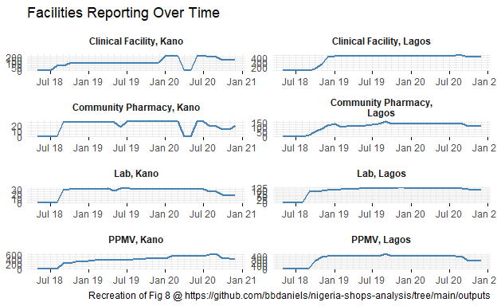
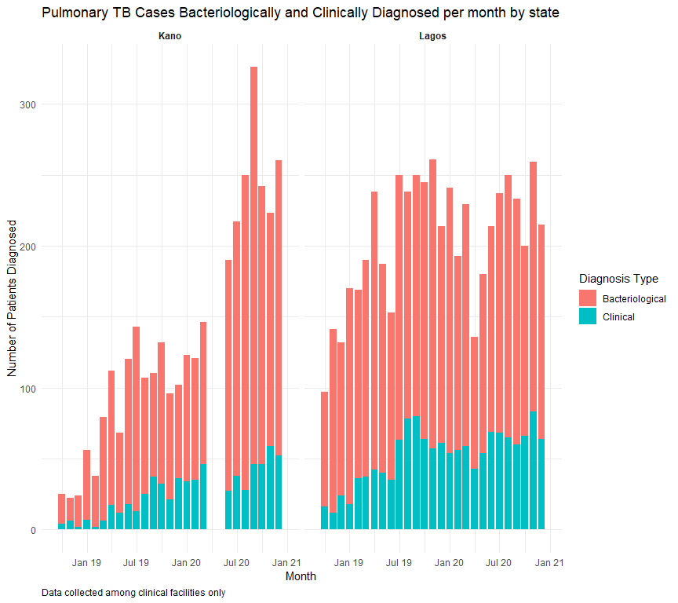
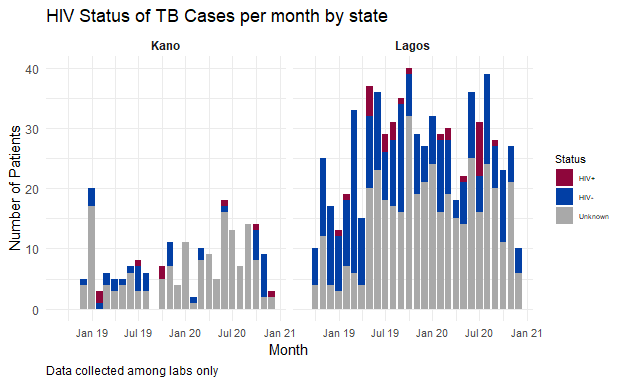
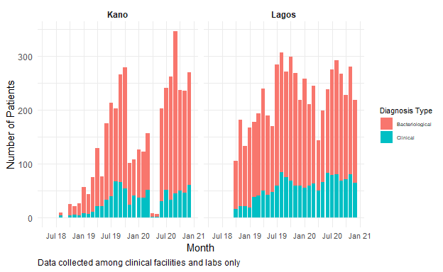
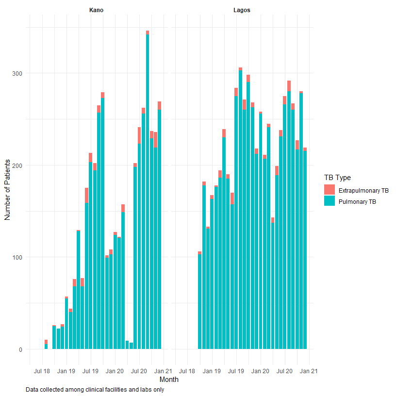
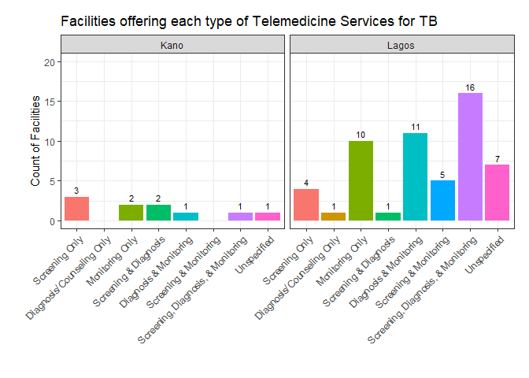

Nigeria Shops Analysis
================

## Load data

There are 32 unique months of data in this dataset. We can check to make
sure no facility id’s have greater or fewer than 32 observations.

``` r
data %>% 
  group_by(fac_id) %>% 
  count() %>% 
  filter(n != 32)
```

    ## # A tibble: 1 x 2
    ## # Groups:   fac_id [1]
    ##   fac_id     n
    ##    <dbl> <int>
    ## 1   2102    64

``` r
head(data %>% filter(fac_id == 2102) %>% arrange(monthyear) %>% select(c(1:9)))
```

    ## # A tibble: 6 x 9
    ##   fac_id month  year monthyear  state lga    fac_name    fac_type fac_type_sub
    ##    <dbl> <dbl> <dbl> <date>     <chr> <chr>  <chr>       <chr>    <chr>       
    ## 1   2102     5  2018 2018-05-01 Lagos Mushin Real Vision PPMV     .           
    ## 2   2102     5  2018 2018-05-01 Lagos Mushin Real Vision Lab      .           
    ## 3   2102     6  2018 2018-06-01 Lagos Mushin Real Vision PPMV     .           
    ## 4   2102     6  2018 2018-06-01 Lagos Mushin Real Vision Lab      .           
    ## 5   2102     7  2018 2018-07-01 Lagos Mushin Real Vision PPMV     .           
    ## 6   2102     7  2018 2018-07-01 Lagos Mushin Real Vision Lab      .

``` r
data %>% filter(fac_id == 2103) %>% select(c(1:9))
```

    ## # A tibble: 0 x 9
    ## # ... with 9 variables: fac_id <dbl>, month <dbl>, year <dbl>,
    ## #   monthyear <date>, state <chr>, lga <chr>, fac_name <chr>, fac_type <chr>,
    ## #   fac_type_sub <chr>

The facility with a `fac_id` of 2102 has two data points in each month,
one classified as a PPMV and the other as a lab. There is no facility
with a `fac_id` of 2103.

Rather than remove the observations for this facility, we can relabel
the facility with ID = 2102 and type = Lab to be facility \#2103.

    ## # A tibble: 0 x 2
    ## # Groups:   fac_id [0]
    ## # ... with 2 variables: fac_id <dbl>, n <int>

<table>
<caption>
Table 1. Summary of Facilities in this Dataset by State and Type
</caption>
<thead>
<tr>
<th style="text-align:left;">
State
</th>
<th style="text-align:left;">
Facility Type
</th>
<th style="text-align:right;">
Total Number of Facilities (N)
</th>
</tr>
</thead>
<tbody>
<tr>
<td style="text-align:left;">
Kano
</td>
<td style="text-align:left;">
Clinical Facility
</td>
<td style="text-align:right;">
217
</td>
</tr>
<tr>
<td style="text-align:left;">
Kano
</td>
<td style="text-align:left;">
Community Pharmacy
</td>
<td style="text-align:right;">
28
</td>
</tr>
<tr>
<td style="text-align:left;">
Kano
</td>
<td style="text-align:left;">
Lab
</td>
<td style="text-align:right;">
35
</td>
</tr>
<tr>
<td style="text-align:left;">
Kano
</td>
<td style="text-align:left;">
PPMV
</td>
<td style="text-align:right;">
804
</td>
</tr>
<tr>
<td style="text-align:left;">
Lagos
</td>
<td style="text-align:left;">
Clinical Facility
</td>
<td style="text-align:right;">
472
</td>
</tr>
<tr>
<td style="text-align:left;">
Lagos
</td>
<td style="text-align:left;">
Community Pharmacy
</td>
<td style="text-align:right;">
195
</td>
</tr>
<tr>
<td style="text-align:left;">
Lagos
</td>
<td style="text-align:left;">
Lab
</td>
<td style="text-align:right;">
140
</td>
</tr>
<tr>
<td style="text-align:left;">
Lagos
</td>
<td style="text-align:left;">
PPMV
</td>
<td style="text-align:right;">
511
</td>
</tr>
<tr>
<td style="text-align:left;">
Kano
</td>
<td style="text-align:left;">
Total
</td>
<td style="text-align:right;">
1084
</td>
</tr>
<tr>
<td style="text-align:left;">
Lagos
</td>
<td style="text-align:left;">
Total
</td>
<td style="text-align:right;">
1318
</td>
</tr>
<tr>
<td style="text-align:left;">
Total
</td>
<td style="text-align:left;">
Total
</td>
<td style="text-align:right;">
2402
</td>
</tr>
</tbody>
</table>

## Which variables apply to each facility type?

*Step 1:* Examine which facility types contain data for each variable
(sum all numeric variables, everything with &gt;0 counted as TRUE,
ignoring NAs)

``` r
variables <- data %>% 
  select(c(1:grep("^ontreat_ds_total", colnames(data)))) %>% 
  group_by(fac_type) %>% 
  summarise_if(is.numeric, sum, na.rm = TRUE) %>% 
  select(-c(fac_id, month, year))

variables <- data.frame(t(variables[,-1]))
colnames(variables) <- c("CF", "CP", "L", "P")

variables <- variables %>% 
  mutate(CF_any = ifelse(CF > 0, TRUE, FALSE), CP_any = ifelse(CP > 0, TRUE, FALSE),
         L_any = ifelse(L > 0, TRUE, FALSE), P_any = ifelse(P > 0, TRUE, FALSE))

variables$var_name <- rownames(variables)
rownames(variables) <- NULL
variables <- variables[,c(9, 1:8)]
head(variables)
```

    ##            var_name      CF CP L P CF_any CP_any L_any P_any
    ## 1    q_recd_cat1kit    9127  0 0 0   TRUE  FALSE FALSE FALSE
    ## 2  phys_inv_cat1kit   26609  0 0 0   TRUE  FALSE FALSE FALSE
    ## 3        q_recd_inh   79843  0 0 0   TRUE  FALSE FALSE FALSE
    ## 4      phys_inv_inh 1381728  0 0 0   TRUE  FALSE FALSE FALSE
    ## 5   q_recd_rhz_paed    5671  0 0 0   TRUE  FALSE FALSE FALSE
    ## 6 phys_inv_rhz_paed   13933  0 0 0   TRUE  FALSE FALSE FALSE

``` r
write_csv(variables, file="./outputs/data/variables.csv")
```

*Step 2:* Cross-check with the codebook shared by our partners in
Nigeria (formatting done in Excel).

``` r
codebook <- read_csv("C:/Users/angie/OneDrive - McGill University/Pai Team/COVET/Nigeria program data/TB Nigeria_Program Data_Codebook.csv")
head(codebook)
```

    ## # A tibble: 6 x 10
    ##   `Variable Name` `Variable Label` `Answer Label` `Answer Code` `Variable Type`
    ##   <chr>           <chr>            <chr>                  <dbl> <chr>          
    ## 1 fac_id          fac_id           Open ended                NA Numeric        
    ## 2 month           month            Open ended                NA Numeric        
    ## 3 year            year             Open ended                NA Numeric        
    ## 4 monthyear       monthyear        Open ended                NA Numeric        
    ## 5 state           state            Open ended                NA String         
    ## 6 lga             lga              Open ended                NA String         
    ## # ... with 5 more variables: Notes <chr>, Clinical facilities <lgl>, CPs <lgl>,
    ## #   Labs <lgl>, PPMVs <lgl>

``` r
colnames(codebook)[1] <- "var_name"
colnames(codebook)[7:10] <- c("CF_codebook", "CP_codebook", "L_codebook", "P_codebook")

crosscheck <- left_join(variables, codebook, by = "var_name")

mismatches <- crosscheck %>% 
  select(var_name, CF_any, CF_codebook, CP_any, CP_codebook, 
         L_any, L_codebook, P_any, P_codebook) %>% 
  filter(CF_any != CF_codebook | 
         CP_any != CP_codebook | 
          L_any != L_codebook | 
          P_any != P_codebook) %>% 
  pivot_longer(cols = c(2:9), names_to = c("fac_type", "source"), 
               names_sep = "_", values_to = "test") %>% 
  pivot_wider(names_from = "source", values_from = "test") %>% 
  rename(actual_data = any) %>% 
  filter(actual_data != codebook) %>% 
  arrange(actual_data)

head(mismatches)
```

    ## # A tibble: 6 x 4
    ##   var_name          fac_type actual_data codebook
    ##   <chr>             <chr>    <lgl>       <lgl>   
    ## 1 presumptives_dr_m L        FALSE       TRUE    
    ## 2 presumptives_dr_f L        FALSE       TRUE    
    ## 3 examined_xpert_f  CP       FALSE       TRUE    
    ## 4 examined_afb_m    CP       FALSE       TRUE    
    ## 5 examined_afb_m    P        FALSE       TRUE    
    ## 6 examined_afb_f    CP       FALSE       TRUE

When `actual_data` is FALSE and `codebook` is TRUE, that means there is
no data where there should be data.

When `actual_data` is TRUE and `codebook` is FALSE, this means there are
data where there should not be any.

*Decision:*

-   If a variable should have data for a given facility type, classify
    it as such.
    -   if `actual_data` = FALSE & `codebook` = TRUE, keep label as TRUE
-   If a variable has data for a specific facility type when it
    shouldn’t, classify that variable as valid for that facility type.
    -   if `actual_data` = TRUE & `codebook` = FALSE, re-label as TRUE

<!-- -->

    ## # A tibble: 18 x 4
    ##    var_name                        fac_type actual_data codebook
    ##    <chr>                           <chr>    <lgl>       <lgl>   
    ##  1 lab_walkins                     CF       TRUE        FALSE   
    ##  2 ss_sent_xpert                   CF       TRUE        FALSE   
    ##  3 ref_trt_m15_plus                CF       TRUE        FALSE   
    ##  4 ref_trt_f15_plus                CF       TRUE        FALSE   
    ##  5 ref_trt_total                   CF       TRUE        FALSE   
    ##  6 cases_starttrt_pvthosp_m15_plus CF       TRUE        FALSE   
    ##  7 cases_starttrt_pvthosp_f15_plus CF       TRUE        FALSE   
    ##  8 cases_starttrt_pvthosp_total    CF       TRUE        FALSE   
    ##  9 cases_starttrt_pubhosp_m15_plus CF       TRUE        FALSE   
    ## 10 cases_starttrt_pubhosp_f15_plus CF       TRUE        FALSE   
    ## 11 cases_starttrt_pubhosp_total    CF       TRUE        FALSE   
    ## 12 cases_hivneg_m15_plus           CF       TRUE        FALSE   
    ## 13 cases_hivneg_f15_plus           CF       TRUE        FALSE   
    ## 14 cases_hivneg_total              CF       TRUE        FALSE   
    ## 15 cases_hivdk_m15_plus            CF       TRUE        FALSE   
    ## 16 cases_hivdk_f15_plus            CF       TRUE        FALSE   
    ## 17 cases_hivdk_total               CF       TRUE        FALSE   
    ## 18 cases_hivstatus_total           CF       TRUE        FALSE

The only facility type where `actual_data` = TRUE & `codebook` = FALSE
is clinical facilities, so those are the only ones that need to be
re-labeled as TRUE.

``` r
to_be_labeled_true <- mismatches$var_name[mismatches$actual_data==TRUE]

codebook_new <- crosscheck %>% 
  transmute(var_name = var_name,
            `Clinical Facility` = CF_codebook, 
            `Community Pharmacy` = CP_codebook, 
            `Lab` = L_codebook, 
            `PPMV` = P_codebook) 

codebook_new$`Clinical Facility`[codebook_new$var_name %in% to_be_labeled_true] <- TRUE
```

## Exploring Gap in Kano Data

Using a custom function (`datacheck`), for each of the 32 months in this
dataset I will:

-   Select the facility identifiers (`fac_id`, `state`, `lga`,
    `fac_name`, `fac_type`, and `fac_type_sub`) and all the routine
    measures for each facility (`q_recd_cat1kit` to `ontreat_ds_total`)

-   Create a column called `reported_any_data` for each month and year,
    which is:

    -   marked FALSE if a facility reported blank values (marked `NA`)
        for **all** routine measures in that month, or
    -   marked TRUE if a facility reported on **at least 1** routine
        measure (i.e. the number of cells with NA is not equal to the
        number of routine variables).
    -   Zeros are counted as reported data.

-   Then, I will sum the number of facilities with any reported data for
    all 32 `reported_any_data` columns and observe the change in number
    of facilities with any reported data during the period when Nigeria
    was under lockdown (April/May 2020).

``` r
datacheck <- function(x) {
  check <- data %>% 
  select(fac_id, monthyear, state, lga, fac_name, fac_type, fac_type_sub, 
         c(codebook_new$var_name)) %>%  
  filter(monthyear == as.Date(x)) 
  check <- check %>% 
    mutate(monthcheck = rowSums(is.na(check[,c(codebook_new$var_name)])) != length(codebook_new$var_name)) %>% 
    select(fac_id, monthyear, state, lga, fac_name, fac_type, fac_type_sub, monthcheck) %>%
    mutate("reported_data_{x}" := monthcheck)
  return(check)
}

dates <- unique(data$monthyear)
check_list <- lapply(dates, datacheck)
names(check_list) = dates

data_check <- check_list[["2018-05-01"]][c(1,3:7,9)] %>% 
  left_join(check_list[["2018-06-01"]][c(1,9)], by = "fac_id") %>% 
  left_join(check_list[["2018-07-01"]][c(1,9)], by = "fac_id") %>% 
  left_join(check_list[["2018-08-01"]][c(1,9)], by = "fac_id") %>% 
  left_join(check_list[["2018-09-01"]][c(1,9)], by = "fac_id") %>% 
  left_join(check_list[["2018-10-01"]][c(1,9)], by = "fac_id") %>% 
  left_join(check_list[["2018-11-01"]][c(1,9)], by = "fac_id") %>% 
  left_join(check_list[["2018-12-01"]][c(1,9)], by = "fac_id") %>%
  left_join(check_list[["2019-01-01"]][c(1,9)], by = "fac_id") %>% 
  left_join(check_list[["2019-02-01"]][c(1,9)], by = "fac_id") %>% 
  left_join(check_list[["2019-03-01"]][c(1,9)], by = "fac_id") %>% 
  left_join(check_list[["2019-04-01"]][c(1,9)], by = "fac_id") %>% 
  left_join(check_list[["2019-05-01"]][c(1,9)], by = "fac_id") %>% 
  left_join(check_list[["2019-06-01"]][c(1,9)], by = "fac_id") %>% 
  left_join(check_list[["2019-07-01"]][c(1,9)], by = "fac_id") %>% 
  left_join(check_list[["2019-08-01"]][c(1,9)], by = "fac_id") %>% 
  left_join(check_list[["2019-09-01"]][c(1,9)], by = "fac_id") %>% 
  left_join(check_list[["2019-10-01"]][c(1,9)], by = "fac_id") %>% 
  left_join(check_list[["2019-11-01"]][c(1,9)], by = "fac_id") %>% 
  left_join(check_list[["2019-12-01"]][c(1,9)], by = "fac_id") %>% 
  left_join(check_list[["2020-01-01"]][c(1,9)], by = "fac_id") %>% 
  left_join(check_list[["2020-02-01"]][c(1,9)], by = "fac_id") %>% 
  left_join(check_list[["2020-03-01"]][c(1,9)], by = "fac_id") %>% 
  left_join(check_list[["2020-04-01"]][c(1,9)], by = "fac_id") %>% 
  left_join(check_list[["2020-05-01"]][c(1,9)], by = "fac_id") %>% 
  left_join(check_list[["2020-06-01"]][c(1,9)], by = "fac_id") %>% 
  left_join(check_list[["2020-07-01"]][c(1,9)], by = "fac_id") %>% 
  left_join(check_list[["2020-08-01"]][c(1,9)], by = "fac_id") %>% 
  left_join(check_list[["2020-09-01"]][c(1,9)], by = "fac_id") %>% 
  left_join(check_list[["2020-10-01"]][c(1,9)], by = "fac_id") %>% 
  left_join(check_list[["2020-11-01"]][c(1,9)], by = "fac_id") %>% 
  left_join(check_list[["2020-12-01"]][c(1,9)], by = "fac_id") 

data_check_summary_table <- data_check %>% 
  group_by(state, fac_type) %>% 
  summarize_if(is.logical, sum) 

data_check_summary <- data_check_summary_table %>% 
  pivot_longer(cols = c(3:34), names_to = "date", names_pattern = "reported_data_(.*)", values_to = "num_reported")

data_check_summary$date <- as.Date(data_check_summary$date)
```



Through this process, I ended up recreating the “Facilities Reporting
Over Time” graph that Ben previously created using the
`attendance_total` variable. **There does appear to be a gap in data
reported by Clinical Facilities and Community Pharmacies in Kano in
April and May 2020.**

Below I’ve displayed the same data in a table and added the number of
facilities in each state and facility type that reported being shutdown
at least once during the COVID lockdown period in Nigeria (April/May
2020).

<table>
<caption>
Table 2. Number of Facilities Reporting Over Time by State and Type
</caption>
<thead>
<tr>
<th style="text-align:left;">
State
</th>
<th style="text-align:left;">
Facility Type
</th>
<th style="text-align:right;">
Number of Facilities that Reported Any Data in Jan 2020
</th>
<th style="text-align:right;">
Feb 2020
</th>
<th style="text-align:right;">
Mar 2020
</th>
<th style="text-align:right;">
Apr 2020
</th>
<th style="text-align:right;">
May 2020
</th>
<th style="text-align:right;">
Jun 2020
</th>
<th style="text-align:right;">
Jul 2020
</th>
<th style="text-align:right;">
Aug 2020
</th>
<th style="text-align:right;">
Sep 2020
</th>
<th style="text-align:right;">
Number of facilities Reporting Having Shut Down during COVID
</th>
</tr>
</thead>
<tbody>
<tr>
<td style="text-align:left;">
Kano
</td>
<td style="text-align:left;">
Clinical Facility
</td>
<td style="text-align:right;">
205
</td>
<td style="text-align:right;">
205
</td>
<td style="text-align:right;">
205
</td>
<td style="text-align:right;">
1
</td>
<td style="text-align:right;">
1
</td>
<td style="text-align:right;">
212
</td>
<td style="text-align:right;">
214
</td>
<td style="text-align:right;">
199
</td>
<td style="text-align:right;">
198
</td>
<td style="text-align:right;">
25
</td>
</tr>
<tr>
<td style="text-align:left;">
Kano
</td>
<td style="text-align:left;">
Community Pharmacy
</td>
<td style="text-align:right;">
26
</td>
<td style="text-align:right;">
26
</td>
<td style="text-align:right;">
26
</td>
<td style="text-align:right;">
0
</td>
<td style="text-align:right;">
0
</td>
<td style="text-align:right;">
26
</td>
<td style="text-align:right;">
26
</td>
<td style="text-align:right;">
18
</td>
<td style="text-align:right;">
18
</td>
<td style="text-align:right;">
4
</td>
</tr>
<tr>
<td style="text-align:left;">
Kano
</td>
<td style="text-align:left;">
Lab
</td>
<td style="text-align:right;">
30
</td>
<td style="text-align:right;">
30
</td>
<td style="text-align:right;">
30
</td>
<td style="text-align:right;">
30
</td>
<td style="text-align:right;">
30
</td>
<td style="text-align:right;">
30
</td>
<td style="text-align:right;">
30
</td>
<td style="text-align:right;">
25
</td>
<td style="text-align:right;">
25
</td>
<td style="text-align:right;">
2
</td>
</tr>
<tr>
<td style="text-align:left;">
Kano
</td>
<td style="text-align:left;">
PPMV
</td>
<td style="text-align:right;">
461
</td>
<td style="text-align:right;">
549
</td>
<td style="text-align:right;">
561
</td>
<td style="text-align:right;">
558
</td>
<td style="text-align:right;">
563
</td>
<td style="text-align:right;">
551
</td>
<td style="text-align:right;">
563
</td>
<td style="text-align:right;">
615
</td>
<td style="text-align:right;">
634
</td>
<td style="text-align:right;">
46
</td>
</tr>
<tr>
<td style="text-align:left;">
Lagos
</td>
<td style="text-align:left;">
Clinical Facility
</td>
<td style="text-align:right;">
433
</td>
<td style="text-align:right;">
433
</td>
<td style="text-align:right;">
433
</td>
<td style="text-align:right;">
433
</td>
<td style="text-align:right;">
432
</td>
<td style="text-align:right;">
433
</td>
<td style="text-align:right;">
433
</td>
<td style="text-align:right;">
439
</td>
<td style="text-align:right;">
439
</td>
<td style="text-align:right;">
19
</td>
</tr>
<tr>
<td style="text-align:left;">
Lagos
</td>
<td style="text-align:left;">
Community Pharmacy
</td>
<td style="text-align:right;">
138
</td>
<td style="text-align:right;">
138
</td>
<td style="text-align:right;">
137
</td>
<td style="text-align:right;">
133
</td>
<td style="text-align:right;">
133
</td>
<td style="text-align:right;">
133
</td>
<td style="text-align:right;">
133
</td>
<td style="text-align:right;">
133
</td>
<td style="text-align:right;">
133
</td>
<td style="text-align:right;">
10
</td>
</tr>
<tr>
<td style="text-align:left;">
Lagos
</td>
<td style="text-align:left;">
Lab
</td>
<td style="text-align:right;">
118
</td>
<td style="text-align:right;">
118
</td>
<td style="text-align:right;">
118
</td>
<td style="text-align:right;">
118
</td>
<td style="text-align:right;">
117
</td>
<td style="text-align:right;">
118
</td>
<td style="text-align:right;">
116
</td>
<td style="text-align:right;">
117
</td>
<td style="text-align:right;">
117
</td>
<td style="text-align:right;">
18
</td>
</tr>
<tr>
<td style="text-align:left;">
Lagos
</td>
<td style="text-align:left;">
PPMV
</td>
<td style="text-align:right;">
404
</td>
<td style="text-align:right;">
403
</td>
<td style="text-align:right;">
403
</td>
<td style="text-align:right;">
399
</td>
<td style="text-align:right;">
399
</td>
<td style="text-align:right;">
399
</td>
<td style="text-align:right;">
399
</td>
<td style="text-align:right;">
398
</td>
<td style="text-align:right;">
390
</td>
<td style="text-align:right;">
55
</td>
</tr>
</tbody>
</table>

# Additional Variable Analysis

## 9a. Sum Total of PTB Cases Bacteriologically Diagnosed and 9b. Sum Total of PTB Cases Clinically Diagnosed (Applies to Clinical facilities only)



## 10. Grand Total of HIV Status of TB Cases



## 16. Grand Total of Cases Notified (Clinical Facilities and Labs Only)



# Results from the December 2020 COVID Survey

## General survey information

Information on 1598 facilities out of 2402 total facilities was included
in the responses to the COVID questionnaire.

<table>
<caption>
Table 3. Summary of Response to Dec 2020 COVID Survey
</caption>
<thead>
<tr>
<th style="text-align:left;">
State
</th>
<th style="text-align:left;">
Facility Type
</th>
<th style="text-align:right;">
Number of Facilities Responding to COVID Survey
</th>
<th style="text-align:right;">
Total Number of Facilities
</th>
<th style="text-align:right;">
Percent Response (%)
</th>
</tr>
</thead>
<tbody>
<tr>
<td style="text-align:left;">
Kano
</td>
<td style="text-align:left;">
Clinical Facility
</td>
<td style="text-align:right;">
151
</td>
<td style="text-align:right;">
217
</td>
<td style="text-align:right;">
69.59
</td>
</tr>
<tr>
<td style="text-align:left;">
Kano
</td>
<td style="text-align:left;">
Community Pharmacy
</td>
<td style="text-align:right;">
17
</td>
<td style="text-align:right;">
28
</td>
<td style="text-align:right;">
60.71
</td>
</tr>
<tr>
<td style="text-align:left;">
Kano
</td>
<td style="text-align:left;">
Lab
</td>
<td style="text-align:right;">
20
</td>
<td style="text-align:right;">
35
</td>
<td style="text-align:right;">
57.14
</td>
</tr>
<tr>
<td style="text-align:left;">
Kano
</td>
<td style="text-align:left;">
PPMV
</td>
<td style="text-align:right;">
550
</td>
<td style="text-align:right;">
804
</td>
<td style="text-align:right;">
68.41
</td>
</tr>
<tr>
<td style="text-align:left;">
Lagos
</td>
<td style="text-align:left;">
Clinical Facility
</td>
<td style="text-align:right;">
395
</td>
<td style="text-align:right;">
472
</td>
<td style="text-align:right;">
83.69
</td>
</tr>
<tr>
<td style="text-align:left;">
Lagos
</td>
<td style="text-align:left;">
Community Pharmacy
</td>
<td style="text-align:right;">
91
</td>
<td style="text-align:right;">
195
</td>
<td style="text-align:right;">
46.67
</td>
</tr>
<tr>
<td style="text-align:left;">
Lagos
</td>
<td style="text-align:left;">
Lab
</td>
<td style="text-align:right;">
108
</td>
<td style="text-align:right;">
140
</td>
<td style="text-align:right;">
77.14
</td>
</tr>
<tr>
<td style="text-align:left;">
Lagos
</td>
<td style="text-align:left;">
PPMV
</td>
<td style="text-align:right;">
266
</td>
<td style="text-align:right;">
511
</td>
<td style="text-align:right;">
52.05
</td>
</tr>
<tr>
<td style="text-align:left;">
Kano
</td>
<td style="text-align:left;">
Total
</td>
<td style="text-align:right;">
738
</td>
<td style="text-align:right;">
1084
</td>
<td style="text-align:right;">
68.08
</td>
</tr>
<tr>
<td style="text-align:left;">
Lagos
</td>
<td style="text-align:left;">
Total
</td>
<td style="text-align:right;">
860
</td>
<td style="text-align:right;">
1318
</td>
<td style="text-align:right;">
65.25
</td>
</tr>
<tr>
<td style="text-align:left;">
Total
</td>
<td style="text-align:left;">
Total
</td>
<td style="text-align:right;">
1598
</td>
<td style="text-align:right;">
2402
</td>
<td style="text-align:right;">
66.53
</td>
</tr>
</tbody>
</table>

## Current Status of Facilities

<table>
<caption>
Table 4. Percent of Facilities Open and Accepting Clients at time of
Survey (Dec 2020)
</caption>
<thead>
<tr>
<th style="text-align:left;">
State
</th>
<th style="text-align:left;">
Facility Type
</th>
<th style="text-align:right;">
Number of Open Facilities
</th>
<th style="text-align:right;">
Total N of Responding Facilities
</th>
<th style="text-align:right;">
Percent Currently Open (%)
</th>
</tr>
</thead>
<tbody>
<tr>
<td style="text-align:left;">
Kano
</td>
<td style="text-align:left;">
Clinical Facility
</td>
<td style="text-align:right;">
148
</td>
<td style="text-align:right;">
151
</td>
<td style="text-align:right;">
98.01
</td>
</tr>
<tr>
<td style="text-align:left;">
Kano
</td>
<td style="text-align:left;">
Community Pharmacy
</td>
<td style="text-align:right;">
17
</td>
<td style="text-align:right;">
17
</td>
<td style="text-align:right;">
100.00
</td>
</tr>
<tr>
<td style="text-align:left;">
Kano
</td>
<td style="text-align:left;">
Lab
</td>
<td style="text-align:right;">
17
</td>
<td style="text-align:right;">
20
</td>
<td style="text-align:right;">
85.00
</td>
</tr>
<tr>
<td style="text-align:left;">
Kano
</td>
<td style="text-align:left;">
PPMV
</td>
<td style="text-align:right;">
502
</td>
<td style="text-align:right;">
550
</td>
<td style="text-align:right;">
91.27
</td>
</tr>
<tr>
<td style="text-align:left;">
Lagos
</td>
<td style="text-align:left;">
Clinical Facility
</td>
<td style="text-align:right;">
389
</td>
<td style="text-align:right;">
395
</td>
<td style="text-align:right;">
98.48
</td>
</tr>
<tr>
<td style="text-align:left;">
Lagos
</td>
<td style="text-align:left;">
Community Pharmacy
</td>
<td style="text-align:right;">
88
</td>
<td style="text-align:right;">
91
</td>
<td style="text-align:right;">
96.70
</td>
</tr>
<tr>
<td style="text-align:left;">
Lagos
</td>
<td style="text-align:left;">
Lab
</td>
<td style="text-align:right;">
108
</td>
<td style="text-align:right;">
108
</td>
<td style="text-align:right;">
100.00
</td>
</tr>
<tr>
<td style="text-align:left;">
Lagos
</td>
<td style="text-align:left;">
PPMV
</td>
<td style="text-align:right;">
248
</td>
<td style="text-align:right;">
266
</td>
<td style="text-align:right;">
93.23
</td>
</tr>
<tr>
<td style="text-align:left;">
Kano
</td>
<td style="text-align:left;">
Total
</td>
<td style="text-align:right;">
684
</td>
<td style="text-align:right;">
738
</td>
<td style="text-align:right;">
92.68
</td>
</tr>
<tr>
<td style="text-align:left;">
Lagos
</td>
<td style="text-align:left;">
Total
</td>
<td style="text-align:right;">
833
</td>
<td style="text-align:right;">
860
</td>
<td style="text-align:right;">
96.86
</td>
</tr>
<tr>
<td style="text-align:left;">
Total
</td>
<td style="text-align:left;">
Total
</td>
<td style="text-align:right;">
1517
</td>
<td style="text-align:right;">
1598
</td>
<td style="text-align:right;">
94.93
</td>
</tr>
</tbody>
</table>

## Previous Status during Lockdown

<table>
<caption>
Table 5. Summary of Facilities Reporting Having Closed During the COVID
Lockdown (April-May 2020
</caption>
<thead>
<tr>
<th style="text-align:left;">
State
</th>
<th style="text-align:left;">
Facility Type
</th>
<th style="text-align:right;">
Number of Facilities that Closed at least once during COVID lockdown
</th>
<th style="text-align:right;">
Total N of Responding Facilities
</th>
<th style="text-align:right;">
Percent Closed at least once during COVID lockdown (%)
</th>
<th style="text-align:right;">
Mean Number of Times Each Facility Closed
</th>
<th style="text-align:right;">
Std. Dev. of Number of Times Closed
</th>
</tr>
</thead>
<tbody>
<tr>
<td style="text-align:left;">
Kano
</td>
<td style="text-align:left;">
Clinical Facility
</td>
<td style="text-align:right;">
25
</td>
<td style="text-align:right;">
151
</td>
<td style="text-align:right;">
16.56
</td>
<td style="text-align:right;">
1.12
</td>
<td style="text-align:right;">
0.33
</td>
</tr>
<tr>
<td style="text-align:left;">
Kano
</td>
<td style="text-align:left;">
Community Pharmacy
</td>
<td style="text-align:right;">
4
</td>
<td style="text-align:right;">
17
</td>
<td style="text-align:right;">
23.53
</td>
<td style="text-align:right;">
1.00
</td>
<td style="text-align:right;">
0.00
</td>
</tr>
<tr>
<td style="text-align:left;">
Kano
</td>
<td style="text-align:left;">
Lab
</td>
<td style="text-align:right;">
2
</td>
<td style="text-align:right;">
20
</td>
<td style="text-align:right;">
10.00
</td>
<td style="text-align:right;">
1.00
</td>
<td style="text-align:right;">
0.00
</td>
</tr>
<tr>
<td style="text-align:left;">
Kano
</td>
<td style="text-align:left;">
PPMV
</td>
<td style="text-align:right;">
46
</td>
<td style="text-align:right;">
550
</td>
<td style="text-align:right;">
8.36
</td>
<td style="text-align:right;">
1.28
</td>
<td style="text-align:right;">
1.34
</td>
</tr>
<tr>
<td style="text-align:left;">
Lagos
</td>
<td style="text-align:left;">
Clinical Facility
</td>
<td style="text-align:right;">
19
</td>
<td style="text-align:right;">
395
</td>
<td style="text-align:right;">
4.81
</td>
<td style="text-align:right;">
1.21
</td>
<td style="text-align:right;">
0.42
</td>
</tr>
<tr>
<td style="text-align:left;">
Lagos
</td>
<td style="text-align:left;">
Community Pharmacy
</td>
<td style="text-align:right;">
10
</td>
<td style="text-align:right;">
91
</td>
<td style="text-align:right;">
10.99
</td>
<td style="text-align:right;">
1.50
</td>
<td style="text-align:right;">
0.97
</td>
</tr>
<tr>
<td style="text-align:left;">
Lagos
</td>
<td style="text-align:left;">
Lab
</td>
<td style="text-align:right;">
18
</td>
<td style="text-align:right;">
108
</td>
<td style="text-align:right;">
16.67
</td>
<td style="text-align:right;">
1.11
</td>
<td style="text-align:right;">
0.32
</td>
</tr>
<tr>
<td style="text-align:left;">
Lagos
</td>
<td style="text-align:left;">
PPMV
</td>
<td style="text-align:right;">
55
</td>
<td style="text-align:right;">
266
</td>
<td style="text-align:right;">
20.68
</td>
<td style="text-align:right;">
1.29
</td>
<td style="text-align:right;">
0.79
</td>
</tr>
<tr>
<td style="text-align:left;">
Kano
</td>
<td style="text-align:left;">
Total
</td>
<td style="text-align:right;">
77
</td>
<td style="text-align:right;">
738
</td>
<td style="text-align:right;">
10.43
</td>
<td style="text-align:right;">
1.21
</td>
<td style="text-align:right;">
1.06
</td>
</tr>
<tr>
<td style="text-align:left;">
Lagos
</td>
<td style="text-align:left;">
Total
</td>
<td style="text-align:right;">
102
</td>
<td style="text-align:right;">
860
</td>
<td style="text-align:right;">
11.86
</td>
<td style="text-align:right;">
1.26
</td>
<td style="text-align:right;">
0.69
</td>
</tr>
<tr>
<td style="text-align:left;">
Total
</td>
<td style="text-align:left;">
Total
</td>
<td style="text-align:right;">
179
</td>
<td style="text-align:right;">
1598
</td>
<td style="text-align:right;">
11.20
</td>
<td style="text-align:right;">
1.24
</td>
<td style="text-align:right;">
1.06
</td>
</tr>
</tbody>
</table>

## Has facility added incremental fees to cover PPE cost?

<table>
<caption>
Table 6. Percent of Facilities That Increased Fees due to PPE Cost
</caption>
<thead>
<tr>
<th style="text-align:left;">
State
</th>
<th style="text-align:left;">
Facility Type
</th>
<th style="text-align:right;">
Number of Facilities That Added PPE Fee
</th>
<th style="text-align:right;">
Total N of Responding Facilities
</th>
<th style="text-align:right;">
Percent of Facilities That Increased Fees due to PPE Cost (%)
</th>
</tr>
</thead>
<tbody>
<tr>
<td style="text-align:left;">
Kano
</td>
<td style="text-align:left;">
Clinical Facility
</td>
<td style="text-align:right;">
17
</td>
<td style="text-align:right;">
151
</td>
<td style="text-align:right;">
11.26
</td>
</tr>
<tr>
<td style="text-align:left;">
Kano
</td>
<td style="text-align:left;">
Community Pharmacy
</td>
<td style="text-align:right;">
3
</td>
<td style="text-align:right;">
17
</td>
<td style="text-align:right;">
17.65
</td>
</tr>
<tr>
<td style="text-align:left;">
Kano
</td>
<td style="text-align:left;">
Lab
</td>
<td style="text-align:right;">
0
</td>
<td style="text-align:right;">
20
</td>
<td style="text-align:right;">
0.00
</td>
</tr>
<tr>
<td style="text-align:left;">
Kano
</td>
<td style="text-align:left;">
PPMV
</td>
<td style="text-align:right;">
27
</td>
<td style="text-align:right;">
550
</td>
<td style="text-align:right;">
4.91
</td>
</tr>
<tr>
<td style="text-align:left;">
Lagos
</td>
<td style="text-align:left;">
Clinical Facility
</td>
<td style="text-align:right;">
77
</td>
<td style="text-align:right;">
395
</td>
<td style="text-align:right;">
19.49
</td>
</tr>
<tr>
<td style="text-align:left;">
Lagos
</td>
<td style="text-align:left;">
Community Pharmacy
</td>
<td style="text-align:right;">
36
</td>
<td style="text-align:right;">
91
</td>
<td style="text-align:right;">
39.56
</td>
</tr>
<tr>
<td style="text-align:left;">
Lagos
</td>
<td style="text-align:left;">
Lab
</td>
<td style="text-align:right;">
15
</td>
<td style="text-align:right;">
108
</td>
<td style="text-align:right;">
13.89
</td>
</tr>
<tr>
<td style="text-align:left;">
Lagos
</td>
<td style="text-align:left;">
PPMV
</td>
<td style="text-align:right;">
57
</td>
<td style="text-align:right;">
266
</td>
<td style="text-align:right;">
21.43
</td>
</tr>
<tr>
<td style="text-align:left;">
Kano
</td>
<td style="text-align:left;">
Total
</td>
<td style="text-align:right;">
47
</td>
<td style="text-align:right;">
738
</td>
<td style="text-align:right;">
6.37
</td>
</tr>
<tr>
<td style="text-align:left;">
Lagos
</td>
<td style="text-align:left;">
Total
</td>
<td style="text-align:right;">
185
</td>
<td style="text-align:right;">
860
</td>
<td style="text-align:right;">
21.51
</td>
</tr>
<tr>
<td style="text-align:left;">
Total
</td>
<td style="text-align:left;">
Total
</td>
<td style="text-align:right;">
232
</td>
<td style="text-align:right;">
1598
</td>
<td style="text-align:right;">
14.52
</td>
</tr>
</tbody>
</table>

### In what ways has this facility passed PPE costs on clients/patients?

`ppe_cost_bearing` was a multi-select question with the following
options:

The question represented by the variable `ppe_cost_bearing` asked: “In
what ways has this facility passed PPE costs on clients/patients?”

Answer options:

| Variable                            | Answer                                                             | Type                            | Amount                         |
|:------------------------------------|:-------------------------------------------------------------------|---------------------------------|--------------------------------|
| ppe\_cost\_bearingadd\_separate\_pp | A. Adding a separate PPE fee on each client/patient’s bill         | addseparateppefee\_onbill\_type | addseparateppefee\_onbill\_amt |
| ppe\_cost\_bearingincrease\_in\_con | B. Increasing consultation fees (for individual consultation fee)  | increaseconsultationfees\_type  | increaseconsultationfees\_amt  |
| ppe\_cost\_bearingincrease\_in\_reg | C. Increasing registration/card fees (for individual registration) | increaseregistrationfees\_type  | increaseregistrationfees\_amt  |
| ppe\_cost\_bearingincrease\_in\_lab | D. Increasing prices of labs, medicines, or other products sold    | increaselabsmed\_type           | increaselabsmed\_amt           |
| ppe\_cost\_bearingincrease\_mentio  | E. Other (specify)                                                 | increasementionedothers\_type   | increasementionedothers\_amt   |
| other\_ppe\_cost\_bearing           | Other: Specific                                                    | N/A                             | N/A                            |

<table>
<thead>
<tr>
<th style="text-align:left;">
answer
</th>
<th style="text-align:right;">
Kano
</th>
<th style="text-align:right;">
Kano\_perc
</th>
<th style="text-align:right;">
Lagos
</th>
<th style="text-align:right;">
Lagos\_perc
</th>
</tr>
</thead>
<tbody>
<tr>
<td style="text-align:left;">
ppe\_cost\_bearingadd\_separate\_pp
</td>
<td style="text-align:right;">
14
</td>
<td style="text-align:right;">
29.79
</td>
<td style="text-align:right;">
39
</td>
<td style="text-align:right;">
21.08
</td>
</tr>
<tr>
<td style="text-align:left;">
ppe\_cost\_bearingincrease\_in\_con
</td>
<td style="text-align:right;">
8
</td>
<td style="text-align:right;">
17.02
</td>
<td style="text-align:right;">
17
</td>
<td style="text-align:right;">
9.19
</td>
</tr>
<tr>
<td style="text-align:left;">
ppe\_cost\_bearingincrease\_in\_reg
</td>
<td style="text-align:right;">
5
</td>
<td style="text-align:right;">
10.64
</td>
<td style="text-align:right;">
15
</td>
<td style="text-align:right;">
8.11
</td>
</tr>
<tr>
<td style="text-align:left;">
ppe\_cost\_bearingincrease\_in\_lab
</td>
<td style="text-align:right;">
26
</td>
<td style="text-align:right;">
55.32
</td>
<td style="text-align:right;">
135
</td>
<td style="text-align:right;">
72.97
</td>
</tr>
<tr>
<td style="text-align:left;">
ppe\_cost\_bearingincrease\_mentio
</td>
<td style="text-align:right;">
5
</td>
<td style="text-align:right;">
10.64
</td>
<td style="text-align:right;">
22
</td>
<td style="text-align:right;">
11.89
</td>
</tr>
<tr>
<td style="text-align:left;">
Total Facilities
</td>
<td style="text-align:right;">
47
</td>
<td style="text-align:right;">
NA
</td>
<td style="text-align:right;">
185
</td>
<td style="text-align:right;">
NA
</td>
</tr>
</tbody>
</table>

    ## # A tibble: 14 x 3
    ## # Groups:   answer [14]
    ##    answer      n    perc
    ##    <fct>   <int>   <dbl>
    ##  1 D         126 0.543  
    ##  2 A          28 0.121  
    ##  3 E          24 0.103  
    ##  4 A D        18 0.0776 
    ##  5 B          10 0.0431 
    ##  6 C           6 0.0259 
    ##  7 B C D       5 0.0216 
    ##  8 A B C D     4 0.0172 
    ##  9 B D         3 0.0129 
    ## 10 A B C       2 0.00862
    ## 11 C D         2 0.00862
    ## 12 D E         2 0.00862
    ## 13 A D E       1 0.00431
    ## 14 B C         1 0.00431

## COVID\_impact\_on\_tb\_service

# Regressions

Cascade = Total OPD, Total Screened, Total Diagnosed, Total Treated,
Total Completed/Cured - Comparing April 2019 and April 2020 or Q2 2019
vs. Q2 2020

    - outcome_cured_total
    - outcome_fail_total
    - outcome_ltfu_total
    - outcome_died_total
    - outcome_completed_total
    - outcome_transferout_total
    - outcome_transferin_total
    - outcome_total
    - notifbacter_ptb_total
    - notifclinic_ptb_total
    - contactscreen_index_total
    - contactscreen_household_total
    - contactscreen_diagnosed_total
    - contactscreen_ontreat_ds_total
    - contactscreen_ontreat_dr_total
    - contactscreen_starttrt_total

Costs 2019 vs. 2020

# Additional Variables of Interest

## CAT 1 Kits and Mini Kits

## hivpos\_refforcare\_total

## cases\_txsupporter\_total

## open\_date1

## Telemedicine Analysis

    ## [1] 186

    ## [1] 65

    ##                                                              Kano Lagos
    ## Facilities offering Telemedicine                               37   149
    ## Facilities offering Telemedicine for TB                        10    55
    ## Facilities offering TB Screening via Telemedicine               6    26
    ## Facilities offering TB Diagnosis/Counseling via Telemedicine    4    29
    ## Facilities offering TB Treatment Monitoring via Telemedicine    4    42
    ## TB Patients using Telemedicine (any kind)                      29   151
    ## Patients Tested for TB using Telemedicine                       8    33
    ## Patients Diagnosed/Counseled for TB using Telemedicine          7    44
    ## Patients Monitored for TB Treatment using Telemedicine         15   108


